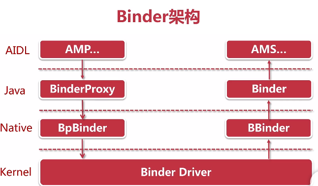
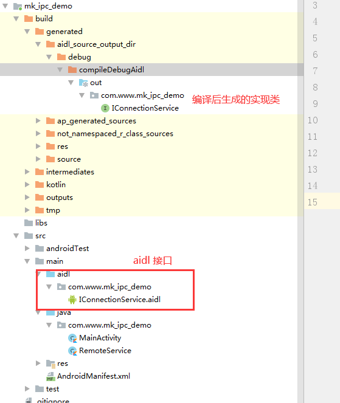
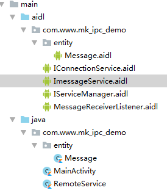

### IPC 简介

IPC 的含义为进程间通信或者跨进程通信，是**指两个进程之间数据交换的过程**
	多进程的情况分为两种:
	1，一个应用因为某些原因自身需要采用多进程模式来实现
	2，当前应用需要向其他应用获取数据
	
Android 中的多进程模式
	正常情况下，在Android中多进程是指一个应用中存在多个进程的情况
	在android 中使用多进程的方法：
	1，给四大组件在AndroidMenifest中指定**android:process**属性（我们无法给一个线程或一个实体类指定其运行时所在的进程）
	2，非常规方法：通过JNI在native层去fork一个新的进程
	

第一种情况：默认进程的名子为程序包名。如果需要指定，有两种方式。
android:process=":remote"
android:process="com.ryg.chapter_2.remote"

两种区别：
第一种 “:”的含义是在当前进程名前附加上当前的包名，是一种简洁的写法
第二种 是完整的命名方式
第一种 是私有进程，其他应用组件不可以和它跑在同一个进程中
第二种 是全局进程，其他应用可以通过 ShareUID 的方式和他跑在同一个进程中。 

Android系统会为每一个应用分配一个 UID ，具有相同UID 的应用才能共享数据，两个应用通过ShareUID 跑在同一个进程中是有要求的。需要这两个应用具有相同的ShareUID 并且签名相同才可以，在这种情况下，他们可以互相访问对方的私有数据，比如data目录，组件信息等，不管他们是否跑在同一个进程中。如果过他们跑在同一进程中，还可以共享内存数据，他们看起来就像是一个应用的两个部分。

android 系统会为每个进程分配一个独立的虚拟机，不同地虚拟机在内存分配上有不同的地址空间，所以早期不同的虚拟机中访问同一个类的对象会产生多个副本。

**使用多进程容易造成一下几个问题**

1，静态成员和单例完全失效

2，线程同步机制完全失效：无论锁对象还是全局对象。

3，SharedPrefrences 可靠性下降

4，Application 会多次创建


​	如上面图片，启动多个进程后，Application 会多次执行，而且 as 上面显示有三个进程，通过试验，两个进程之间的静态数据不会被干扰，相当于把原来进程中的数据重新拷贝了一份。修改当前进程，别的进程数据也不会改变，尽管他是静态属性。

------

### IPC 基础，主要包含三个方面:

#### 1，Serializable 接口

​		java 提供的序列化接口。可以为对象提供标准的 序列化和反序列化。[使用也很简单](https://blog.csdn.net/baidu_40389775/article/details/89096527)

#### 2，Parcelable 接口

​		Android 提供过的序列化接口，只要实现这个接口，类对象就可以通过 Intent 和 Binder 传递。

```kotlin
class Book(userId: Int, bookName: String) : Parcelable {

    var id: Int = userId

    var bookName: String? = bookName


    /**
     * 将当前对象写入序列化结构中，通过一系列的 write 方法完成
     * 其中 flags 有两种值：0 或 1，
     * <p> 为 1 时标识当前对象需要作为返回值返回，不能立即释放资源
     * 几乎所有情况都返回 0
     */
    override fun writeToParcel(parcel: Parcel, flags: Int) {
        parcel.writeInt(id)
        parcel.writeString(bookName)
    }

    /**
     * 返回当前对象的描述，如果含有文件扫描符，返回1，否则返回0
     * 几乎所有情况都返回 0
     */
    override fun describeContents(): Int {
        return 0
    }

    /**
     * 反序列化
     */
    companion object CREATOR : Parcelable.Creator<Book> {

        /**
         * 从序列化后对象中创建原始对象
         */
        override fun createFromParcel(source: Parcel): Book {
            return Book(source.readInt(),source.readString()!!)
        }
        override fun newArray(size: Int): Array<Book?> {
            /**
             * 创建指定长度的原始对象数组
             */
            return arrayOfNulls(size)
        }
    }
}
```

#### 3，Binder

​			直观上来说：Binder 是Android 中的一个类，实现了 IBinder 接口。

​			从 IPC 角度来说：Binder 是 Android 中一种跨进程通信的方式。

​			Binder 还可以理解为一种虚拟的物理设备，他的设备驱动是 /dev/binder。该通信方式在 Linux 上没有

​			从 AndroidFramework 角度来说：Binder 是 ServiceManager 连接各种 Manager(ActivityManager，WindowManager，等等) 和相应 ManagerService 的桥梁

​			从 Android 应用层来说：Binder 是客户端 和 服务端进行通信的媒介，当 binderService 的时候，服务端会返回一个包含了服务端业务调用的 Binder 对象，通过这个 Binder 对象，客户端就可以获取服务器提供的服务或者数据，这里的服务包括普通服务和基于 ALDL 的服务。

Binder 架构

​	

​	首先是 AIDL ，在 android 中通过编写 AIDL 去基于 Binder 去提供**对外的接口和实现**，然后通过 AIDL 文件调用到 对应的java 层，然后通过 java 的 JNI 调用到 Native 层，最后是调用到 内核

### 使用 AIDL

​	使用 AIDL 进行进程间通信的流程，分为客户端和服务端两个方面

1，服务端

​	服务端首先要创建一个 Service 用来监听客户端的连接请求，创建创建 AIDL 文件，将暴露给客户端的接口在这个 AIDL 文件中声明，最后在 Sercie 中实现这个接口

2，客户端

​	首先绑定服务，将服务端的返回的 Binder 转成 AIDL 接口所属的类型，接着就可以调用 AIDL 中的方法了

**注意事项**

- AIDL 是定义 IPC 过程中接口的一种描述语言
- AIDL 文件在编译过程中生成接口的实现类，用于 IPC 通信
- 支持基本数据类型，实现了 Parcelable 接口的对象，List，Map
- 注意导包，使用到的 Parcelable 对象和 AIDL 对象必须显示的 import 进来，不管是否在同一个包下
- 如果 AIDL 文件中用到了自定义的 Parcelable 对象，那么必须创建一个和他同名的 AIDL 文件，并声明拓为 Parcelable 类型。下面会后文件结构图

### 实战：通过 AIDL 实现跨进程通信

解决问题：

- AIDL 如何实现 IPC
- in ，out，inout 关键字的作用
- oneway 关键字的作用
- AIDL 如何实现 callback

项目场景

在子进程中有一个链接服务 和 消息服务

- 连接服务：connect (建连)，disconnect(断连)，isConnected(链接状态)

- 消息服务：sendMessage(发送消息)，registerMessaageReceiverListener(在主进程中监听子进程的消息)，unRegisterMessageReceiverListener(注销消息的监听)

#### 1，创建子进程的 Service

```kotlin
/**
 * 管理和提供子进程的连接和消息服务
 */
class RemoteService : Service() {
    override fun onBind(intent: Intent?): IBinder? {
        return null
    }
}
```

在清单文件中进行注册，并指定在私有的子线程

```xml
<!--  子进程的Service  -->
<service
    android:name=".RemoteService"
    android:process=":remote" />
```

接着在 MainActivity 中启动这个服务

```kotlin
class MainActivity : AppCompatActivity() {

    override fun onCreate(savedInstanceState: Bundle?) {
        super.onCreate(savedInstanceState)
        setContentView(R.layout.activity_main)

        //启动子进程的 Service
        bindService(Intent(this, RemoteService::class.java), object : ServiceConnection {
            override fun onServiceConnected(name: ComponentName?, service: IBinder?) {
            }

            override fun onServiceDisconnected(name: ComponentName?) {
            }

        }, Context.BIND_AUTO_CREATE)
    }
}
```

运行程序后就会发现子进程已经启动了

#### 2，完成连接服务

​	右击 module ，选择 new 中的 AIDL ，创建一个名字为 IConnectionService.aidl 的文件，并定义三个方法，也就是上面我们所说的三个方法，如下所示：

```kotlin
/**
 * 连接服务
 */
interface IConnectionService {

    void connect();

    void disconnect();

    boolean isConnected();
}

```

有几点需要注意一下： 

​		文件创建完成后，你就会发现他会自动在 main 文件夹下创建 aidl 文件夹，并且里面和 java 下的包名是一样的。

​		这个接口中**不能有任何注释**，否则会编译不通过，切记

​		点一下锤子，进行编译，看一下生成的实现类和目录结构：



接着我们来完成一下 处于子进程中的 RemoteService 

```kotlin
/**
 * 管理和提供子进程的连接和消息服务
 */
class RemoteService : Service() {

    /**
     * 连接状态
     */
    private var isConnected: Boolean = false
    
    /**
     * 这三个方法就是 aidl 文件中的三个方法，在这里进行实现
     */
    val connectionService =
        object : IConnectionService.Stub() {
            //当主进程调用 connect 时，这里个 connect 就会执行
            override fun connect() {
                //模拟连接耗时
                Thread.sleep(5000)
                this@RemoteService.isConnected = true
                Log.e(  "connect","${android.os.Process.myPid()}   ${Thread.currentThread().name}")
                GlobalScope.launch(Dispatchers.Main) {
                    Toast.makeText(this@RemoteService, "connect", Toast.LENGTH_LONG).show()
                }
            }

            //当主进程调用 disconnect 时，这里个 disconnect 就会执行
            override fun disconnect() {
                this@RemoteService.isConnected = false
                Log.e("connect","${android.os.Process.myPid()}  --- ${Thread.currentThread().name}")
                //切换到主线程
                GlobalScope.launch(Dispatchers.Main) {
                    Toast.makeText(this@RemoteService, "disconnect", Toast.LENGTH_LONG).show()
                }
            }

            override fun isConnected(): Boolean {
                return this@RemoteService.isConnected
            }

        }

    override fun onBind(intent: Intent?): IBinder? {
        return connectionService.asBinder()
    }
}
```

​		我们实现了 AIDL 实现类中的抽象类，并且实现了三个方法，这三个方法就是我们在接口中定义的方法。

​		接着在 onBind 中 将他转为了 Binder 进行返回，这样在主进程中就可以进行调用了。如下

修改 MainActivity ：

```kotlin
class MainActivity : AppCompatActivity() {

    private var connectionServiceProxy: IConnectionService? = null

    override fun onCreate(savedInstanceState: Bundle?) {
        super.onCreate(savedInstanceState)
        setContentView(R.layout.activity_main)

        //启动子进程的 Service
        initService()
        
        //三个 button 
        connect.setOnClickListener {
            connectionServiceProxy?.connect()
        }
        dis_connect.setOnClickListener {
            connectionServiceProxy?.disconnect()
        }
        is_connect.setOnClickListener {
            val isconnected = connectionServiceProxy?.isConnected
            Toast.makeText(this, "$isconnected", Toast.LENGTH_LONG).show()
        }
    }

    private fun initService() {
        bindService(Intent(this, RemoteService::class.java), object : ServiceConnection {
            override fun onServiceConnected(name: ComponentName?, service: IBinder) {
                //拿到 子进程中 onBind 返回的值
                connectionServiceProxy = IConnectionService.Stub.asInterface(service)
            }

            override fun onServiceDisconnected(name: ComponentName?) {
                 //销毁时调用,可用于重新连接
                Toast.makeText(this@MainActivity, "$name 销毁了", Toast.LENGTH_LONG).show()
            }

        }, Context.BIND_AUTO_CREATE)
    }
}
```

​		首先是启动了 RemoteService，然后拿到了 onBinde 中返回的值。

​		接着在 点击事件中进行了调用，观察打印的日志，如下：

```
 3741-3764/com.www.mk_ipc_demo:remote E/connect: 3741  --- Binder:3741_2
 3741-3764/com.www.mk_ipc_demo:remote E/connect: 3741  --- Binder:3741_2
```

​		对比进程 id，可以看出是执行在 子进程中，并且还是执行在子线程中，正因为如此，所以上面在 Toast 的时候转到了主线程

​		不知道你有没有注意到，当你点击连接的按钮后，按钮的状态在 5秒后才会恢复，**如果没注意到赶紧去看一下**。这是因为 connect 方法时阻塞的，只有等到子进程将这个方法执行完成后 主进程中的主线程才会继续往下执行。

​		那这种情况有没有什么办法解决呢？如下

- 直接在子线程中调用 connect 方法即可。

- 使用 **oneway** 关键字，如下：

  ```java
  interface IConnectionService {
     oneway void connect();
     .......
  }
  ```

  然后重写跑一些代码，就会发现按钮的状态直接恢复，不会在进行阻塞了。

  有一点需要注意：使用 oneway 后，该方法不能有任何的返回值，否则会报错

**通过上面的代码，我们就实现了通过 AIDL 实现了连接服务，在主进程和子进程之间的 IPC 调用。**

#### 3，完成消息的发送，注册，反注册

- 1，首先新建一个消息的实体类和消息实体类的 AIDL ，在 java 包下新建一个包 entity ，并新建一个 Message 消息对象。

  ```kotlin
  package com.www.mk_ipc_demo.entity
  
  import android.os.Parcel
  import android.os.Parcelable
  
  class Message() : Parcelable {
      /**
       * 消息内容
       */
      var content: String? = null
      /**
       * 消息的状态
       */
      var isSendSuccess = false
  
      constructor(parcel: Parcel) : this() {
          content = parcel.readString()
          isSendSuccess = parcel.readByte().toInt() != 0
      }
  
      override fun writeToParcel(parcel: Parcel, flags: Int) {
          parcel.writeString(content)
          parcel.writeByte(if (isSendSuccess) 1.toByte() else 0.toByte())
      }
  
      override fun describeContents(): Int {
          return 0
      }
  
      companion object CREATOR : Parcelable.Creator<Message> {
          override fun createFromParcel(parcel: Parcel): Message {
              return Message(parcel)
          }
  
          override fun newArray(size: Int): Array<Message?> {
              return arrayOfNulls(size)
          }
      }
  }
  ```

  接着在 aidl 的包下也新建一个 entity 的包，并建立一个 Message 的实体类，内容如下：

  ```kotlin
  package com.www.mk_ipc_demo.entity;
  parcelable Message;
  ```

  如果该文件没有在 entity 下，请移动到 entity目录下面，并且修改包名

  通过上面这句话，就会和 java 包下的Message 实体类相互关联。注意，这两个 Message 的路径一定要相同

- 2，创建消息的事件接口，注意是 aidl 文件

  ```java
  package com.www.mk_ipc_demo;
  import com.www.mk_ipc_demo.entity.Message;
  
  /**
   * 消息事件
   */
  interface MessageReceiverListener {
      void onReceiveMessage(in Message message);
  }
  ```

  注意：引用实体类 Message 必须加上 in 关键字

- 3，创建消息服务

  ```java
  package com.www.mk_ipc_demo;
  
  import com.www.mk_ipc_demo.entity.Message;
  import com.www.mk_ipc_demo.MessageReceiverListener;
  
  /**
   * 消息服务
   */
  interface ImessageService {
  
      void sendMessage(in Message message);
  
      void registerMessageReceiveListener(MessageReceiverListener listener);
  
      void unRegisterMessageRececleListener(MessageReceiverListener listener);
  
  }
  ```

  用于发送消息，注册消息事件，和取消注册

- 4，创建服务的管理者，用于返回指定服务的 Binder

  ```java
  interface IServiceManager {
      IBinder getService(String serviceName);
  }
  ```

  用于返回指定的 Ibinder

-  5，最终的目录结构如下：

  

-  6，接着就是在子进程的服务中使用了，如下：

  ```kotlin
  class RemoteService : Service() {
  
      /**
       * 连接状态
       */
      private var isConnected: Boolean = false
  
      //注册消息监听的集合
      private val messageReceiverListener = arrayListOf<MessageReceiverListener>()
  
      private var scheduledThreadPoolExecutor: ScheduledThreadPoolExecutor? = null
  
      private var scheduledFuture: ScheduledFuture<*>? = null
  
      /**
       * Stub 是实现类中的抽象类
       * 这三个方法就是 aidl 文件中的三个方法，在这里进行实现
       */
      val connectionService =
          object : IConnectionService.Stub() {
              //当主进程调用 connect 时，这里个 connect 就会执行
              override fun connect() {
                  //模拟连接耗时
                  Thread.sleep(5000)
                  this@RemoteService.isConnected = true
                  GlobalScope.launch(Dispatchers.Main) {
                      Toast.makeText(this@RemoteService, "connect", Toast.LENGTH_LONG).show()
                  }
                  //每隔 5 秒钟，如有监听，则发送消息
                  scheduledFuture =
                      scheduledThreadPoolExecutor?.scheduleAtFixedRate(object : Runnable {
                          override fun run() {
                              messageReceiverListener.forEach {
                                  val message = Message()
                                  message.content = "我是子进程发送的消息"
                                  it.onReceiveMessage(message)
                              }
                          }
                      }, 5000, 5000, TimeUnit.MILLISECONDS)
              }
  
              //当主进程调用 disconnect 时，这里个 disconnect 就会执行
              override fun disconnect() {
                  this@RemoteService.isConnected = false
                  GlobalScope.launch(Dispatchers.Main) {
                      Toast.makeText(this@RemoteService, "disconnect", Toast.LENGTH_LONG).show()
                  }
                  scheduledFuture?.cancel(true)
              }
  
              override fun isConnected(): Boolean {
                  return this@RemoteService.isConnected
              }
  
          }
  
      /**
       * 消息服务的实现
       */
      val messageService = object : ImessageService.Stub() {
          override fun sendMessage(message: Message?) {
              GlobalScope.launch(Dispatchers.Main) {
                  Toast.makeText( this@RemoteService,  "${android.os.Process.myPid()} -- ${message?.content}",Toast.LENGTH_LONG).show()
              }
              //设置消息状态
              message?.isSendSuccess = isConnected
          }
  
          override fun registerMessageReceiveListener(listener: MessageReceiverListener?) {
              if (listener != null) messageReceiverListener.add(listener)
          }
  
          override fun unRegisterMessageRececleListener(listener: MessageReceiverListener?) {
              if (listener != null) messageReceiverListener.remove(listener)
          }
  
      }
  
      /**
       * Service 管理，可让主进程选择性的调用连接服务或者消息服务
       */
      private val serviceManager = object : IServiceManager.Stub() {
          override fun getService(serviceName: String?): IBinder? {
              if (IConnectionService::class.java.simpleName == serviceName) {
                  return connectionService.asBinder()
              } else if (ImessageService::class.java.simpleName == serviceName) {
                  return messageService.asBinder()
              } else
                  return null
          }
      }
  
  
      override fun onBind(intent: Intent?): IBinder? {
          return serviceManager.asBinder()
      }
  
      override fun onCreate() {
          super.onCreate()
          scheduledThreadPoolExecutor = ScheduledThreadPoolExecutor(1)
      }
  }
  ```

  仔细看的话其实和之前的连接服务差不多。

  在连接服务的下面完成了消息服务的实现。其中如果有消息就弹出对话框显示当前进程 id 和消息内容，如果调用了添加监听就将监听添加到集合，否则 remove 监听。

  消息服务的下面 则是 服务的管理，**通过传入的 name ，返回指定的 binder**。

  接着在 onBInd 方法中 返回了 **serviceManager 的 binder**

  最后看一下连接服务，连接成功后就会每隔5秒遍历一次监听，如果有监听，则发送消息。

- 7，在主进程中调用

  ```kotlin
  class MainActivity : AppCompatActivity() {
  
      //连接服务
      private var connectionServiceProxy: IConnectionService? = null
      //消息服务
      private var messageServiceProxy: ImessageService? = null
      //管理Service
      private var serviceManagerProxy: IServiceManager? = null
  
      //注册消息事件监听
      //这个监听也是一个 AIDL 的实现，和在 RemoteService 中的实现是一样的，只不过是一个反向的
      //消息服务注册该事件后，就可在子进程中进行调用了
      private val messageReceiveListener = object : MessageReceiverListener.Stub() {
          override fun onReceiveMessage(message: Message?) {
              GlobalScope.launch(Dispatchers.Main) {
                  Toast.makeText(
                      this@MainActivity,
                      "${android.os.Process.myPid()} -- ${message?.content}",
                      Toast.LENGTH_LONG
                  ).show()
              }
          }
  
      }
  
      override fun onCreate(savedInstanceState: Bundle?) {
          super.onCreate(savedInstanceState)
          setContentView(R.layout.activity_main)
  
          //启动子进程的 Service
          initService()
  
          //三个 button，用于连接服务
          connect.setOnClickListener {
              //这里也会阻塞50000
              connectionServiceProxy?.connect()
          }
          dis_connect.setOnClickListener {
              connectionServiceProxy?.disconnect()
          }
          is_connect.setOnClickListener {
              val isconnected = connectionServiceProxy?.isConnected
              Toast.makeText(this, "$isconnected", Toast.LENGTH_LONG).show()
          }
  
          //三个 button，用户消息服务
          send_message.setOnClickListener {
              val message = Message()
              message.content = "主进程发送的消息"
              messageServiceProxy?.sendMessage(message)
          }
          register_listener.setOnClickListener {
              //添加消息监听
     messageServiceProxy?.registerMessageReceiveListener(messageReceiveListener)
          }
          unregister_listener.setOnClickListener {
              //移除消息监听
     messageServiceProxy?.unRegisterMessageRececleListener(messageReceiveListener)
          }
      }
  
      private fun initService() {
          bindService(Intent(this, RemoteService::class.java), object : ServiceConnection {
              override fun onServiceConnected(name: ComponentName?, service: IBinder) {
                  serviceManagerProxy = IServiceManager.Stub.asInterface(service)
                  //获取连接服务
                  connectionServiceProxy = IConnectionService.Stub.asInterface(
         serviceManagerProxy?.getService(IConnectionService::class.java.simpleName)
                  )
                  //获取消息服务
                  messageServiceProxy = ImessageService.Stub.asInterface(
     serviceManagerProxy?.getService(ImessageService::class.java.simpleName)
                  )
              }
  
              override fun onServiceDisconnected(name: ComponentName?) {
                   //销毁时调用,可用于重新连接
                  Toast.makeText(this@MainActivity, "$name 销毁了", Toast.LENGTH_LONG).show()
              }
  
          }, Context.BIND_AUTO_CREATE)
      }
  }
  ```

  其实和原来的也差不多，在启动服务后获取消息服务的 IPC 连接 和 连接服务的 IPC 连接

  可以看到新增了三个 button，用于发送消息，添加消息和移除消息。

  然后还实现了一个消息的监听，用于在子进程中调用。

- 8，结果

  运行程序，点击 connect ，五秒后连接成功。接着发送消息，子进程就会收到消息。

  点击添加监听后，这个每隔5秒监听就会被回调。并且打印当前进程的 id。

  但是点击取消后没有任何反应，这是为啥呢？

  ​	因为在取消监听的时候传到子进程的对象会经过反序列化，所以取消时传入的对象和添加的对象已经不是同一个了。所以无法取消。

  解决：

  ```kotlin
  private val messageRemoteListener = RemoteCallbackList<MessageReceiverListener>()
  
  //每隔 5 秒钟，如有监听，则发送消息
                  scheduledFuture =
                      scheduledThreadPoolExecutor?.scheduleAtFixedRate(object : Runnable {
                          override fun run() {
                              val size = messageRemoteListener.beginBroadcast()
                              for (i in 0 until size) {
                                  val message = Message()
                                  message.content = "我是子进程发送的消息"
                                  messageRemoteListener.getBroadcastItem(i).onReceiveMessage(message)
                              }
                              messageRemoteListener.finishBroadcast()
                          }
                      }, 5000, 5000, TimeUnit.MILLISECONDS)
                      
  
  if (listener != null) messageRemoteListener.register(listener)
  if (listener != null) messageRemoteListener.unregister(listener)
                      
  ```

  使用系统提供的 RemoteCallbackList 即可。至于为什么可以，去看一下源码就明白了

### 关键字的作用

- in ：如果对象被标记了 in ，该对象被传到子进程中后，修改该对象的数据，主进程中的该对象不会发生任何改变。

- inout：使用 inout 后，子进程的数据修改后，主进程的数据也会被更新。运行程序就会发现报了如下错误：

  ```
  错误: 找不到符号message.readFromParcel(_reply);
  ```

  在子进程修改完数据之后，如果要把数据重新返回给主进程，需要把数据通过Message的 readFromParcel() 方法重新赋值给主进程的 message 对象。所以需要在 Message 类中添加 readFromParcel() 方法，如下：

  ```kotlin
  fun readFromParcel(parcel: Parcel) {
      content = parcel.readString()
      isSendSuccess = parcel.readByte().toInt() == 1
  }
  ```

  接着在运行一下代码就会发现主进程中的数据已经被修改了
  
- out ：和 in 正好相反，数据不能发送到子进程，但是子进程的数据可以发送到主进程


### 总结

​	上面 通过 AIDL 实现了跨进程的通信。

​	 使用 AIDL 时，有些需要注意的地方：只支持 基本数据类型 和 实现了 Parcelable 接口的对象。

​	 实现的步骤：

​		1，创建 AIDL 接口文件

​		2，创建一个服务端，onBind 方法中返回一个 IBind 对象，这个对象是通过 AIDL 接口.Stub 得到的，

​		3，创建一个客户端，然后使用 bindService 的方式启动 服务，服务端的 onBind 执行完后，客户端就可以获取到服务端传过来的值(即把 Binder 对象转为 AIDL接口)，

​		4，使用传过来的 AIDL 接口就可以调用到服务端了。