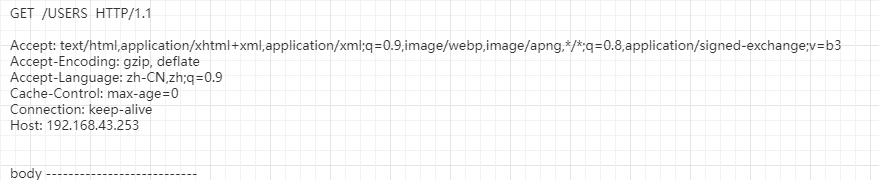
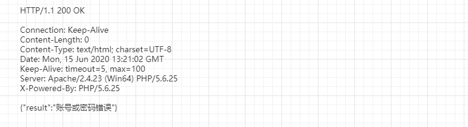
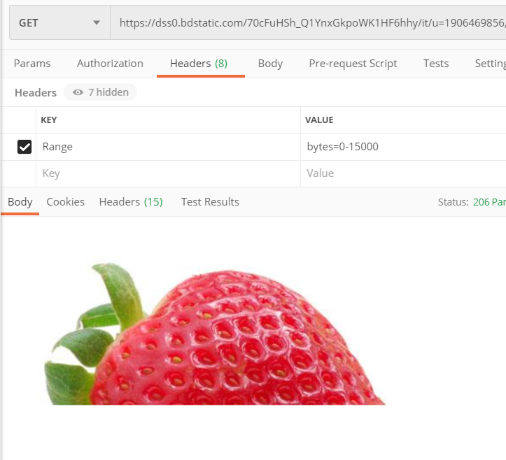

### HTTP 是什么

​	用于传输超文本的协议，以前是 HTML ，现在也包括 Web API 的数据。

### HTTP 的工作方式

​		最直观的方式：地址栏输入地址，然后页面就会显示结果

​		实际上是：在地址栏输入地址，回车后就会向服务器发送请求，然后服务器会进行响应，接着浏览器就会将响应的数据进行渲染出来


### URL -> HTTP 报文

- 示例：http://www.baidu.com/s?cl=3 
  - 其中 http 为协议类型，协议类型都有 http，ftp 等等，这些叫做应用层协议
  - //www.baidu.com 为服务器地址
  - /s 及其后面的为 路径 path

上面这个地址看起来是一个地址，但是浏览器拿到后会分为三块进行处理，处理完成后如下所示

- GET /s?cl=3  HTTP/1.1

  Host :www.baidu.com

  

### HTTP 的工作方式

#### 报文格式：Request



**其中第一行为：请求行 ，分别对应三个部分，**

- 第一部分 method ，他可以为 GET ,POST ,PUT 等，代表你的行为
- 第二部分：path ，路径，给服务器看到，定位
- 第三部分：版本

**第二行往下为 headers** 

​	其中左边是键，右边是值

**最后一行为 body**

​	在 get 中是不需要 body 的。而在 post 中则需要使用 body了，body 中是你需要向服务器提交的一些数据

#### 报文格式：Response



**其中第一行为状态行**

- 最开始为 http 的版本
- 中间是 status code，状态码
- 最后是状态信息 status message

**中间的是 headers**

​	左边是键，右边是值

**最后一行为 body**

​	服务器返回的数据

#### 关键内容

- **Request method**

   请求的方法：如 get，post，put 等

   - GET

      获取资源，不会携带 body

   - POST

      增加或者修改资源，有 body

      ```java
      //请求行
      POST /users  HTTP/1.1
      //headers
      Host:192.168.43.253
      Content-Type:text/html; charset=UTF-8
      Date:Mon, 15 Jun 2020 13:20:08 GMT
      //body
      {
          "name": "456",
          "password": "12345"
      }
      ```

   - PUT

      修改资源，只用来修改，有 body

      和 get 的共同点：他们都是幂等的。意思就是他们的结果是相等的。例如获取资源，获取10 次结果都是一样的，执行多次和执行一次是一样的

   - DELETE

      删除资源，没有body，具有幂等性，删除一次和删除多次没区别

   - HEAD

      和 GET 几乎一样，区别就是服务器不会返回 body。

- **Response status code**

   对结果做出类型化的描述，如果获取成功，内容未找到等

   - 1xx：临时性消息
   - 2xx：成功
   - 3xx：重定向，会进行二次请求，进行请求后会重新定向，接着就会重新请求请求，这个过程感知不到的，但是可以通过状态码来查看到。301 永久性迁移，302 临时迁移，304 内容没有改变
   - 4xx：客户端错误，如 400参数错误，404 资源未找到等
   - 5xx：服务器错误

- **header**

   **作用**：

   - HTTP 消息的元数据(metadata)

   -  HTTP 中的元数据：例如同 http 提交一个用户信息，信息中的 name，age 等都是数据本身，他们并不是元数据。元数据是消息的长度，消息的格式，返回的数据集，有没有压缩等。可以看做为数据的属性

   **比较常见的**

   -  Host：服务器地址，但是他不是用来寻址的。在浏览器将报文拼好之后，在发出请求之前就已经去进行服务器的寻址了，他会拿着域名通过 DNS 去寻找对应的 ip 地址。一个域名可能会对应多个 ip 地址。找到对应的目标服务器地址后就会将报文发给目标服务器。既然都找到服务器了，为啥还要发送 host 呢？因为一个 ip 地址下面可能会有多个服务器存在，他们对外的ip 都是一样的，当寻找到 ip 进行访问的时候就没办法转到具体的主机，这个时候就没办法正确的响应。所以需要传入 host，这个 host 一般传入的是服务器地址+TCP 端口。

   -  Content-Type/Content-Length：Body 的类型/长度(字节)

      - text/html

         ```java
         Content-Type:text/html; charset=UTF-8
         ```

      - application/x-www-form-urlencoded:普通表单,encoded URL 格式

         例如使用 Retrofit 的 post 请求是，需要使用 @FormUrlEncoded ，这种就是表单提交

         而且如果要传文件，还需要使用 @MultPart

      - multpiipart/form-data ; boundary = ********************

         多补发形式，一般用于传输包含二进制内容的多项内容

         使用 Retrofit 就需要使用 @MultPart

         boundary  是一个分界线，用来分界 header 值得各个属性和 body

      - application/json

         json 形式，用于 Web Api 的响应或者 POST/PUT 请求

         body 中是 json 格式

         使用这种方式进行post 请求的时候 body 中的内容可以为 json 格式，好处就是格式比较自由。

      - image/jped	

         图片上传         

   - Location：重新定向的目标 URL

   - User-Agent：用户代理

   - Range/Accept-Range：指定 Body 的内容范围

      如果你的服务器支持你分段取内容/下载 的时候，指定的范围

      例如：从百度上复制一个图片地址到 postMan 中进行求，就会加载出图片，接着你在查看他的 headers，就会找到 Accept-Ranges 这个值如下

      ```
      Accept-Ranges:bytes
      ```

      这表示他是支持分段加载的

      我们在请求这个图片的时候在header 中加上如下属性：

      ```
      Range:bytes=0-15000
      ```

      

      你就会发现这个图片只被加载了一般

      那么他又什么作用呢？1，断点续传，如果下载中断，那么下一次下载的时候只需要指定开始的位置和文件的大小即可。2，分段下载，可以用来多线程下载

   - Cookie/Set-Cookie：发送 Cookie /设置 Cookie

   - Authorization:授权信息

   - Accept：客户端能接受的数据类型

      ```
      Accept: text/html,application/xhtml+xml,application/xml;q=0.9,image/webp,image/apng,*/*;q=0.8,application/signed-exchange;v=b3
      ```

   - Accept-Charset:客户端能接受的字符集，如 utf-8

   - Accept-Encoding：客户端能接收的压缩编码类型，如 gzip

   - Content-Encoding：压缩类型,如 gzip

   - Cache-Control:no-cache，no-store，max-age，

      - Cache 和 Buffer 的区别：**Cache：**缓存,这个东西创建好我已经用完了，但是等会可能还会使用，所以我把这个东西继续放在这里。**Buffer：**缓冲，从来都是针对工作流的。有生产的上游和消费的下游，上游多生产一些，给下游稍后使用，这个叫做 Buffer，一般是两个原因，1，上游生产太快，下游跟不上，2，下游现在不需要，等会在进行消费。
      - no-cache：你可以缓存，当再次使用的时候需要问一下服务器资源是否失效。对于需要向服务器询问的有两类，1，资源是否改变：Etag，2，指定的日期是否到达：Last-Modified
      - no-store：不可以缓存
      - max-age：失效日期直接就可以直接使用
      - private/public：我们在请求的时候并不是从客户端直接连接到服务端，中间还会有一些节点，例如 网关等很多中间节点。private 和 public 的意思是告诉这些中间的节点是否要缓存这个消息，不只是本地机器可以缓存，中间的节点也可以帮助你进行缓存。public 就可以进行缓存，private 则不能缓存

   -  Last-Modified：服务器传过来文件的时候会告诉文件最近修改的日期，当你再次需要这个文件的时候就去请求服务器并且判断一下这个修改日期是否发生了改变，如果没有改变，则表示文件是最新的。

      - if-Modeified-Since：是否在什么之前改动过

   - Etag：对比文件本身，在从服务器获取文件的时候会附加得到一个 tag，下次获取的时候问一下服务器这个 tag 是否为最新的即可
     
     - if-Noe-Match：最新的资源还是这个 tag 吗

- body

   要发送给服务器的内容，和服务器返回的数据内容

   