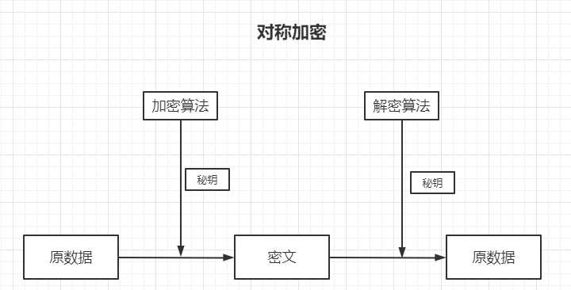
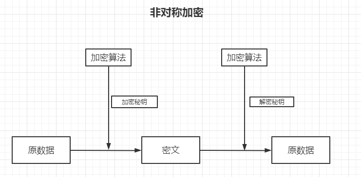

## 对称加密

-  使用秘钥和加密算法对数据进行转换，得到的无意义数据以为密文；使用秘钥和解密算法对密文进行逆向转换，得到的数据即为原数据。



​		 首先通过加密算法进行加密，然后在进行发送，目标收到密文后就会通过解密算法进行解密

- 对称加密对任何的二进制数据都可以进行加密。

- 经典算法：DES，AES

   由于 DES 秘钥太短，导致被弃用了，如果秘钥太短就会导致容易破解，为什么呢？如果暴力进行破解，秘钥的长度太短，就会导致这个秘钥很快被试完，然后就会被破解。

   现在主流都是 AES 。这两个都是对称加密。

   

## 非对称加密

使用公钥对数据进行加密得到密文；使用私钥对数据进行解密得到原数据。



和对称加密不同的是：在非对称加密中解密的时候用的还是加密算法，但是秘钥却不同了

例子：比如双方要进行通信，**通信的内容只有10 个字符，分别是 0,1,2,3,4,5,6,7,8,9。加密秘钥：对每个字符+4，解密秘钥：对每个字符 +6**

发送消息：110

加密：554

解密：5+6 = 11，拿到溢出的就是1，中间的也一样，最后面的就是 4+6 = 10，拿到后面溢出的就是 0，最后的结果就是 110。

**当然这个是禁不起推敲的，但是他可以解释非对称加密的核心原理，其中最主要的就是溢出**。如果不允许溢出，那么非对称加密就没办法玩了。

- 问题：如果 A 和 B 通过非对称加密来进行通信时没有任何问题的，但是问题在于怎么把秘钥发送给对方呢？

   

   如果 A 和 B 进行通信， A 有自己的加密密钥和解密密钥，同样的 B 也有。

   那怎么解决密钥传输的问题呢？ **答案就是将 加密密钥直接公布出去**

   **理解一下：**

   在通信的时候，A 把自己的加密密钥给 B，B 把自己的密钥给 A。

   A 给 B 发送一个消息，然后通过 加密密钥B 进行加密，然后发送给 B。B 接收到密文后就可以使用本地的解密密钥 B 进行解密。但是：**如果在发送的过程中被 C 截获了加密密钥和密文，那么他能解密吗？** 显然是不能的，因为加密和解密的密钥不是同一个，所以就算被截获也无法解密

- 在上面的问题中：

  **加密密钥对应着：公钥**

  **解密密钥对应着：私钥**

  **其中公钥是可以任意公布的，但是私钥不能对任何人公布且不能进行传输。**

- 延时用途

  **公钥能不能解私钥？**

  可以，首先通过 私钥进行加密，得到密文，接着使用公钥再次进行加密就可以得到原数据。这种方式叫做签名验证。

  **为什么呢？**

  既然先通过 公钥加密后在通过私钥加密就可以得到原数据。那同样的道理，通过私钥加密后在通过公钥加密就可以拿到原数据。

- 签名与验证

  由于私钥和公钥互相可解，因此非对称加密还可以用作数字签名技术

  签名：使用私钥对原数据进行加密算法(称为签名)**得到签名数据**

  验证：使用公钥对原数据进行加密算法(称为验证)**得到原数据**

  例如：我对某个文件进行签名后，得到签名数据。别人拿着一个看不懂的文件是可以通过公钥验证成功的就说明这个文件是由我亲自进行签名的。因为私钥只有我知道，没有人可以随意的造出一个可以刚好被公钥验证后是原数据的数据。

- 同时使用 加密和签名

  **还是上面的那个图**

  A 发送消息 到 B ，在这个过程中可以被 C 给拦截到，C  无法解密出原数据，但是 C 可以使用公钥重新加密一段数据发送给 B。

  例如 C发送：给我借 3万元。然后 B 收到后就使用私钥进行解密，发现是借钱，然后就会把钱打过去。这就会导致 B 的钱被骗走。

  **怎么解决呢：使用 加密+签名**

  A 发送消息的时候使用对方的公钥进行加密，然后使用自己的私钥对消息进行签名

  B 收到消息后，使用自己的私钥解密拿到原数据，还需要使用对方的公钥进行验证即可

  这样一来，即时 C 拿到数据，他可以通过公钥进行加密，但是他没办法通过私钥进行签名，所以这个问题就得到了解决。

- 经典算法:RSA , DSA

  RSA：可以用来加密解密，和签名

  DSA：专门被设计用来签名的。他的优势就是速度比较快。
  
- 优点：可以在不安全的网络上传输

- 缺点：计算复杂，因此性能上比对称加密差的很多

## 密钥和登陆密码

- 密钥(Key)

  密钥就是一个刚好契合密文的东西，通过这个密钥刚好就可以对密文进行解密

  - 场景：用于加密和解密
  - 目的：保证数据被盗是不会被人读懂内容

- 登陆密码(password)

  相当于就是一个通行口令，是一个身份验证。

  - 场景：用于进入网站或登陆时的身份验证
  - 目的：数据提供方对用户的数据进行保护，保证 “你是你” 的时候才提供权限

## Base64

​	将二进制数据转换成由64个字符组成的字符串，分别是 大小写26个字母，一共是52，然后是0 到 9，接着是 + / ，一共是64字符

- 什么是二进制数据

  非文本数据就是二进制数据，例如图片，音乐，电影等都是二进制数据。

- 用途

  - 让原数据具有字符串所具有的特性，如可以放在 URL 中传输，可以保持到文本文件，可以通过普通的聊天软件进行文本传输
  - 把原本人眼可读的字符串变成不可读的字符串，降低偷窥风险

- Base64 加密传输图片，可以更安全和高效，真的吗？

  - Base64 没有任何的安全可言，可通过码表逆向的得到元数据
  - Base64 的高效是假的。通过 Base64进行转换后的字符串会比原来的数据大，所以不会高效，相反他是低效的。

- 变种：Base58

  他把 Base64 中的字符给去掉了4个 ，0，O，I，l，+，/ ，这6个去掉了，因为这个容易混淆，+ / 去掉是因为双击复制。

- 变种：URL encoding

  将 URL 中的保留字符使用 % 进行编码，并且将 + 和 / 换成了另外两个字符

  例如:https://blog.csdn.net/哈哈哈

  上面这个网址，放在浏览器中回车，然后将复制出来粘贴到下面如下：

  https://blog.csdn.net/%E5%93%88%E5%93%88%E5%93%88

  因为浏览器不支持显示汉子，即时你看起来是汉子，实际上他都已经转换过了，

  如果在流量器中输入 中 国，注意中间有个空格，在浏览器中，会直接使用 + 代替，而且 / 也有独特的作用，这正是 在为什么需要将 + / 换成别的字符的原因。

  **目的：消除歧义，避免解析错误**

## 压缩与解压缩

- 压缩：把数据换一种方式来存储，以减小存储空间

- 解压缩：把压缩后的数据还原为原来的形式，以便使用

- 常见的压缩算法：DEFLATE，JPEG，MP3

  - DEFLATE：将一大堆东西归档，在归档的同时还可以进行压缩
  - JPEG：对图片进行压缩
  - MP3：对声音进行压缩

- 压缩属于编码吗？

  - 编码到底是什么意思？

    编码没有任何官方定义。例如：将 A 转为 B，并且还可以转回来，在这个转换的过程中没人任何信息的损失，且不会增加任何信息。这个就是编码

  压缩和解压缩是完全符合这个特点的。所以压缩也是属于编码的一种形式。

## 媒体数据的编解码

什么是图片，音频，视频的编解码

- 图片的编码：把图像数据协程 JPG,PNG等文件的编码格式

  其实就是把数据转为对应的格式，例如一个白点用 ffffff 表示，一个图片的宽高是 64*64，那么就会有 64 * 64 个 ffffff，

  要对这个 64*64 的图片进行编码可以指定的格式如：

  YS： ffffff=64*64；

  通过上面这个格式可以很清楚的看到，并且进行解码。

  当然上面只是一个简单的例子，好的算法可不是这么干的，但是意思到了就行了

- 图片的解码：把 JPG,PNG 等文件中的数据解析为标准的图像数据。
- 音频，视频的编解码：和上面的都差不多，有有损压缩和无损压缩等，无非就是音质不太好，当然图片也是可以的，例如微信表情现在 1mb，你就需要对图片进行压缩了，使用好的算法压缩后的图片会变小，但是看起来还是和原图差不多。

## 序列化

把对象(一般是在内存中的)转换成字节序列的过程

[java 序列化机制](https://blog.csdn.net/baidu_40389775/article/details/89096527?ops_request_misc=%257B%2522request%255Fid%2522%253A%2522159238429519724811827537%2522%252C%2522scm%2522%253A%252220140713.130102334.pc%255Fblog.%2522%257D&request_id=159238429519724811827537&biz_id=0&utm_medium=distribute.pc_search_result.none-task-blog-2~blog~first_rank_v1~rank_blog_v1-1-89096527.pc_v1_rank_blog_v1&utm_term=%E5%BA%8F%E5%88%97%E5%8C%96)

- 目的：让内存中的东西可以被存储和传输

- 序列化是编码吗？

  严格来说不是编码，编码是将 A 格式 转为 B 格式，并且可以任意相互转换，但是序列化是将内存中的对象序列化为字节的过程。其实都差不多，就看你怎么理解了。

## Hash

​	把任意数据转换成指定大小（通常很小）的范围的数据，他在主要作用是 摘要，数字指纹。比如说有 200 个人，通过 hash 对这 200 个人进行编号，如 001,002等，每个编号对应着一个人，这个编号就被称作为 hash值。

- 经典算法：MD5，SHA1,SHA256 等。

   hash 是有算法的，他会根据算法算出对应的 hash 值。在算出 hash 值得同时也要保证碰撞率非常低，碰撞率指的就是 hash 值不相同。还有就是不容易被破解。

   学过 java 的应该都知道 hashcode，可以重新 hashcode 方法进行自定义的 hash 值计算，如：

   ```java
   public int hashCode(String sources){
   	return sources.length()
   }
   //传入 哈好很 得到的 hash值：3
   //传入 哈哈	 得到的 hash 值：2
   ```

   通过上面这个简单的算法就可以得到对应的 hash 值。

   如果保证 hash 值得碰撞率非常低，这就需要一些比较高深的算法了。

- 实际用途

   - 数据完整性验证

      例如：从网上下载一个文件，这个文件的作者提供了一个 5g 的文件和一个 hash 值。然后你从网上下载，下载完成后在计算这个文件的 hash 值，如果和作者提供的一样，就说明文件没有损坏，否则的话就说明文件可能被篡改或者是损坏了。

   - 快速查找：hashCode 和 HashMap

      [HashMap 原理](https://blog.csdn.net/baidu_40389775/article/details/87190631?ops_request_misc=%257B%2522request%255Fid%2522%253A%2522159239973419724845010470%2522%252C%2522scm%2522%253A%252220140713.130102334.pc%255Fblog.%2522%257D&request_id=159239973419724845010470&biz_id=0&utm_medium=distribute.pc_search_result.none-task-blog-2~blog~first_rank_v2~rank_blog_v1-1-87190631.pc_v2_rank_blog_v1&utm_term=HashMap)

      [hashCode与equals的作用与区别](https://blog.csdn.net/baidu_40389775/article/details/87173379?ops_request_misc=%257B%2522request%255Fid%2522%253A%2522159239973419724845010470%2522%252C%2522scm%2522%253A%252220140713.130102334.pc%255Fblog.%2522%257D&request_id=159239973419724845010470&biz_id=0&utm_medium=distribute.pc_search_result.none-task-blog-2~blog~first_rank_v2~rank_blog_v1-3-87173379.pc_v2_rank_blog_v1&utm_term=HashMap)

      学过 java 的肯定都知道，重写 hashCode 后必须要重写 equals。这是为啥呢？

      HashMap的数据结构是数组+链表的形式，通过hashCode获取对应的下标，然后在判断是否需要保存数据。 在保存数据的时候是通过 key 来保存的，这个键必须是惟一的。在保存的时候，传入 key ，然后看源码就可以发现，他会计算 key 的 hash 值，然后就会判断这个 hash 是否是惟一的，也就是 hash 是否碰撞，如果没有，则就会以这个 hash 值为key ，将值保存起来，如果 hash 不是惟一的，就说明发生了 hash 碰撞。接着就会通过 equals 判断 key 的内容是否相等，如果不相等就保存进去，否则就不保存。

   - 隐私保护

      - 明文：有些网站保存用户信息的时候使用的是明文，就是 账号密码直接保存，在数据库中是可见的，如果数据库发送泄漏，那么别人就可以直接拿到你的账号密码。这种明文存储的坏处。

      - 不明文：什么是不明文呢？就是对密码进行 hash。登陆的时候只需要将密码进行 hash 比较相同后说明真确，否则则不行。如果数据库泄露，他拿到的也是一些 hash 值，并没有用处，所以说是安全的。

      - 加盐
   
        因为 hash ，md5 不可逆，拿到 hash 之后，无法逆向的算出原密码。但是那些非常闲的人就会将常用的密码进行hash，然后在比较 hash 值是否相等。
      
        正应为上面的这个原因，所以每个网站都有自己的盐，在保存密码的时候对 密码和盐进行 hash 值的计算，然后将对应的结果保存。这样一来就算拿到 hash 值，也不可能比较出原密码了。因为 hash 值是进过加盐的。
      
        所以每个网站的盐必须要严格的保护，不能泄露。
      
   - Hash 是编码吗
   
      不是，Hash 是不可逆的。他只是抽取对象的特征然后生成的一个 hash值。
   
   - Hash 是加密码？ MD5 是加密？
   
      其实都不是，加密指的是可逆的，加密后的数据进过计算后可以还原。但是 hash 和 MD5 都不不符合这个条件，你可以称他们为 **“不可逆的转换”**
   
   - Hash 和 非对称加密
   
      在 非对称加密中进行签名的时候，需要使用私钥对原数据进行签名，然后得到签名文件。但是如果这个文件非常大，那么这个签名文件也会非常大，就会造成非常大的浪费。
   
      因此将 hash 算法放在了签名中，流程如下： 
   
      使用 hash 算法对原数据进行特征的提取拿到 hash 值。然后通过私钥对 hash 值进行加密(用私钥加密叫做签名)，得到签名后的值。
   
      验证的时候：使用公钥进行验证，然后拿到 hash 值，然后在计算一下原数据的 hash 值，如果相同就说明成功，否则文件就被篡改了。
   
      使用这种方式，在发送消息的时候不管原数据多大，签名数据都会非常小。
   

## 字符集

一个由整数向**现实世界中的文字符号**的 Map

- 分支

  - ASCLL：128个字符，1字节

  - ISO-8859：对 ASCLL 进行扩充，1 字节

  - Unicode：13 万个字符，多字节

    - UTF-8：Unicode 编码分支
    - UTF-16：Unicode 编码分支

  - GBK/GB2312/GB18030

    中国自研标准，多字节，字符集+编码