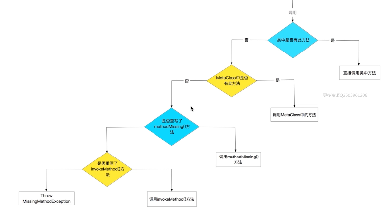

### 对象

​		首先创建一个 Person 类

```groovy
class Person {
    String name;
    Integer age;

    /**
     * 定义方法 ，def 代表的就是 object
     * @param years
     */
    def increateAge(Integer years) {
        this.age += years;
}
```

​	上面我们定义了一个 Person 类，注意他和 java 类还是有所不同的。区别如下：

​		1，groovy 中的所有类 都继承自 GroovyObject

​		2，groovy 中的所有 class ，方法等都是 public 类型的

​	接着看一下使用：

```groovy
def Person person = new Person(name: "张三", age: 20);
println "the name is ${person.name} ， the age is ${person.age}"
```

​	尽管没有构造方法，但是在 groovy 中依然可以进行赋值，而且是想给那个就给那个赋值

​	还有一点要注意：最后一行的打印语句使用的是 .name 和 .age , 在 groovy 中，无论直接使用 . 字段或者是 get / set 方法，最终调用的都是 get / set 。

### 接口

​		首先定义一个接口

```java
interface Action {
    void eat()

    void drink()

    void play()
}
```

​		其实这和 java 中的接口基本一样，没有多大区别 。但是需要注意的是在 groovy 中定义的接口方法不能是 protected 类型的。其他的基本都一样

### trait

​		我感觉 trait 是介于接口和抽象之间的。他内部可以定义抽象方法，也可以定义具体的实现方法。如下：

```java
trait DefaultAction {
    //抽象类型
    abstract void eat()
    //空实现
    void pay() {
        println 'i can pay'
    }

}
```

​		如果你有一个接口，接口中的方法非常多。而实现类只用到了一个特定的方法，这种情况就会造成代码非常臃肿，这种情况就可以使用 trait。只需要将特定的方法抽象即可其他的默认实现即可。

### 元编程

​		说白了就是运行时期的一个策略。例如调用一个对象的某一个方法，如果这个方法不存在，编译器也不会报错，而是通过一系列的查找最终确定是调用还是抛出异常，下面就是简化后的流程：




​			这里我们来实现一下这个过程，我们从底部往上看，这样比较简单，首先还是一个 Person类：

```groovy
class Person {
    String name;
    Integer age;
}
```

​		这里并没有任何方法，我们创建一个对象，并调用一个不存在的方法，如下：

```groovy
def Person person = new Person(name: "张三", age: 205);
person.cry()
```

​		调用 cry 方法后编译器没有任何报错，但是运行时会报错如下：

```groovy
Caught: groovy.lang.MissingMethodException: No signature of method: variable.Person.cry()
```

​		下面在 Person 中重写一个方法 invokeMethod ，如下：

```groovy

/**
 * 一个方法找不到时 ，会调用这个方法
 * @param name
 * @param Object
 * @return
 */
def invokeMethod(String name, Object) {
        println "the name is ${name} ， the age is ${age}";
}
```

​		接着在运行一下：

```
the name is cry ， the age is 205
```

​		就会发现没有报错，虽然没有 cry 方法，但是 invokMethod 方法被执行了。**当某个方法找不到的时候这个方法就会被执行。**

​		接着继续重写一个方法：methodMissing

```groovy
   /**
     * 比 invokeMethod 优先级高，如果重写了此方法，则 invokeMethod 不会调用
     * @param name
     * @param args
     * @return
     */
    def methodMissing(String name, Object args) {
        println "this missing ${name}"
    }
```

​	结果如下：

```groovy
this missing cry
```

​	**这个方法会在 invokeMethod 之前执行，如果执行这个方法，invokeMethod 不会被带调用，这个方法在 倒着第二层**

**MetaClass**

​	metaClass 元类，通过它我们可以给某一个类动态的添加字段，方法，静态方法。下面分别实现一些

​	**动态添加属性**

```groovy
Person.metaClass.sex = 'male' //添加属性
def Person per = new Person(name: "张三", age: 205);
per.sex = 'female'
println "the new sex is:" + per.sex;
//结果：the new sex is:female
```

​	**动态添加方法**

```groovy
//添加属性
Person.metaClass.sex = 'male'
//为类动态的添加方法
Person.metaClass.sexUpperCase = {
    ->
    //将 sex 转为大写，这个方法 String 中的方法
    sex.toUpperCase()
}
def Person per = new Person(name: "张三", age: 205);
//调用动态添加的方法
println per.sexUpperCase()
//结果：MALE
```

​	**动态添加静态方法**

```groovy
Person.metaClass.static.createPerson = {
    String name, Integer age ->
    	//创建对象
        return new Person(name: name, age: age)
}
Person pe = Person.createPerson("张三",20)
println pe.name + "----" + pe.age
//结果 :张三----20
```


通过这种动态的注入有什么好处呢：例如你你使用了某个第三方库，想要添加某些方法，这个时候就可以使用这种方法来实现，而不用新建一个类去继承他。特别是某些类被修饰为 final ，那我们更不可能去修改他的内容了。但是通过这种方法可以，如下：

```groovy
//注意，这里需要初始化一下，否则无法确定其类型
String.metaClass.lv = '';
String string = "String"

string.lv = "我是自定义属性"
println string.lv
//结果：我是自定义属性
```


当然，这个动态创建的方法等都不是全局的，在别的类中如果用就需要重新注入。的确，groovy 提供了设置全局的方法，下面通过一个例子来看一下：

首先，还是一个 Person 类。

```groovy
class Person {
    String name;
    Integer age;
}
```

接着是 PersonManager 类

```groovy
/**
 * PerSon 管理类
 */
class PersonManager {
    static Person createPerson(String name, int age) {
        //调用 Person 不存在的方法
        return Person.createPerson(name, age)
    }
}
```

上面调用一个不存在的方法。

```groovy
class ApplicationManager {
    static void init() {
        //设置全局
        ExpandoMetaClass.enableGlobally()
        //创建 Person 静态方法
        Person.metaClass.static.createPerson = {
            String name, Integer age ->
                return new Person(name: name, age: age)
        }
    }
}
```

在 init 方法中设置全局，动态注入了一个静态方法，获取 Person 对象。最后看一下使用：

```java
class Entry {

    public static void main(String[] args) {
        println '应用程序正在启动'
        //初始化
        ApplicationManager.init()
        println '应用程序初始化完成'

        def person = PersonManager.createPerson("张三", 20)
        println person.name + "----" + person.age
    }
}
```

最终结果如下：

```java
应用程序正在启动
应用程序初始化完成
张三----20
```

可以看到通过动态注入的静态方法创建了 Person 对象

