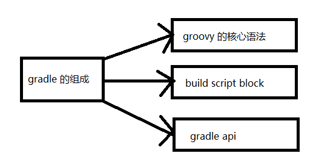
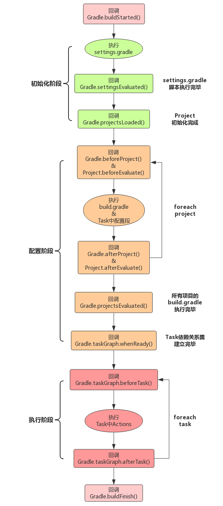
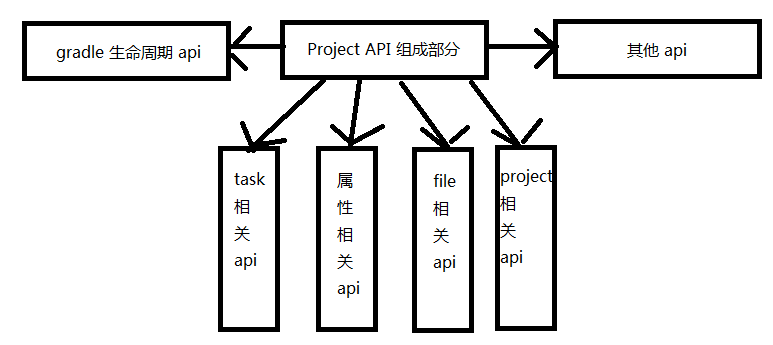

### Gradle 是什么？

​		gradle 是一个基于 Apache Ant 和 Apache Maven 概念的项目自动化构建工具，他使用一种 基于 groovy 的特定领域语言来声明项目的设置，而不是使用传统的 XML 。gradle 就是工程的管理，帮我们做好了依赖，打包，部署，发布，各种渠道的差异管理等工作	

### Gradle 的组成



​		gradle 完全使用的是 groovy 的语法。

### Gradle 的优势

​		非常灵活，可以自行去扩展。一款最新的构建工具，使用它逼格更高。丰富的第三方插件，项目构建灵活性更高，Maven ，Ant 能做的 Gradle 都能做，Gradle 能做的 它们不一定能做

### Gradle 生命周期

  


​	Gradle 生命周期回调方法的时机：

```java
/**
 * 配置阶段开始前回调监听
 */
this.beforeEvaluate {
}

/**
 * 配置阶段完成后回调监听
 */
this.afterEvaluate {
    println '配置阶段完成...'
}


/**
 * build 执行完毕
 */
this.buildFinished {
  
}
/**
 * 监听 task 的创建
 */
tasks.whenTaskAdded { task ->
    task.ext.srcDir = 'src/main/java'
}

/**
 * 监听某个task开始执行，结束执行
 */
gradle.taskGraph.addTaskExecutionListener(new TaskExecutionListener() {
    @Override
    void beforeExecute(Task task) {

    }

    @Override
    void afterExecute(Task task, TaskState state) {

   }
})
```

```java
//其他的监听
this.gradle.addBuildListener(new BuildListener() {
    @Override
    void buildStarted(Gradle gradle) {
		//在构建启动时调用
    }

    @Override
    void settingsEvaluated(Settings settings) {
		//在加载和计算构建设置时调用,设置对象已完全配置完成可用来加载构建项目
    }

    @Override
    void projectsLoaded(Gradle gradle) {
		//从设置创建构建的项目时调用。这些项目都没有评估
    }

    @Override
    void projectsEvaluated(Gradle gradle) {
		//构建的项目评估后调用
    }

    @Override
    void buildFinished(BuildResult result) {
		//构建完成时调用
    }
})

```

​	

​	Gradle 的生命周期分为三个阶段，初始化阶段，配置阶段，执行阶段。

- 初始化阶段：通过 setting.gradle 来判断项目有哪些项目需要初始化，加载需要被初始化的项目的build.gradle 文件，并为每个项目创建 project 对象。如果你的项目有好几个模块，你可以打开 setting.gradle ，每个模块的名字都在里面，如果删除某个模块的名字，则这个模块不会被构建。

  ```groovy
  include  ':app', ':core', ':detegateManager', ':tabHome', ':tabShop', ':tabDiscover', ':tabMall', ':tabMine', ':ui'
  rootProject.name='CarSteward'
  ```

- 配置阶段，执行各个项目下的 build.gradle 脚本处理依赖等。完成 project 的配置，构造 Task 链表(这里的链表指的是存在依赖关系的 task 的集合，不是数据结构链表)

- 执行阶段

  根据 task 链表执行某一个特定的task，这个被 task 所以来的其他task都会被先执行


### Gradle 中的 Project

​		对于 gradle 来说，每一个模块都是一个 project ，对于他来说不存在什么 Library 等模块。他们都是一个项目，如下：


​		对于 android 来说 这是一个项目，里面有很多模块，但是 gradle中每个模块也相当于一个 project。我们可以通过一个命令来查看一下：gradlew projects

```java
Root project 'CarSteward'
+--- Project ':app'
+--- Project ':core'
+--- Project ':detegateManager'
+--- Project ':tabDiscover'
+--- Project ':tabHome'
+--- Project ':tabMall'
+--- Project ':tabMine'
+--- Project ':tabShop'
\--- Project ':ui'
```

​		可以看到有一个 Root project ，其他的则是子project。从这个结构可以看出来 gradle 是以树的结构来管理所有的 project。但是这个树只有两层，因为我们不可能在 module 中新建一个模块

​		Project 是脚本的核心，每个 project 的初始化都是通过 build.gradle 文件，所以构建的核心脚本都要编写在 build.gradle 中

​		每一个模块都必须有一个 build.gradle 文件，否则他就不会被任务是一个 project。

​		根 Project 的作用就是用来管理所有的子project，他提供了一系列的 api 来进行管理。

​		子 Project 则是用来对应输出的，一个子 project 对应一个输出，例如上面的 app project就对应着一个 apk 的输出，而 core 等其他的就对应一个 aar 的输出 。如果是 java 的项目，则对应的就是 jar 的输出。

### Project Api



- project 相关的api

  让当前 project 可以操做他的父 project 以及管理它子 project 的能力

  ```groovy
  def getProjects() {
      println "------------"
      //获取所有project 并遍历
      this.getAllprojects().eachWithIndex {
          Project entry, int i ->
              if (i == 0) {
                  println "Root Project ${entry.name}"
              } else {
                  println "+--- Project ${entry.name}"
              }
      }
      println "------------"
  }
  this.getProjects()
  //结果：
  ------------
  Root Project CarSteward
  +--- Project app
  +--- Project core
  +--- Project detegateManager
  +--- Project tabDiscover
  +--- Project tabHome
  +--- Project tabMall
  +--- Project tabMine
  +--- Project tabShop
  +--- Project ui
  ------------
  
      
  //获取所有子 project 并遍历
   this.getSubprojects().eachWithIndex {
          Project entry, int i ->
              println "+--- Project ${entry.name}"
  }
  
  //获取父 project，需要在子 project 中执行
  def getParentProject() {
      println "----" + this.getParent().name
  }
  //获取 RootProject
  println "----" + this.getRootProject().name
  ```

  注意：**不管是project 中的方法也好，代码也好都是在配置阶段执行的。**

  ```java
  //获取指定的 project，第一个参数为路径，第二个为闭包
  project("core") {
      Project project ->
          println project.name //获取 name
          apply plugin: 'com.android.library' //指定 plugin
          group 'com.123'  //指定 group
          version '1.0.0' //指定 版本号
          dependencies { //指定 依赖
  
          }
          android { //指定 android
  
          }
  }
  ```

  我们可以直接在RootProject 中获取子 Project，并且调用一些方法，如上，可以完全将 core 中的配置移到 RootProject 中也没有任何问题。但是一般都不会这样做。

  ```groovy
  //配置当前结点工程和所有子 project
  allprojects {
      version '2.0.0'
      group 'com.ww.com'
  }
  println project('core').group
  println project('core').version
  //结果：
  com.ww.com
  2.0.0
  
  //不包括当前结点工程，只包含他的子 project
  subprojects {
      version '2.0.0'
      group 'com.ww.com'
  }
  ```

  使用 allprojects 就可以替换当前及子 project 中的配置。

- task 相关 api

  为当前的 project 提供了新增 task  以及使用当前 project 中 task 的能力

  task 内容有点多，需要单独提出来

- 属性相关的 api

  gradle 本身提供了一些属性，**属性 api 让我们在 project 中可以添加额外的属性能力**

  ```java
  public interface Project extends Comparable<Project>, ExtensionAware, PluginAware {
  
      /**
       * 默认的项目构建文件名,所以我们的自 project 中才必须有 build.gradle
       */
      String DEFAULT_BUILD_FILE = "build.gradle";
  	/**
       * 分割符
       */
      String PATH_SEPARATOR = ":";
      
      /**
       * 每个 project 都有一个build 文件夹，就是下面这个属性，文件夹中则是输出
       */
      String DEFAULT_BUILD_DIR_NAME = "build";
  	/**
  	 * 这个字段是一个文件，这个文件中定义的所有属性都是全局的，在所有的.gradle 文件中
  	 * 以使用，注意只能是 key value 类型
  	 */
      String GRADLE_PROPERTIES = "gradle.properties";
  
      ......
  }
  ```

  扩展属性：

  在 RootProject 中定义扩展属性，如下： 

  ```groovy
  subprojects {
     ext{
          compile_sdk_version = 29
       	min_sdk_version = 15
        	target_sdk_version = 29
      	version_code = 1
      	version_name = APP_VERSION
      	build_tools_version = "29.0.2"
      }
  }
  ```

  通过这种方式就可以子 project 中直接使用这些属性了。只需要定义一次，就可以定义在所有的子 project 中。

  但是这种有一个缺陷，虽然看起来我们只定义了一次，但是本质上 gradle 会为每一个project 都定义这些属性，我们只是感觉操作方便了一些而已。

  改进一哈：

  直接在 RootProject 中定义 ext。而不是定义在 subprojects 中。这样子工程就可以直接通过获取 rootProject来获取这些属性了。

  ```
  ext{
          compile_sdk_version = 29
       	min_sdk_version = 15
        	target_sdk_version = 29
      	version_code = 1
      	version_name = APP_VERSION
      	build_tools_version = "29.0.2"
  }
  ```

  子工程的获取：

  ```java
  compileSdkVersion this.rootProject compile_sdk_version
  ```

  gradle 规定父类中所有的属性都可以被子类继承，所以这里就可以这样写：

  ```groovy
  compileSdkVersion compile_sdk_version
  ```

  但是如果将所有的扩展属性都定义在 RootProject 中，感觉会非常臃肿，所以我们可以新建一个 config.gradle 文件，将 扩展属性定义在里面，然后在 RootProject 中引入即可，如下：

  ```groovy
  //从根工程下寻找 config.gradle 文件
  apply from: file('config.gradle')
  ```

  我们还可以再 gradle.properties 文件中定义属性，但是在这个文件中只能定义 key value 类型的属性，所以他的使用有些限制。使用如下：

  ```java
  
  android.useAndroidX=true
  android.enableR8=false
  isDebug=false
  # 版本
  APP_VERSION=1.0.3
  ```

   如上面是引入 AndroidX，关闭 R8。下面的 isDebug 是我们自定义的，定义完后我们就可以在任何的 .gradle 文件中使用 isDebug。如下所示：

  ```java
  if (isDebug.toBoolean()){
      apply plugin: 'com.android.application'
  }else {
      apply plugin: 'com.android.library'
  }
  ```

- file 相关的 api

  这个 file 主要用于操作当前 project 下文件的处理

  ```java
  println getRootDir().absolutePath //获取根工程路径
  println getBuildDir().absolutePath //获取 build 路径
  println getProjectDir().absolutePath //获取工程的路径
  
  //结果：
  C:\Users\Administrator\Desktop\345\Project\CarSteward
  C:\Users\Administrator\Desktop\345\Project\CarSteward\build
  C:\Users\Administrator\Desktop\345\Project\CarSteward
  ```

   上面就是获取路径

  ```java
  //文件定位，以当前的 project 来寻找文件
  def getContent(String pach) {
      try {
          //返回文件内容
          return file(pach).text
      } catch (GradleException e) {
          println "file not found..."
      }
  }
  
  println getContent("config.gradle")
  //结果：
  ext{
  
      compile_sdk_version = 29
      min_sdk_version = 15
      target_sdk_version = 29
      version_code = 1
      version_name = APP_VERSION
      build_tools_version = "29.0.2"
  
  }
  ```

  可以看到已经找到 config.gradle 并且将他的内容全部打印出来了。file只能定位一个文件，但是 files 可以定位多个。

  ```java
  //copy
  //将 app 下的签名文件 copy 到 根工程的 build 目录下
  copy {
      from(file('CarSteward.jks'))
      into getRootProject().getBuildDir()
  }
  //copy 文件夹
  copy {
      from(file('build/outputs/'))
      into getRootProject().getBuildDir().path + "/outputs/"
  }
  
  //copy 文件夹
  copy {
      from(file('build/outputs/'))
      into getRootProject().getBuildDir().path + "/outputs/"
      exclude {
          //可以配置哪些不需要copy
      }
      rename {
          //可以修改 name
      }
  }
  ```

  注意 copy 完后需要刷新一下。。。

  ```groovy
  //对文件树进行遍历
  fileTree('build/') {
      FileTree fileTree ->
          fileTree.visit {
              FileTreeElement element ->
                  println element.file.name
                  // copy 内容
                  copy {
                      from element.file
                      into getRootProject().getBuildDir().path + "/"
                  }
          }
  }
  ```

  

- gradle 生命周期的 api

  这个在上面已经说过了

- 其他 api

  例如对 project 添加依赖，添加配置，引入外部文件等等

  **buildscript** 

  其实最重要的就是 buildscript 方法了，如下：
  
  ```
  //buildscript 中就是依赖配置的核心方法
  buildscript {
      ScriptHandler scriptHandler ->
          //配置工程的仓库地址
          scriptHandler.repositories {
              RepositoryHandler repositories ->
                  repositories.jcenter()
                  repositories.mavenCentral()
                  repositories.mavenLocal()
                  repositories.ivy {}
                  repositories.maven {}
          }
          //配置工程中插件的地址
          scriptHandler.dependencies {
          }
}
  ```

  buildscript 方法接收一个闭包参数，查看源码可以知道这个闭包的参数是 ScriptHandle ，

  而 ScriptHandle 有一个 repositories 方法，我看看一哈源码：
  
  ```java
  	/**为脚本依赖项配置存储库。对{@link执行给定的闭包
  	   这个处理程序的RepositoryHandler}。{@link RepositoryHandler}作为闭包的闭	   包传递给闭包委托。
  	 */
    void repositories(Closure configureClosure);
  ```

  在这个方法中为脚本依赖配置存储库。具体的实现在闭包中，我们也可以看到他的参数是一个闭包。由注释可以看到闭包的参数为 RepositoryHandler。下面看一哈这个类
  
  ```java
  public interface RepositoryHandler extends ArtifactRepositoryContainer {
      MavenArtifactRepository jcenter();
      MavenArtifactRepository mavenCentral(Map<String, ?> args);
      MavenArtifactRepository mavenCentral();
      MavenArtifactRepository mavenLocal();
      MavenArtifactRepository google();
      MavenArtifactRepository maven(Closure closure);
}
  ```

  这里我列举了几个非常常见的，是不是非常熟悉。我们为脚本依赖配置的存储库都是在这里进行引入的，一般使用比较多的就是 jcenter，google，maven 等。注意 maven 还可以传入闭包，意味着他可以进行深入的配置，其实它内部可以配置，地址，name，账号密码等。

  最上面 buildscript 中的代码写的是非常容易理解的，我们将参数都列举了出来，并且调用的时候都使用了参数进行调用，其实我们可以完全进行简写，当然，前提是你对 groovy 的闭包非常熟练。如下所示：
  
  ```
  buildscript {
      ScriptHandler scriptHandler ->
          //配置工程的仓库地址
          repositories {
              RepositoryHandler repositories ->
                  jcenter()
                  mavenCentral()
                  mavenLocal()
                  ivy {}
                  maven {}
          }
          //配置工程中插件的地址
          scriptHandler.dependencies {
  
          }
}
  ```
  
  可以看到这里直接是调用方法，前面并没有使用 参数.方法()，这是为啥呢？还记得 owner 吗，默认情况下他指的是当前类对象，单是如果闭包嵌套的话他指的就是闭包，然后 delegate 默认和 owner 是一样的。这里如果没有使用参数调用的话默认使用的就是 delegate 了。
  
  其实闭包只有一个参数，也可以不用写的。如下
  
  ```groovy
  buildscript {
          //配置工程的仓库地址
          repositories {
                  jcenter()
                  mavenCentral()
                  mavenLocal()
  //                ivy {}
  //                maven {}
          }
          //配置工程中插件的地址
  //        scriptHandler.dependencies {
  //
  //        }
  }
  ```
  
  是不是非常熟悉，这就是 as 自动为我们创建的东西，而刚才我们只是了解了一下他的过程而已，至于这里我注释了几行代码，是因为 ivy 和 mave 参数都是闭包，要运行的话必须传入闭包，所以我给注释掉了。下面的 dependencies 其实也一样。下面来看一下 dependencies
  
  scriptHandler 中还有一个 dependencies 方法。
  
  ```java
  / ** 
    *配置脚本的依赖项。针对此处理程序，针对{@link DependencyHandler}执行给定的关闭。    {@link DependencyHandler}作为闭包的委托传递到闭包。 
    * 
    * @param configureClosure闭包用于配置依赖项。 
    * /
   void dependencies(Closure configureClosure);
  ```
  
  可以看到这是用来配置脚本依赖的(**注意是脚本依赖，也就是 gradle 用到的插件依赖**)，传入一个闭包，闭包的参数为 DependencyHandler。
  
  所以这里定义的插件是给 gradle 使用的。并非是应用程序。
  
  ```java
     dependencies {
          classpath 'com.android.tools.build:gradle:3.5.2'
          classpath 'com.jakewharton:butterknife-gradle-plugin:10.1.0'
          // 美团多渠道打包插件
          classpath 'com.meituan.android.walle:plugin:1.1.6'
          //bugly
          classpath "com.tencent.bugly:tinker-support:1.2.1"
      }
  ```
  
  如上面这些，都是给 gradle 使用的，关于 classpatch 我在 DependencyHandler 中并没有发现这个方法，但按住 ctrl 点击这个方法又看到他是 DependencyHandler 中的方法，点击去后跳的位置是错误的，不晓得是为啥。。。。
  
  **dependencies**
  
  应用程序使用的 dependencies ，我们看一下 dependencies 下都能配置什么内容，点击去看一下你就会发现他是 Project 类下的方法：
  
  ```java
  / ***
      <p>配置此项目的依赖项。
      * 
      * <p>此方法针对此项目的{@link DependencyHandler}执行给定的关闭。 {@link 
      * DependencyHandler}作为闭包的委托传递到闭包。 
      * 
      * <h3>示例：</ h3> 
      *请参见{@link DependencyHandler}文档
      *
      * @param configureClosure闭包以用于配置依赖项。
      * /
      void dependencies(Closure configureClosure);
  ```
  
  查看参数是一个闭包，这个闭包可以用于配置依赖项，参数为 DependencyHandler。
  
  使用如下：
  
  ```java
  dependencies {
      implementation project(path: ':core')
      implementation project(path: ':detegateManager')
      implementation 'com.tencent.bugly:crashreport_upgrade:1.4.2'
      implementation 'com.tinkerpatch.sdk:tinkerpatch-android-sdk:1.2.14'
      implementation 'com.tencent.bugly:nativecrashreport:3.7.1'
  }
  ```
  
  在 RootProject 的 gradle 中 dependencies 是为gradle添加插件的，而 子 project 则是给应用程序添加依赖。
  
  如果项目中的依赖太多的话就会有可能导致依赖冲突。如一个第三方库依赖了别的第三方库，而指不定还有些库也依赖了别的第三方库。如果第三方库相同就会导致依赖冲突。有冲突后编译器就会报错。
  
  ```java
  api('com.joanzapata.iconify:android-iconify-fontawesome:2.2.2') {
          exclude group: 'com.android.support'
  }
  ```
  
  例如上面的 iconify 库，编译器报了依赖冲突，查看后发现是 suport 的冲突，可以使用  exclude 方法来解决排除掉 support 库即可。还有一种方式如下：
  
  ```java
  exclude module : 'com.android.support'
  ```
  
  如果你不想使用第三方库中所依赖的库，可以使用以下关键字禁用
  
  ```java
  api('com.joanzapata.iconify:android-iconify-fontawesome:2.2.2') {
          exclude group: 'com.android.support'
          transitive false
  }
  ```
  
  将 transitive 设置为 false 后当前项目就不会调用到库中所依赖的库了。

------

​	到这里 Gradle 的基础就说的差不多了。已经常用的 api 使用等，关于 task 将会在下一篇中讲解。而且他是非常重要的！！！