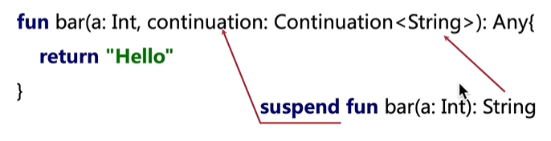

协程是什么？

​		其实就是一套由 Kotlin 官方提供的线程 API 。是程序运行时的东西。

### 协程怎么使用

在项目中配置对 Kotlin 的协程的支持

```kotlin
//核心库
implementation "org.jetbrains.kotlinx:kotlinx-coroutines-core:1.3.1" 
//依赖当前平台对应的库
implementation "org.jetbrains.kotlinx:kotlinx-coroutines-android:1.3.1"
```

Kotlin 协程是以官方扩展库的形式进行支持的。而且 核心库 和 平台库的版本应该保持一致。

- 核心库中包含的代码主要是协程的公共 API 部分，有了这一层的代码，才使得协程在各个平台上的接口得到统一
- 平台库中包含的代码主要是协程框架在具体平台的具体实现方式。因为多线程在每个平台上都是有差异的。

### 开始使用协程

```kotlin
//launch 函数的含义：我要创建一个新的协程。并且在指定的线程上运行它
CoroutineScope(Dispatchers.IO).launch {
	println(Thread.currentThread().name)
}
```

可嵌套使用

```kotlin
CoroutineScope.launch(Dispatchers.IO) {
    val image = getImage(imageId)
    launch(Dispatch.Main) { //将会运行在 Main 线程
        avatarIv.setImageBitmap(image)
    }
}
```

如果只是嵌套，这并没有多少作用。协程有一个非常好用的函数 ：withContext。这个函数可以切换到指定线程，并在闭包中的逻辑执行完后自动把线程切回去继续执行

```kotlin
CoroutineScope(Dispatchers.Main).launch {
    println(Thread.currentThread().name)
    val bitmap = withContext(Dispatchers.IO) {  //切换到 IO 线程
        getImage()
    }
    iv.setImageBitmap(bitmap)		//主线程更新
}
```

由于可以自动切回来，我们甚至可以把 withContext 放进一个单独的函数里面，如下：

```kotlin
 suspend fun getImage(): Bitmap = withContext(Dispatchers.IO) {
    //.....
}
```

但是要注意 **suspend** 关键字。这个关键字后面在说，他中文意思是 暂停 或者 可挂起。

### 案例1：

通过协程下载一张网络图片，并且显示出来

```kotlin
 override fun bindView(view: View) {
        val iv = view.findViewById<AppCompatImageView>(R.id.delegate_shop_iv)
        btn = view.findViewById(R.id.delegate_shop_btn)

        btn.setOnClickListener {
            CoroutineScope(Dispatchers.Main).launch {
                val bitmap = getImage()
                iv.setImageBitmap(bitmap)
            }
        }
    }

private suspend fun getImage(): Bitmap = withContext(Dispatchers.IO) {
    OkHttpClient().newCall(Request.Builder()              			.url("https://dss0.bdstatic.com/6Ox1bjeh1BF3odCf/it/u=4256581120,3161125441&fm=193")
                           .get()
                           .build())
    .execute().body()?.byteStream().use {
        BitmapFactory.decodeStream(it)
    }
}
```


### suspend

协程指的就是 launch 中的代码，那么协程中的挂起是什么呢？ 其实挂起的对象就是协程

当执行在 launch 中时，在执行到某一个 suspend 函数时，这个协程就会被挂起。让

时间静止，兵分两路，来看一下到底是怎么回事，这两路分别是协程和线程(UI线程)

#### 线程

​	当代码执行到协程中的 suspend 函数后，就暂时不会执行协程代码，而是跳出协程的代码块。继续向下执行。

```kotlin
CoroutineScope(Dispatchers.Main).launch {
    val bitmap = getImage()	//挂起
    iv.setImageBitmap(bitmap)
}
ToastUtils.show("哈哈哈哈")
```

​	当主线程执行到 getImage 时，会跳出协程，执行下面的 Toast。

​	这个协程本质上会往主线程 post 一个 Runnable。然后继续执行协程内部代码。当执行到被挂起的时候，Runnable 会提前结束，线程继续执行其他的东西。而协程则会被挂起。所以接下来看一下协程

#### 协程

​	主线程在执行到 suspend 的时候会被掐断，接下来协程会继续往下执行。不过是执行在指定的线程。通过 withContext 传入的 Dispatchers.IO 所指定的 IO 线程

​	Dispatchers 调度器：将协程限制在一个特定的线程执行，或者将他分派到一个线程池。

​	日常使用的调度器：Main：Android主线程，IO：网络IO，Default：适合CPU 密集的任务，比如计算。

​	协程从 suspend 开始执行在指定的线程，执行完之后，就会自动将我们把线程切回来。

​	切回来就是切换到原本的线程，如原本是运行在主线程的，切回来后就会继续在主线程执行。也就是说协程会帮我们 post 一个 Runnable 到主线程。

通过上面两个角度，可以得到一个解释：协程在执行到有 suspend 的时候就会被挂起，而这个挂起，则就是切个线程；只不过挂起的执行完后会重新切回他原来的线程

这个切回来的动作，在 Kotlin 中叫做 resume ，恢复

### suspend 的挂起

​	挂起函数，就是以 suspend 修饰的函数，挂起函数只能在 **其他挂起函数**或者协程中使用

​	这是一个关键字。但是他并不是正真的挂起。你可以写一个带 supend 的函数，运行后就会发现并没有挂起，为啥没有被挂起，应为它不知道往哪切，需要我们来告诉他。如下：

```
    suspend fun get() = withContext(Dispatchers.IO) {
       
    }
```

​	withContext 本身就是一个挂起函数，接收一个  `Dispatcher`  参数，他必须依赖于这个参数，才能知道协程需要被挂起。接着才会切换到别的线程

​	所以 suspend 起不到任何挂起函数的作用，挂起函数是 kt 的协程帮我们做的

### suspend 的意义

​	为啥 suspend 关键字没有实际的挂起，但 Kotlin 为啥要把它提供出来？

​	因为他本来就不是用来操作挂起的。也就是说切线程依赖的是函数中的代码，而不是这个关键字。所以这个关键字只是用来提醒。

​	如果你创建一个 suspend 函数，但是内部不包含正真的挂起逻辑，编译器会给你提醒： Redundant 'suspend' modifier ，这个关键字是多余的

​	因为这个函数并不会发生挂起，那这个 suspend 只有一个效果：限制此函数只能在协程中被调用，如果在非协程中调用，则编译不会通过

​	所以，创建一个 suspend 函数，为了让他包含挂起，要在内部直接或者间接调用 Kotlin 自带的 suspend 函数，这个时候函数才是有意义的

### 什么时候需要自定义 suspend 函数

​	如果你某个函数比较耗时，也就是需要等，就可以把它写成 suspend 函数

​	给函数加上 suspend 关键字，然后在 withContext 把函数内容包住就行了。当然并不是只有 withContext 来辅助我们实现自定义的函数，如 delay ，他的作用是等一段时间后在继续往下执行代码。

```kotlin
suspend fun get() {
	delay(5) //挂起
}
```

#### 挂起函数的类型

```
suspend fun foo(){}
```

如果没有 suspend 这个函数的类型就是 ()-> Unit 

但是加了 suspend 后，函数的类型为 suspend()-> Unit

只要你知道函数的类型是什么，然后在前面加一个 suspend 就是挂起函数的类型

```
suspend fun bar(a:Int):String{
        return "Hello"
}
```

挂起函数 bar 的类型为 suspend(Int)->String

**还记得 suspend 为什么只能在 挂起函数或者协程中调用吗？**

​	因为所有的挂起函数都有一个 Continuation<Unit> 参数，Continuation 是从哪来的呢，suspend 关键字会隐含在 函数的参数列表的最后加一个 Continuation 参数。Continuation 的泛型参数是由函数的返回值来决定的



上面的 挂起函数 bar 最终的样子如上图，他会在参数列表的最后加一个参数，并且返回值成为了 Any。这个 Any 有两种情况，如果这个函数没有真正的挂起，比如 bar函数，foo 函数。**在函数没有真正挂起的时候，这个 Any就是用来承载返回值结果。如果函数真的被挂起了，这个Any 返回的是一个挂起的标志 COROUTINE_SUSPENDED ，让外部的协程体知道我这个协程真正被挂起了。要等待这个函数的回调，才能继续往下执行。** 所以这个 Any 是非常重要的

### 将回调写为挂起函数

​	通过 suspendCoroutine 来实现：

```kotlin
    private suspend fun getImage() = suspendCoroutine<Bitmap> { 
        continuation ->
        OkHttpClient().newCall(Request.Builder()
                .url("https://timgsa.baidu.com/timg?image&quality=80&size=b9999_10000&sec=1581869591580&di=e0412feb1e101a144e416f7a873bd88d&imgtype=0&src=http%3A%2F%2Fi0.hdslb.com%2Fbfs%2Farticle%2F6febb183087736d089b6583a790c491f2dc7469a.jpg")
                .get()
                .build())
                .enqueue(object : Callback {
                    override fun onFailure(call: Call, e: IOException) {
                        continuation.resumeWithException(e)
                    }
                    override fun onResponse(call: Call, response: Response) {
                        continuation.resume(response.body()?.byteStream().use { BitmapFactory.decodeStream(it)})
                    }
                })
    }
```

​	如果要将回调转为挂起，需要使用 suspendCoroutine 这个函数调用获取当前函数的 Continuation。通过这个方法就可以拿得到 Continuation。这个参数被编译器藏了起来。

​	回调成功可以使用 resume 或者 resumeWith 将结果返回

​	异常就是用 resumeWithException 即可。

### 案例2

​	网络请求一张图片，并进行两次切割 。1，切成四份，取第一份。2，切9份，去最后一份

```kotlin
 override fun bindView(view: View) {
        //        getSupportDelegate().loadRootFragment(R.id.delegate_shop_layout,
        //                BaseShopListDelegate.newInstance(CarPreference.getMyCar(), BusinessScope.BUSINESSSCOPE_SHOP_LIST));

        val iv1 = view.findViewById<AppCompatImageView>(R.id.delegate_shop_iv1)
        val iv2 = view.findViewById<AppCompatImageView>(R.id.delegate_shop_iv2)
        val iv3 = view.findViewById<AppCompatImageView>(R.id.delegate_shop_iv3)
        btn = view.findViewById(R.id.delegate_shop_btn)

        btn.setOnClickListener {
            CoroutineScope(Dispatchers.Main).launch {
                val bitmap = getImage()
                iv1.setImageBitmap(bitmap)//原图
                val bm1 = Bitmap.createBitmap(bitmap, 0, 0, bitmap.width / 2, bitmap.height / 2)
                iv2.setImageBitmap(bm1)
                val bm2 = Bitmap.createBitmap(bitmap, bitmap.width / 3 * 2, bitmap.height / 3 * 2, bitmap.width / 3, bitmap.height / 3)
                iv3.setImageBitmap(bm2)
            }
        }
    }

    private suspend fun getImage(): Bitmap = withContext(Dispatchers.IO) {
        OkHttpClient().newCall(Request.Builder()
                .url("https://dss0.bdstatic.com/6Ox1bjeh1BF3odCf/it/u=4256581120,3161125441&fm=193")
                .get()
                .build())
                .execute().body()?.byteStream().use {
                    BitmapFactory.decodeStream(it)
                }
    }
```

### 非阻塞式挂起

​	首先什么是阻塞呢？ 

1，前面有障碍物，过不去了(线程卡主)

2，清除障碍物（等待耗时任务结束）

3，绕道而行（切到别的线程）

​	**非阻塞式挂起并没有限定在一个线程中，因为挂起本来就涉及到多个线程。主线程执行的时候遇到耗时任务，然后将耗时任务挂起，这时主线程就自由了，可以继续做别的事了。所以非阻塞式挂起其实就是在讲 协程在挂起的时候切换线程这件事**。

​	协程只是看起来会阻塞，但其实是非阻塞的，因为它可以切线程

​	协程与线程：在 Kotlin 中，协程就是基于线程实现的一种更上层的工具 API ，只不过他的用法非常简单。

​	协程是什么：基于线程的一个框架

​	协程的挂起：自动切换线程

​	非阻塞式挂起：可以用看起来阻塞的代码来实现非阻塞的操作

 

------

### 协程的具体使用

#### 	delay

```kotlin
fun main() {
    GlobalScope.launch {
        delay(1000L) //协程挂起，阻塞1秒
        println(" 2020")
    }
    print("hello")  //协程挂起时，主线程继续执行
    Thread.sleep(2000L)//延时：保证 主线程存活
}
//hello 2020
```

#### runBlocking

​	在讲创建协程的时候说过，runBlocking 是阻塞式的

```kotlin
fun main() {
    GlobalScope.launch {
        delay(1000L)
        println("2020 ")
    }
    println("Hello ")
    //表达式阻塞了主线程，调用了 runBlocking 的主线程会一直等到 runBlocking执行完毕
    runBlocking {
        delay(2000L) //延时：保证 主线程存活
    }
}
//Hello 2020 
```

​	修改代码如下：

```kotlin
fun main() = runBlocking {//开始执行主协程
    println(Thread.currentThread().name)
    GlobalScope.launch {
        delay(1000L)
        println("2020 ")
    }
    print("Hello ")
    delay(2000L) //延时：保证 主线程存活
}
//main
//Hello 2020 
```

​		其实还是主线程

#### 等待一个任务

```kotlin
suspend fun main() {
    val job = GlobalScope.launch {
        delay(1000L)
        println(" 2020")
    }
    println("Hello")
    job.join() //等待子线程执行结束
}
```

​	注意 main 方法被 suspend 修饰了，因为 join 方法被 suspend 修饰过，suspend 本身不会挂起，挂起是因为 join 内部有挂起的代码。suspend 只是一个提示。只是这个提示必须写。

#### 结构化的并发

```kotlin
fun main() = runBlocking {
    //开始执行主协程
    launch {
        delay(1000L)
        println(" 2020")
    }
    print("Hello")
}
//Hello 2020
```

​	注意：在最后并没有让主线程等待，也没有调用 join。为啥会打印出 2020 呢？

​	在 runBlocking 内的每个协程构建器中都将 CoruntineScope 的实例添加到代码块的作用域中。我们可以在这个作用域中启动协程而无需显示调用 join。因为外部协程（runBlocking）直到在其作用域中启动的所有协程执行完毕后才会结束。

​	

​				