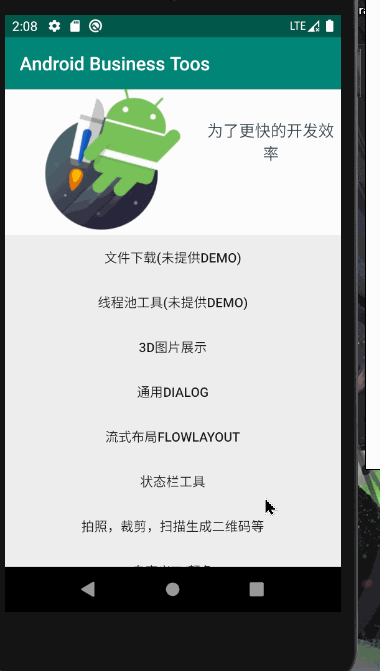

首先看一下效果：



使用方式：

```kotlin
 	    fileUrl.setText("https://kotlinlang.org/docs/kotlin-docs.pdf")
        fileName.setText("Kotlin-Docs.pdf")
        downloadButton.setOnClickListener {
            DownLoadLaunch.create(this, fileUrl.text.toString(),
                    fileName.text.toString(), object : OnStateListener {
                override fun start() {
                    Toast.makeText(context, "开始下载", Toast.LENGTH_LONG).show()
                }

                override fun process(value: Int) {
                    downloadButton.text = "Downloading $value"
                }

                override fun error(throwable: Throwable) {
                    Toast.makeText(context, "下载出错：${throwable.message}", Toast.LENGTH_LONG).show()
                    downloadButton.text = "DownLoad"
                }

                override fun donal(file: File) {
                    downloadButton.text = "下载成功"
                    downloadPath.setText(file.absolutePath)
                    Toast.makeText(context, "下载完成：" + file.path, Toast.LENGTH_LONG).show()
                }
            })
        }
```

只需要指定 url 和 文件的名字，在调用一个方法，就可以实现文件的下载。并且当前活动销毁时，就会停止下载

下面看一下使用方法：

1，导入依赖：

```kotlin
implementation "org.jetbrains.kotlin:kotlin-stdlib-jdk8"
    implementation "androidx.core:core-ktx:1.2.0"
    //协程基础库
    implementation "org.jetbrains.kotlinx:kotlinx-coroutines-core:1.3.1"
    //协程 Android 库，提供 UI 调度器
    implementation "org.jetbrains.kotlinx:kotlinx-coroutines-android:1.3.1"

    //liveData + ViewModel + lifecycle
    implementation "androidx.lifecycle:lifecycle-livedata-core-ktx:2.3.0-alpha01"
    implementation "androidx.lifecycle:lifecycle-livedata-ktx:2.3.0-alpha01"
    implementation "androidx.lifecycle:lifecycle-reactivestreams-ktx:2.3.0-alpha01"
    implementation "androidx.lifecycle:lifecycle-runtime-ktx:2.3.0-alpha01"
    implementation "androidx.lifecycle:lifecycle-viewmodel-ktx:2.3.0-alpha01"
```

2，创建 DownLoadManager

```kotlin
object DownLoadManager {
    //创建文件
    private val downloadDirectory by lazy {
        File(ContextTools.context.filesDir, "download").also { it.mkdirs() }
    }

	//状态
    sealed class DownloadStatus {
        object None : DownloadStatus()
        class Progress(val value: Int) : DownloadStatus()
        class Error(val throwable: Throwable) : DownloadStatus()
        class Donel(val file: File) : DownloadStatus()
    }

	//下载
    fun download(url: String, fileName: String): Flow<DownloadStatus> {
        val file = File(downloadDirectory, fileName)
        return flow {
            val request = Request.Builder().url(url).get().build()
            val response = OkHttpClient.Builder().build()
                    .newCall(request).execute()
            if (response.isSuccessful) {
                response.body!!.let { body ->
                    //总大小
                    val total = body.contentLength()
                    //当前值
                    var emittedProcess = 0L
                    file.outputStream().use { output ->
                        body.byteStream().use { input ->
                            input.copyTo(output) { bytesCopied ->
                                //计算百分比
                                val progress = bytesCopied * 100 / total
                                //当前的值大于上一次的就进行通知
                                if (progress - emittedProcess > 1) {
                                    //发射，外部的 collect 会执行
                                    emit(DownloadStatus.Progress(progress.toInt()))
                                    emittedProcess = progress
                                }
                            }
                        }
                    }
                    //下载完成
                    emit(DownloadStatus.Donel(file))
                }
            } else {
                throw Exception(response.message)
            }
        }.catch {

            file.delete()
            emit(DownloadStatus.Error(it))
            //保留最新的值
        }.conflate()

    }
}
```

```kotlin
//重写了一些copyTo 方法，增加了一个参数，用来回调下载进度
inline fun InputStream.copyTo(out: OutputStream, bufferSize: Int = DEFAULT_BUFFER_SIZE, progress: (Long)-> Unit): Long {
    var bytesCopied: Long = 0
    val buffer = ByteArray(bufferSize)
    var bytes = read(buffer)
    while (bytes >= 0) {
        out.write(buffer, 0, bytes)
        bytesCopied += bytes
        bytes = read(buffer)

        progress(bytesCopied)
    }
    return bytesCopied
}
```

上面主要使用了 flow 进行下载，不了解的可以先百度一下

3,创建 DownloadModel ，用来进行下载

```kotlin
class DownloadModel : ViewModel() {

    val downloadStateLiveData =
            MutableLiveData<DownLoadManager.DownloadStatus>(DownLoadManager.DownloadStatus.None)


    suspend fun download(url: String, fileName: String) {
        DownLoadManager.download(url, fileName)
                .flowOn(Dispatchers.IO)
                .collect {
                    //发送数据
                    downloadStateLiveData.value = it
                }
    }
}
```

4，创建 DownloadLaunch，入口类，我们调用这个类的方法进行下载

```kotlin
interface OnStateListener {
    fun start()
    fun process(value: Int)
    fun error(throwable: Throwable)
    fun donal(file: File)
}

object DownLoadLaunch {

    private val mDownloadModel: DownloadModel = DownloadModel()

    fun create(
            owner: LifecycleOwner,
            url: String,
            fileName: String,
            stateListener: OnStateListener
    ) {
        //这里的 Lambda 会被多次调用，当 liveData 发送消息后 lambda会得到执行
        mDownloadModel.downloadStateLiveData.observe(owner) { status ->
            when (status) {
                DownLoadManager.DownloadStatus.None -> {
                    //启动协程
                    owner.lifecycleScope.launch {
                        stateListener.start()
                        //下载
                        mDownloadModel.download(url, fileName)
                    }
                }
                is DownLoadManager.DownloadStatus.Progress -> {
                    stateListener.process(status.value)
                }
                is DownLoadManager.DownloadStatus.Error -> {
                    stateListener.error(status.throwable)
                }
                is DownLoadManager.DownloadStatus.Donel -> {
                    stateListener.donal(status.file)
                }
            }
        }
    }
}
```

5，进行使用

```xml
<androidx.appcompat.widget.LinearLayoutCompat xmlns:android="http://schemas.android.com/apk/res/android"
    xmlns:app="http://schemas.android.com/apk/res-auto"
    xmlns:tools="http://schemas.android.com/tools"
    android:layout_width="match_parent"
    android:layout_height="match_parent"
    android:gravity="center"
    android:orientation="vertical">

    <androidx.appcompat.widget.AppCompatEditText
        android:id="@+id/fileUrl"
        android:layout_width="match_parent"
        android:layout_height="wrap_content"
        android:hint="文件路径"
        android:paddingLeft="20dp"
        android:paddingRight="20dp"
        android:textColor="#000000"
        android:textSize="25sp" />

    <androidx.appcompat.widget.AppCompatEditText
        android:id="@+id/fileName"
        android:layout_width="match_parent"
        android:layout_height="wrap_content"
        android:paddingLeft="20dp"
        android:layout_marginTop="20dp"
        android:paddingRight="20dp"
        android:hint="文件名字"
        android:textColor="#000000"
        android:textSize="25sp"
     />


    <androidx.appcompat.widget.AppCompatButton
        android:id="@+id/downloadButton"
        android:layout_width="match_parent"
        android:layout_height="wrap_content"
        android:text="DownLoad"
        android:layout_marginTop="20dp"
        android:textAllCaps="false" />

    <androidx.appcompat.widget.AppCompatEditText
        android:id="@+id/downloadPath"
        android:layout_width="match_parent"
        android:layout_height="wrap_content"
        android:paddingLeft="20dp"
        android:paddingRight="20dp"
        android:textColor="#000000"
        android:layout_marginTop="20dp"
        android:textSize="25sp"
        android:textStyle="bold" />

</androidx.appcompat.widget.LinearLayoutCompat>
```

```kotlin
class DownLoadActivity : AppCompatActivity() {

    override fun onCreate(savedInstanceState: Bundle?) {
        super.onCreate(savedInstanceState)
        setContentView(R.layout.activity_down_load)
        init()
    }

    @SuppressLint("SetTextI18n")
    private fun init() {

        fileUrl.setText("https://kotlinlang.org/docs/kotlin-docs.pdf")
        fileName.setText("Kotlin-Docs.pdf")
        downloadButton.setOnClickListener {
            DownLoadLaunch.create(this, fileUrl.text.toString(),
                    fileName.text.toString(), object : OnStateListener {
                override fun start() {
                    Toast.makeText(context, "开始下载", Toast.LENGTH_LONG).show()
                }

                override fun process(value: Int) {
                    downloadButton.text = "Downloading $value"
                }

                override fun error(throwable: Throwable) {
                    Toast.makeText(context, "下载出错：${throwable.message}", Toast.LENGTH_LONG).show()
                    downloadButton.text = "DownLoad"
                }

                override fun donal(file: File) {
                    downloadButton.text = "下载成功"
                    downloadPath.setText(file.absolutePath)
                    Toast.makeText(context, "下载完成：" + file.path, Toast.LENGTH_LONG).show()
                }
            })
        }
    }
}

```

