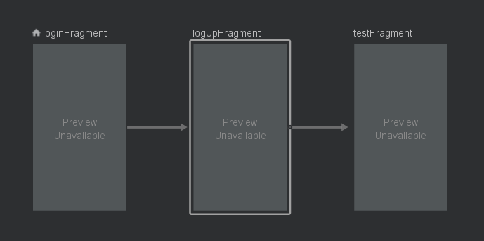
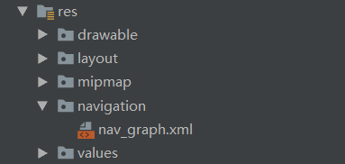

## Navigation 可以更加方便的使用 Fragment，使用过程非常简单，下面看一下使用方法

### 1，导入依赖

```java
  	implementation 'android.arch.navigation:navigation-fragment:1.0.0'
    implementation 'android.arch.navigation:navigation-ui:1.0.0'
    androidTestImplementation 'android.arch.navigation:navigation-testing:1.0.0-alpha08'
```

​	

### 2，在Res 目录下 创建 navigation 文件夹，然后创建 nav_graph.xml



### 3,在这个xml 文件中 选择自己的 fragment



​		需要指定从那个 fragment 开始的话就直接 选中某个视图 然后右击  点击 Set as Start Destination 这个项目就可以将这个设置为 最开始的fragment，然后通过连线的方式确定他启动的是哪一个fragment

### 4，在 Activity 中引用

​	有两种方式进行引用，修改 Activity 的布局如下所示：

```java
<?xml version="1.0" encoding="utf-8"?>
<androidx.appcompat.widget.LinearLayoutCompat xmlns:android="http://schemas.android.com/apk/res/android"
    xmlns:app="http://schemas.android.com/apk/res-auto"
    xmlns:tools="http://schemas.android.com/tools"
    android:layout_width="match_parent"
    android:layout_height="match_parent"
    android:orientation="vertical"
    tools:context=".mvp.base.BaseActivity">


    <!-- name 是NavHostFragment，他实现了NavHost，这是一个用于放置管理的 destination 的空视图 -->
    <!-- defaultNavHost 表示NavHostFragment 可以拦截处理返回键  -->
    <!-- navGraph 用于将这个 NavHostFragment 和 nav_graph.xml 关联起来 -->
    <fragment
        android:id="@+id/nav_fragment"
        android:name="androidx.navigation.fragment.NavHostFragment"
        android:layout_width="match_parent"
        android:layout_height="match_parent"
        app:defaultNavHost="true"
        app:navGraph="@navigation/nav_graph"/>

</androidx.appcompat.widget.LinearLayoutCompat>
```

​	通过上面这种方式就可以 显示第一个fragment 了。

​	还有一种方式，如下：

```java
<androidx.appcompat.widget.LinearLayoutCompat xmlns:android="http://schemas.android.com/apk/res/android"
    xmlns:app="http://schemas.android.com/apk/res-auto"
    xmlns:tools="http://schemas.android.com/tools"
    android:layout_width="match_parent"
    android:layout_height="match_parent"
    android:orientation="vertical"
    tools:context=".mvp.base.BaseActivity">

    <FrameLayout
        android:id="@+id/frame_layout"
        android:layout_width="match_parent"
        android:layout_height="match_parent" />
    
</androidx.appcompat.widget.LinearLayoutCompat>
```

​	还需要在代码中进行如下修改：

```java
//找到xml 文件
        NavHostFragment navHost = NavHostFragment.create(R.navigation.nav_graph);
        getSupportFragmentManager()
                .beginTransaction()
                .replace(R.id.frame_layout,navHost)
                // 相等于 xml 中的 app:defaultNavHost="true"
                .setPrimaryNavigationFragment(navHost)
                .commit();
```

​	即可完成加载

### 5，碎片之间的跳转 和 回退栈

​	在 nav_graph.xml 中将 fragment 连接好以后 就可以使用 Navigation 自带的方法进行跳转了,并且在跳转的使用可以在nav_graph.xml 中设置跳转的动画。fragment 直接跳转的方法 如下 ：

```java
// id 为nav_graph.xml 中 fragment 内 action 的id ，就是需要跳转掉指定fragment的 id

fragment基本跳转	A->B
Navigation.findNavController(rootView).navigate(id);

fragment 携带数据跳转-Bundle   A->B
Navigation.findNavController(rootView).navigate(id, bundle);

跳转方法，多级跳转     A->B->C,C->A,避免Navigation 跳转后重新执行生命周期方法
注意：这里的id 为 需要回退到指定fragment的 id，并非action，不需要再 xml 中进行连线。
第二个参数 为false 表示 退栈不包括指定的id，否则会将 id 的那个fragment 也退掉
avigation.findNavController(rootView).popBackStack(id, false); //如果退栈一次就返回 true

退栈方法
Navigation.findNavController(rootView).navigateUp();

```

### 6，生命周期

​		通过 Navigation 进行跳转后，原来 fragment 的生命周期会走到那一步呢？如下：

​			A ---> B 

​			从 A 到 B ，则A的生命周期执行到 onDestroyView() ，这个方法的作用就是销毁 fragment 的有关视图 但是依然可以通过 onCreateView() 方法进行重写创建视图。

​			在跳到 B 后，如果点击了 返回，则 A 就会通过 onCreateView() 重新创建视图。这时 B 就会 执行 onDestory()。

以上就是 Navigation 的用法，是不是非常简单呢？