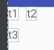
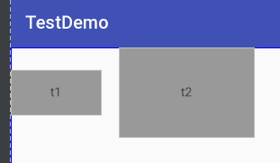
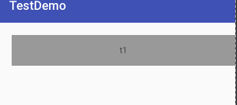
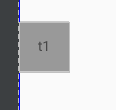
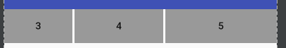
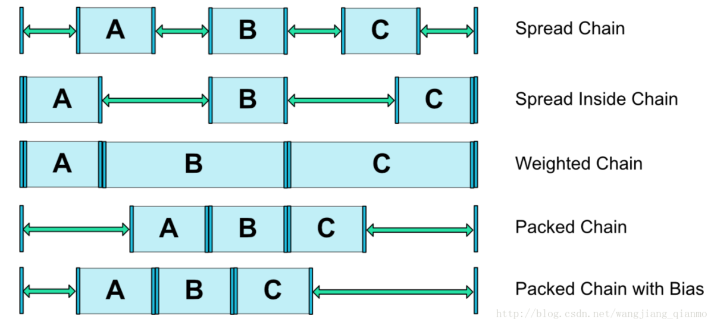
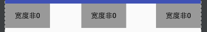
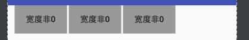

约束布局 ConstraintLayout 是一个 ViewGroup ，可以在 API9 以上的 Android

系统中使用它，他的出现主要是为了解决布局嵌套过多的问题，使用起来非常灵活。

## 使用：


### 	1，相对定位

​			根据名字就可以理解，当前的控件位置是相对于别的控件。如下面所示



​				如果使用约束布局要怎么写呢，其实这种写法和相对布局类似，如下：

```java
<android.support.constraint.ConstraintLayout xmlns:android="http://schemas.android.com/apk/res/android"
    xmlns:app="http://schemas.android.com/apk/res-auto"
    xmlns:tools="http://schemas.android.com/tools"
    android:layout_width="match_parent"
    android:layout_height="match_parent"
    tools:context="www.testdemo.com.MainActivity">

    <TextView
        android:id="@+id/t1"
        android:layout_width="wrap_content"
        android:layout_height="wrap_content"
        android:text="t1" />

    <TextView
        android:id="@+id/t2"
        android:layout_width="wrap_content"
        android:layout_height="wrap_content"
        android:text="t2"
        android:layout_marginLeft="10dp"
        app:layout_constraintLeft_toRightOf="@+id/t1"/>
		<--将t2的左边约束到 t1 的右边-->
    <TextView
        android:id="@+id/t3"
        android:layout_width="wrap_content"
        android:layout_height="wrap_content"
        android:layout_marginTop="10dp"
        android:text="t3"
        app:layout_constraintTop_toBottomOf="@+id/t1"/>
		<--将 t3 的上边约束到 t1 的下面-->
</android.support.constraint.ConstraintLayout>

```

​	是不是非常简单呢！

​	同理：`app:layout_constraintRight_toRightOf="parent"`则表示`view`的右边对齐父布局的右边。

​	下面看一下常用的属性

```
layout_constraintLeft_toLeftOf
layout_constraintLeft_toRightOf
layout_constraintRight_toLeftOf
layout_constraintRight_toRightOf
layout_constraintTop_toTopOf
layout_constraintTop_toBottomOf
layout_constraintBottom_toTopOf
layout_constraintBottom_toBottomOf
layout_constraintBaseline_toBaselineOf
layout_constraintStart_toEndOf
layout_constraintStart_toStartOf
layout_constraintEnd_toStartOf
layout_constraintEnd_toEndOf
```

​		这些属性的值可以是 parent，也可以是某个 view 的 id 。

​		先看一下文字基线，如果有两个TextView 大小不一样，但是你还要他们的内容对齐，这种情况就可以使用 layout_constraintBottom_toBottomOf ,使用如下

```java
<TextView
        android:id="@+id/t1"
        android:layout_width="100dp"
        android:layout_height="50dp"
        android:gravity="center"
        android:background="#999999"
        app:layout_constraintBaseline_toBaselineOf="@id/t2"
        android:text="t1" />

    <TextView
        android:id="@+id/t2"
        android:layout_width="150dp"
        android:layout_height="100dp"
        android:background="#999999"
        android:gravity="center"
        android:layout_margin="20dp"
        android:text="t2"
        app:layout_constraintLeft_toRightOf="@+id/t1"/>
```

​		效果如下



### 2，角度定位

​	

### 	3，边距

- 经常使用的 margin

  android:layout_marginStart
  android:layout_marginEnd
  android:layout_marginLeft
  android:layout_marginTop
  android:layout_marginRight
  android:layout_marginBottom

  在 ConstraintLayout 里面要实现 margin ，必须先约束该控件在 ContraintLayout 里的位置，也就是要控制 View的位置

  如下：

  ```
   <TextView
          android:id="@+id/t1"
          android:layout_width="wrap_content"
          android:layout_height="wrap_content"
          android:layout_marginLeft="10dp"
          android:layout_marginTop="10dp" />
  ```

  上面这种情况 如果在 ConstraintLayout 里面设置 margin 是无法生效的。因为没有约束 TextView 在布局里面的位置。正确写法如下所示：

  ```
   <TextView
          android:id="@+id/t1"
          android:layout_width="wrap_content"
          android:layout_height="wrap_content"
          android:layout_marginLeft="10dp"
          android:layout_marginTop="10dp" />
  ```

  注意：

  ​		1，控件必须在布局中约束一个相对的位置

  ​		2，margin 只能大于 0

  - goneMargin

    goneMargin 用于 控件的可见性设置为 gone 的时候使用的 margin 值，属性如下：

    layout_goneMarginStart
    layout_goneMarginEnd
    layout_goneMarginLeft
    layout_goneMarginTop
    layout_goneMarginRight
    layout_goneMarginBottom

    

    举个例子 ，t2 的左边约束在 t1 的右边，并给 t2 设置了一个 layout_goneMarginLeft ="10dp"，这个时候他的间距是不显示的，也就是没有间距。这个时候如果把 t1 可见性设计gone ，那么 t2 就会有一个10dp的边距。

    也就是说 当 t1 设置为 gone 时，在 t2 设置的 layout_goneMarginLeft 才会有作用。 

    

### 	4，居中和偏移

​	居中的写法：

```java
app:layout_constraintBottom_toBottomOf="parent"
app:layout_constraintLeft_toLeftOf="parent"
app:layout_constraintRight_toRightOf="parent"
app:layout_constraintTop_toTopOf="parent"
```

​	意思是把控件的上下左右 约束在布局的上下左右，这样就能把控件放在布局中间了。

```
  <TextView
        android:id="@+id/t1"
        android:layout_width="wrap_content"
        android:layout_height="wrap_content"
        android:gravity="center"
        android:background="#999999"
        android:text="居中"
        app:layout_constraintTop_toTopOf="parent"
        app:layout_constraintBottom_toBottomOf="parent"
        app:layout_constraintLeft_toLeftOf="parent"
        app:layout_constraintRight_toRightOf="parent"/>
```

偏移，可以再居中后对 View 进行偏移，可以是用 marginLeft 等，但是除了这种类型之外还有一种偏移属性：

```
外，ConstraintLayout还提供了另外一种偏移的属性：
layout_constraintHorizontal_bias 水平偏移
layout_constraintVertical_bias 垂直偏移
```

```
<TextView
        android:id="@+id/t1"
        android:layout_width="wrap_content"
        android:layout_height="wrap_content"
        android:gravity="center"
        android:background="#999999"
        android:text="居中偏移"
        app:layout_constraintTop_toTopOf="parent"
        app:layout_constraintBottom_toBottomOf="parent"
        app:layout_constraintLeft_toLeftOf="parent"
        app:layout_constraintRight_toRightOf="parent"
        app:layout_constraintVertical_bias="0.3"/>
```

上面的代码就是 向上偏移0.3，如果是0.5就是居中，0.7就是向下便宜了

### 5，尺寸约束

​		尺寸布局可以通过下面这几种方式来指定

- **使用指定的尺寸**

- **使用wrap_content** 

  让控件自己计算大小，当控件的高度或者官渡为 wrap_content 时，可以使用下面属性来控制 最大或者最小值：

  android:minWidth 最小的宽度
  android:minHeight 最小的高度
  android:maxWidth 最大的宽度
  android:maxHeight 最大的高度

  注意，当版本为 1.1 以下时，使用这些熟悉需要加上强制约束，如下

  app:constrainedWidth=”true”
  app:constrainedHeight=”true”

- **使用0dp**

  在 ConstraintLayout 中不推荐使用 MATCH_PARENT 这个值，如果要实现和 MATCH_PARENT 同样的效果，可以使用 0% 来代替，其表示MATCH_CONSTRAINT 。

  ```java
   <TextView
          android:id="@+id/t1"
          android:layout_width="0dp"
          android:layout_height="50dp"
          android:gravity="center"
          android:background="#999999"
          android:text="t1"
          android:layout_marginLeft="20dp"
          android:layout_marginTop="20dp"
          app:layout_constraintTop_toTopOf="parent"
          app:layout_constraintLeft_toLeftOf="parent"
          app:layout_constraintRight_toRightOf="parent" />
  ```

  

  - **宽高比**

    当宽或者高至少有一个被设置为 0dp 时，可以通过属性 layout_constraintDimensionRatio 设置宽高比，如下

    ```xml
    <TextView
            android:id="@+id/t1"
            android:layout_width="0dp"
            android:layout_height="50dp"
            android:gravity="center"
            android:background="#999999"
            android:text="t1"
            app:layout_constraintDimensionRatio="4:4"
            app:layout_constraintTop_toTopOf="parent"
            app:layout_constraintBottom_toBottomOf="parent"/>
    ```

    效果如下：

    

    还可以在值得前面加 W 或者H ，分别制定宽度和高度的限制，例如

    "H,2:3"指的是  高:宽=2:3

    "H,2:3"指的是  高:宽=2:3

  - **百分比宽高**

    要使用 百分比，宽和高同样要设置为 0dp

    然后使用如下属性即可：

    ```
    app:layout_constraintWidth_default="percent" //设置宽为百分比
    app:layout_constraintWidth_percent="0.3" //0到1之间的值
    或
    app:layout_constraintHeight_default="percent" //设置高为百分比
    app:layout_constraintHeight_percent="0.3" //0到1之间的值
    ```

    ```xml
     <Button
            android:layout_width="0dp"
            android:layout_height="wrap_content"
            android:text="宽50%"
            app:layout_constraintWidth_default="percent"
            app:layout_constraintLeft_toLeftOf="parent"
            app:layout_constraintWidth_percent="0.5"/>
    ```

    注：在1.1-beta1和1.1-beta2版本中必需手动指定app:layout_constraintWidth_default="percent"，在之后的版本中如果设置了app:layout_constraintWidth_percent属性，则可以不用指定。

  - 权重

    LinearLayout 中可以设置权重，ConstraintLayout 中同样可以

    ```xml
    app:layout_constraintHorizontal_weight //水平权重
    app:layout_constraintVertical_weight //竖直权重
    ```

    ```xml
      <Button
            android:id="@+id/b1"
            android:layout_width="0dp"
            android:layout_height="wrap_content"
            android:background="#999999"
            android:gravity="center"
            android:text="3"
            app:layout_constraintLeft_toLeftOf="parent"
            app:layout_constraintRight_toLeftOf="@id/b2"
            app:layout_constraintHorizontal_weight="3" />
    
        <Button
            android:id="@+id/b2"
            android:layout_width="0dp"
            android:layout_height="wrap_content"
            android:layout_marginLeft="3dp"
            android:background="#999999"
            android:gravity="center"
            android:text="4"
            app:layout_constraintLeft_toRightOf="@id/b1"
            app:layout_constraintRight_toLeftOf="@id/b3"
            app:layout_constraintHorizontal_weight="4" />
    
        <Button
            android:id="@+id/b3"
            android:layout_width="0dp"
            android:layout_height="wrap_content"
            android:layout_marginLeft="3dp"
            android:background="#999999"
            android:gravity="center"
            android:text="5"
            app:layout_constraintLeft_toRightOf="@id/b2"
            app:layout_constraintRight_toRightOf="parent"
            app:layout_constraintHorizontal_weight="5" />
    ```

    

    

### 	6，链

​		上面这种相连的 View 两两约束就形成了链，在 ConstraintLayout 中可以实现各种不同的链，权重链只是其中的一种，整个链有 第一个View(链头)上设置的属性控制。

​		官网上一共有五种样式的链：



​	

​	可以通过一下属性来设置链的样式

```xml
app:layout_constraintHorizontal_chainStyle="spread|spread_inside|packed"
```

- #### spread 

  默认的样式就是 spread ，所以可以不用设置，宽或者高非0即可

  ```xml
  <android.support.constraint.ConstraintLayout xmlns:android="http://schemas.android.com/apk/res/android"
      xmlns:app="http://schemas.android.com/apk/res-auto"
      xmlns:tools="http://schemas.android.com/tools"
      android:layout_width="match_parent"
      android:layout_height="match_parent"
      tools:context="www.testdemo.com.MainActivity">
  
      <Button
          android:id="@+id/b1"
          android:layout_width="wrap_content"
          android:layout_height="wrap_content"
          android:background="#999999"
          android:gravity="center"
          android:text="宽度非0"
          app:layout_constraintHorizontal_chainStyle="spread"
          app:layout_constraintLeft_toLeftOf="parent"
          app:layout_constraintRight_toLeftOf="@id/b2" />
  
      <Button
          android:id="@+id/b2"
          android:layout_width="wrap_content"
          android:layout_height="wrap_content"
          android:layout_marginLeft="3dp"
          android:background="#999999"
          android:gravity="center"
          android:text="宽度非0"
          app:layout_constraintLeft_toRightOf="@id/b1"
          app:layout_constraintRight_toLeftOf="@id/b3" />
  
      <Button
          android:id="@+id/b3"
          android:layout_width="wrap_content"
          android:layout_height="wrap_content"
          android:layout_marginLeft="3dp"
          android:background="#999999"
          android:gravity="center"
          android:text="宽度非0"
          app:layout_constraintLeft_toRightOf="@id/b2"
          app:layout_constraintRight_toRightOf="parent" />
  
  </android.support.constraint.ConstraintLayout>
  ```

  

- #### Spread Inside 

  ```xml
  app:layout_constraintHorizontal_chainStyle="spread_inside"
  ```

  

  效果如上图

- #### Weighter 

  即权重链，具体上面已经实现过

- #### Packed

  Packed 是一种 View 聚拢出来的效果

  ```xml
  app:layout_constraintHorizontal_chainStyle="packed"
  ```


- Packed with bias 

  就是 Packed 再加上一个 偏移属性，偏移属性可以看上面。

  ```xml
  app:layout_constraintHorizontal_chainStyle="packed"
  app:layout_constraintHorizontal_bias="0.1"
  ```

  

### 7，工具

- #### Glideline 辅助线

  Glideline 可以用来辅助布局，通过Guideline 能创建出一条条的水平或者垂直线，这个线不会显示在界面，但是可以利用这些线添加约束去完成界面的布局

  Glideline 的主要属性有

  ```xml
  android:orientation="horizontal|vertical" 
  app:layout_constraintGuide_begin="30dp" 
  app:layout_constraintGuide_end="30dp"
  app:layout_constraintGuide_percent="0.5"
  ```

  ​	1，标识水平或者垂直的导线

  ​	2，如果是水平线，则距离顶部30dp，如果是垂直，则距离左边30dp

  ​	3，如果是水平线，则距离底部30dp，如果是垂直，则距离右边30dp

  ​	4，如果是 水平线，则距离顶部为整个布局的高度的 50%，如果是垂直，则距离左边这个布局宽度的50%。

- Group

  Group 可以吧多个控件归为1组，方便隐藏或者显示

  ```xml
    <android.support.constraint.Group
          android:id="@+id/group"
          android:layout_width="wrap_content"
          android:layout_height="wrap_content"
          android:visibility="invisible"
          app:constraint_referenced_ids="t1,t2,t3" />
  ```

- Placeholder

  它指的是占位符，在 Placeholder 中可以使用 setContetn() 设置另一个的控件id，使另一个控件移动到占位符的位置

  ```java
  <android.support.constraint.Placeholder
          android:id="@+id/placeholder"
          android:layout_width="wrap_content"
          android:layout_height="wrap_content"
          app:content="@+id/t1"
          app:layout_constraintLeft_toLeftOf="parent"
          app:layout_constraintTop_toTopOf="parent" />
  
      <TextView
          android:id="@+id/t1"
          android:layout_width="wrap_content"
          android:layout_height="wrap_content"
          android:background="#cccccc"
          android:padding="16dp"
          android:text="TextView"
          android:textColor="#000000"
          app:layout_constraintRight_toRightOf="parent"
          app:layout_constraintTop_toTopOf="parent" />
  ```

  新建一个占位符在左上角，t1 在右上角


