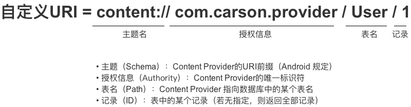

​	**ContentProvider 即内容提供者，是 Android 四大组件之一。主要用于进程间进行数据交互，共享。及跨进程通信。其底层采用的是 Android 中的 Binder 机制。ContentProvider 就像是两个进程之间的搬用工，正真存储/操作数据的数据源还是原来的存储方式。数据源可以是 ：数据库，文件，XML，网络等。**

​		统一资源标识符（URI）：唯一表示 ContentProvider 和 其中的数据，外界进程通过 URI 找到对应的 ContentProvider 和其中的数据，在进行数据操作。URI 分为系统预置和自定义，分别对应系统内置的数据(如联系人，日历等) 和 自定义数据库

​		自定义 URI :

  

​	

```
// 设置URI
Uri uri = Uri.parse("content://com.carson.provider/User/1") 
// 上述URI指向的资源是：名为 `com.carson.provider`的`ContentProvider` 中表名 为`User` 中的 `id`为1的数据

// 特别注意：URI模式存在匹配通配符* & ＃

// *：匹配任意长度的任何有效字符的字符串
// 以下的URI 表示 匹配provider的任何内容
content://com.example.app.provider/* 
// ＃：匹配任意长度的数字字符的字符串
// 以下的URI 表示 匹配provider中的table表的所有行
content://com.example.app.provider/table/# 
```

### MIME 类型

​		指定某种扩展名文件用什么应用程序来打开的方式类型。当该扩展名文件被访问到的时候，浏览器会自动使用指定的应用程序来打开。多用于指定一些客户端自定义的文件名，以及一些媒体文件的打开方式。

| 类型/子类型（Content-Type/subtype ）    | 扩展名 |
| --------------------------------------- | ------ |
| application/vnd.android.package-archive | .apk   |
| application/vnd.android.package-archive | .txt   |
| image/jpeg                              | .jpeg  |
| text/html                               | .html  |
| audio/x-pn-realaudio                    | .rmvb  |
| audio/mpeg                              | .mp3   |
| video/mp4                               | .mp4   |
| image/png                               | .png   |
| application/json                        | .json  |
| application/pdf                         | .pdf   |

​	[更多类型可查看](https://blog.csdn.net/ouyang_peng/article/details/47102537)

UriMatcher 类

​		这是一个工具类，帮助匹配 ContentProvider 中的 URI，只对外提供了两个方法  addURI 和 match 方法,

```
public void addURI(String authority, String path, int code)
public int match(Uri uri)
```

- 