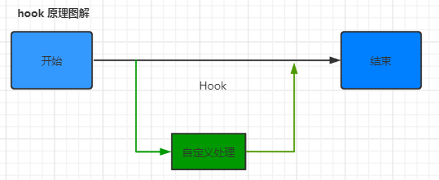
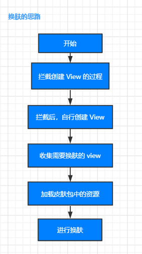

## 什么是 Hook？

Hook 翻译过来就是 钩子的意思，在代码流程的开始和结束的中间挂一个钩子，勾住以后就可以在中间添加一些我们自定义的代码

## 布局文件加载流程

通过 setContextView 方法加载界面布局，最终布局会被加载的 DecorView 中 id为 R.id.content 的 FrameLayout 中。

如果不清楚这个流程可以看一下: **[源码分析 | 布局文件加载流程](https://juejin.cn/post/6844904195607232525)**

通过这篇文章可以知道 Activity 和 AppCompatActivity 中布局文件的加载流程，以及如果拦截 View 的创建

### 换肤思路

关键点

- 如果拦截 View 的创建
- 如果获取到需要换肤的 View
- 如果加载新的资源包

