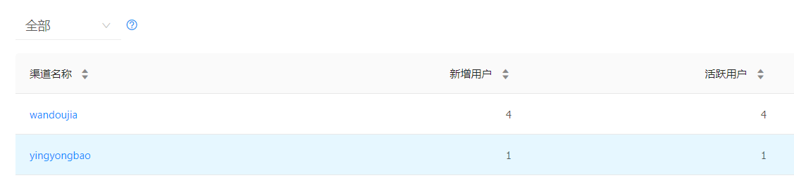

1，[打开](https://www.umeng.com/)友盟官网，进行注册，添加 app ，记住 key。

2，集成，一共两种方式，使用 jar 包和 自动集成，这里我们选择自动集成，如下：

​	在项目的 gradle 中添加如下：

```java
 repositories {
        ......
        maven { url 'https://dl.bintray.com/umsdk/release' }
    }
```

```java
repositories {
        ......
        maven { url 'https://dl.bintray.com/umsdk/release' }
    }
```

​	接着在 在工程App 对应build.gradle配置脚本dependencies段中添加基础组件库和统计SDK库依赖，如下：

```java
//友盟基础组件库和统计SDK库依赖
api 'com.umeng.umsdk:analytics:8.0.0'
api 'com.umeng.umsdk:common:2.0.0'
```

​	这样就集成完毕了

3，集成配置

​	所需要的权限：

```xml
    <!--友盟统计所需权限-->
    <uses-permission android:name="android.permission.ACCESS_NETWORK_STATE"></uses-permission>
    <uses-permission android:name="android.permission.ACCESS_WIFI_STATE" />
    <uses-permission android:name="android.permission.INTERNET"></uses-permission>
    <uses-permission android:name="android.permission.READ_PHONE_STATE"></uses-permission>
```

​	在 AndroidManifest.xml 中配置 key

```java
 <!--value的值填写你在友盟后台申请的应用Appkey-->
<meta-data
   android:name="UMENG_APPKEY"
   android:value="****************" />
```

4，配置渠道

​	在 AndroidManifest.xml 中配置动态渠道

```java
 <!--value的值填写渠道名称，例如yingyongbao。这里设置动态渠道名称变量-->
<meta-data
     android:name="UMENG_CHANNEL"
     android:value="${UMENG_CHANNEL_VALUE}" />
```

​	在 app.gradle 中添加渠道

```java
 /*配置渠道*/
    productFlavors {
        yingyongbao {
            manifestPlaceholders = [UMENG_CHANNEL_VALUE: "yingyongbao"]
        }
        wandoujia {
            manifestPlaceholders = [UMENG_CHANNEL_VALUE: "wandoujia"]
        }
        xiaomi {
            manifestPlaceholders = [UMENG_CHANNEL_VALUE: "xiaomi"]
        }
    }
```

​	在同步过程中如果出现：ERROR: All flavors must now belong to a named flavor dimension. 的问题，就在 app/build.gradle 的 defaultConfig 中加入 flavorDimensions "versionCode" 即可

5，初始化

​	在自定义的 Application 中进行初始化：

```java
/**
 * 初始化common库
 * 参数1:上下文，必须的参数，不能为空
 * 参数2:友盟 app key，非必须参数，如果Manifest文件中已配置app key，该参数可以传空，则使用Manifest中配置的app key，否则该参数必须传入
 * 参数3:友盟 channel，非必须参数，如果Manifest文件中已配置channel，该参数可以传空，则使用Manifest中配置的channel，否则该参数必须传入，channel命名请详见channel渠道命名规范
 * 参数4:设备类型，必须参数，传参数为UMConfigure.DEVICE_TYPE_PHONE则表示手机；传参数为UMConfigure.DEVICE_TYPE_BOX则表示盒子；默认为手机
 * 参数5:Push推送业务的secret，需要集成Push功能时必须传入Push的secret，否则传空
 * 如果在 AndroidManifeset.xml 中没有配置 appkey 和 channel 则可以如下配置
 * UMConfigure.init(this, "*****************", "Umeng", UMConfigure.DEVICE_TYPE_PHONE,  * 我已经配置过，所以如下方式初始化
 */
UMConfigure.init(this, UMConfigure.DEVICE_TYPE_PHONE, "");
// log 
UMConfigure.setLogEnabled(true);
```

​	其中 注释中的 channel 指的是渠道，我们在 AndroidManifest.xml 中已经动态配置过，所以这里就不用配置了

6，使用

​	在每个 Activity 中需要如下调用：

```java
 @Override
    protected void onResume() {
        super.onResume();
        //友盟统计
        MobclickAgent.onResume(this);
    }

    @Override
    protected void onPause() {
        super.onPause();
        //友盟统计
        MobclickAgent.onPause(this);
    }
```

​	如果 Activity 中有继承关系，则不能重复调用，否则会造成启动数据异常增高

7，打包，进行测试


​	如上所示：在打包的时候就可以选择渠道，这里可以进行多选

​	打包成功后打开 app ，随便逛一下，然后打开友盟官网，查看统计数据


​	查看渠道数据：



​	**这里需要注意一点：**

​	**每台设备仅记录首次安装激活的渠道，在其他渠道再次安装不会重复计量。 所以在测试不同的渠道的时候，请使用不同的设备来分别测试不要改变 ’UMENG_CHANNEL’。意思就是在某个设备上安装渠道应用后，这个设备安装其他渠道应用将不会计量。**

​	当应用在后台运行超过30秒（默认）再回到前端，将被认为是两个独立的session(启动)，例如用户回到home，或进入其他程序，经过一段时间后再返回之前的应用。可通过接口：setSessionContinueMillis(long interval) 来自定义这个间隔（参数单位为毫秒）。

​	如果开发者调用kill或者exit之类的方法杀死进程，请务必在此之前调用onKillProcess(Context context)方法，用来保存统计数据。

8，采集方式：


​	在上面我们说的是在 Activity 中的数据统计，如果是 fragment 呢，这种情况下我们就要用到 采集方式了，一般我们使用 AUTO 的方式来进行采集。

​	首先在 Application 中进行添加如下：

```java
 // 选用AUTO页面采集模式
MobclickAgent.setPageCollectionMode(MobclickAgent.PageMode.AUTO);
```

​	接着我们要在 fragment 的 onResume 和 onPause 中进行数据采集。但是由于 fragment 是 嵌套在 activity 中的，例如 使用 hide 隐藏 fragment，这个时候 fragment 并没有执行 onPause ，使用 ViewPager 加载 fragment 等，这些都会造成 fragment 统计的数据不准确，这个时候就需要调整了。

​	找了一个帖子，发现讲的挺好。挺好的解决方式：[当友盟遇到 fragment 的坑](https://www.jianshu.com/p/9c917f7a2fbc)

​	这样就可以解决 fragment 中采集数据的问题了

9，混淆

​	如果您的应用使用了代码混淆，请添加如下配置，以避免【友盟+】SDK被错误混淆导致SDK不可用

```java
-keep class com.umeng.** {*;}

-keepclassmembers class * {
   public <init> (org.json.JSONObject);
}

-keepclassmembers enum * {
    public static **[] values();
    public static ** valueOf(java.lang.String);
}
```

**以上就是基础的使用方式了**

------

高级用法：

1，自定义事件统计

​	在友盟中找到事件管理，点击设置，手动添加事件即可，如下图：


​	然后在项目中点击商品的地方进行设置如下：

```java
 @Override
    public void onItemClick(BaseQuickAdapter adapter, View view, int position) {
        GetGoodsListBean.DataBean bean = this.adapter.getData().get(position).getField(MultipleFields.OBJECT);
        ToastUtils.show(bean.getGoodsName());
        //第二个参数为点击 id
        MobclickAgent.onEvent(getContext(), "shop");
    }
```

​	接着运行 app 进行操作，就可以在友盟上看到统计效果了。

2，错误统计

​	组件化统计SDK内建JVM层错误统计。SDK通过Thread.UncaughtExceptionHandler 捕获程序崩溃日志，并在程序下次启动时发送到服务器。

如不需要错误统计功能，可通过此方法关闭：

```
// isEnable: false-关闭错误统计功能；true-打开错误统计功能（默认打开）
public static void setCatchUncaughtExceptions(boolean isEnable)
```

如果是捕获的异常，可以通过以下方式上传：

```java
public static void reportError(Context context, String error);   
//或  
public static void reportError(Context context, Throwable e);
```

例如： 

```
MobclickAgent.reportError(mContext, "Parameter Error");

try {
    // 抛出异常的代码
} catch (Exception e) {
    MobclickAgent.reportError(mContext, e);
}
```


还有许多功能，如账号统计等。[可以上官网查看](https://developer.umeng.com/docs/119267/detail/118637#h1-u9519u8BEFu5206u67904)