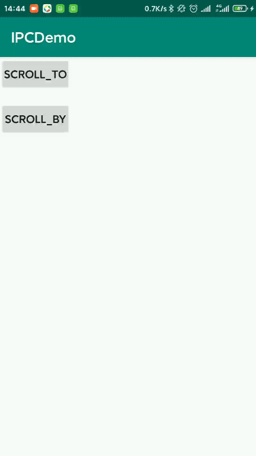
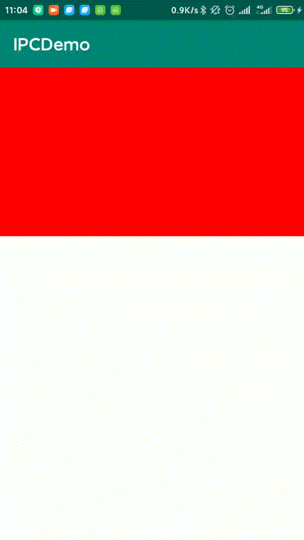

​		是一个用于处理滚动效果的工具类。其实**任何一个控件都是可以滚动的**，因为 VIew 类中有 scrollTo 和 scrollBy 方法。

​	先看一个效果

```xml
<LinearLayout xmlns:android="http://schemas.android.com/apk/res/android"
    xmlns:tools="http://schemas.android.com/tools"
    android:id="@+id/layout"
    android:layout_width="match_parent"
    android:layout_height="match_parent"
    android:orientation="vertical"
    tools:context=".MainActivity">
    <androidx.appcompat.widget.AppCompatButton
        android:id="@+id/scroll_to"
        android:layout_width="100dp"
        android:layout_height="wrap_content"
        android:gravity="center"
        android:padding="5dp"
        android:text="Scroll_To"
        android:textColor="#000000"
        android:textSize="15sp"
        tools:ignore="HardcodedText" />

    <androidx.appcompat.widget.AppCompatButton
        android:id="@+id/scroll_by"
        android:layout_width="100dp"
        android:layout_height="wrap_content"
        android:layout_marginTop="15dp"
        android:gravity="center"
        android:padding="5dp"
        android:text="Scroll_By"
        android:textColor="#000000"
        android:textSize="15sp"
        tools:ignore="HardcodedText" />
</LinearLayout>
```

```kotlin
scroll_to.setOnClickListener {
    //layout 是父布局LinearLayout
    layout.scrollTo(-60, -100)
}
scroll_by.setOnClickListener {
    layout.scrollBy(-60, -100)
}
```

为什么调用的是 LinearLayout 的 scrollBy 方法，不管是 scrollTo 还是 scrollBy 方法，滚动的都是该 View 内部的内容，而 LinearLayout 中内容就是 两个 Button。如果调用 Button 的 scroll 方法，结果一定不是你想看到的。

效果如下：



可以看到 点击 scrollTo 是，两个按钮会往下一点，再次点击没有反应了

点击 scrollBy 时往下移动，不停点击就会一直移动。

区别：scrollTo 方法是放 View 相对于初始位置以为某段距离，由于初始位置不会变，虽有不管点多少此都会是同一个位置。而 scrollBy 是相对于当前位置移动某段距离，所以才可以一直往右下方移动。

从图中可以看出没有任何滑动的痕迹，效果就是跳跃式的。通过这个方法是很难完成 ViewPager 类似的效果，因此要借助另外一个关键的工具，也就是 Scroller 。

Scroller 的 用法可以分为以下几个步骤：

1，创建 Scroller 的实例

2，调用 startScroll() 方法来初始化滚动数据并刷新界面

3，重写 computeScroll 方法，并在其内部完成平滑滚动的逻辑

------

下面就按照上述的步骤通过模拟一个 ViewPager 来理解以下 Scroller 的用法

```kotlin
class ScrollerLayout : ViewGroup {

    /**
     * 用于完成滚动操作的实例
     */
    private var mScroller: Scroller

    /**
     * 判定为拖动的最小移动像素
     */
    private var mTouchSlop = 0

    /**
     * 按下时的屏幕坐标
     */
    private var mXDown = 0f

    /**
     * 移动时所处的屏幕坐标
     */
    private var mXMove = 0f

    /**
     * 上次触发 MOVE 事件的屏幕坐标
     */
    private var mXLastMove = 0f

    /**
     * 界面可滚动的左边界
     */
    private var leftBorder = 0

    /**
     * 界面可滚动的由边界
     */
    private var rightBorder = 0

    constructor(context: Context) : this(context, null)
    constructor(context: Context, attributeSet: AttributeSet?) : super(context, attributeSet) {
        mScroller = Scroller(context)
        //最小移动距离
        mTouchSlop = ViewConfigurationCompat.getScaledHoverSlop(ViewConfiguration.get(context))

        //让当前view 可以点击
        isClickable = true
    }

    override fun onMeasure(widthMeasureSpec: Int, heightMeasureSpec: Int) {
        super.onMeasure(widthMeasureSpec, heightMeasureSpec)
        for (i in 0 until childCount) {
            val childView = getChildAt(i)
            //测量子控件的大小
            measureChild(childView, widthMeasureSpec, heightMeasureSpec)
        }
    }

    override fun onLayout(changed: Boolean, l: Int, t: Int, r: Int, b: Int) {
        if (changed) {
            val childCount = childCount
            for (i in 0 until childCount) {
                val childView = getChildAt(i)
                //给每一个子控件在水平方向上布局
                childView.layout(
                    i * childView.measuredWidth, 0,
                    (i + 1) * childView.measuredWidth, childView.measuredHeight
                )
            }
            //获取左右边界
            leftBorder = getChildAt(0).left
            rightBorder = getChildAt(childCount - 1).right
        }
    }

    override fun onInterceptTouchEvent(ev: MotionEvent): Boolean {
        when (ev.action) {
            MotionEvent.ACTION_DOWN -> {
                //rawX ，相对于屏幕的横坐标
                mXDown = ev.rawX
                mXLastMove = mXDown
            }
            MotionEvent.ACTION_MOVE -> {
                mXMove = ev.rawX
                //移动的距离
                val diff = abs(mXMove - mXDown)
                mXLastMove = mXMove
                //当手指拖动大于 TouchSlop 值时，认为应该进行滚动，拦截子控件的时间
                if (diff > mTouchSlop) {
                    return true
                }
            }
        }
        return super.onInterceptTouchEvent(ev)
    }

    @SuppressLint("ClickableViewAccessibility")
    override fun onTouchEvent(event: MotionEvent): Boolean {

        when (event.action) {
            MotionEvent.ACTION_MOVE -> {
                mXMove = event.rawX
                //移动的距离
                val scrolledX = (mXLastMove - mXMove).toInt()
                //边界处理，拖出边界后就使用 scrollTo 回到边界位置
                if (scrollX + scrolledX < leftBorder) {
                    scrollTo(leftBorder, 0)
                    return true
                } else if (scrollX + width + scrolledX > rightBorder) {
                    scrollTo(rightBorder - width, 0)
                    return true
                }
                //移动
                scrollBy(scrolledX, 0)
                mXLastMove = mXMove
            }
            MotionEvent.ACTION_UP -> {
                //当手指抬起时，根据当前滚动值来判定应该滚动到那个子控件界面
                //计算收松开后要显示的页面 index
                val targetIndex = if (mXDown > event.rawX) {
                    //从右往左滑动, 滑出的距离 + 80% * 宽 = 要显示的页面
                    (scrollX + (width * 0.8).toInt()) / width
                } else {
                    //从左往右滑动
                    (scrollX + (width * 0.2).toInt()) / width
                }
                val dx = targetIndex * width - scrollX
                //第二步，调用 startScroll 方法来初始化数据并刷新界面
                mScroller.startScroll(scrollX, 0, dx, 0)
                invalidate()
            }
        }
        return super.onTouchEvent(event)
    }


    override fun computeScroll() {
        //第三步，重新 computeScroll 方法，并在内部完成平滑滚动逻辑
        //判断滚动操作是否完成了，如果没有完成就继续滚动
        if (mScroller.computeScrollOffset()) {
            scrollTo(mScroller.currX, mScroller.currY)
            invalidate()
        }
    }
}
```

item 布局

```xml
<androidx.appcompat.widget.AppCompatImageView xmlns:android="http://schemas.android.com/apk/res/android"
    xmlns:tools="http://schemas.android.com/tools"
    android:id="@+id/item_button"
    android:layout_width="match_parent"
    android:layout_height="200dp"
    android:gravity="center"
    android:orientation="vertical"
    tools:ignore="HardcodedText">

</androidx.appcompat.widget.AppCompatImageView>
```

```kotlin
val arrayOf = arrayOf(Color.RED, Color.YELLOW, Color.BLUE, Color.CYAN)
for (i in 0..3) {
    val iv =
        LayoutInflater.from(this).inflate(
            R.layout.item,
            layout,
            false
        ) as AppCompatImageView
    iv.setBackgroundColor(arrayOf[i])
    iv.setOnClickListener {
        Toast.makeText(this,"$i",Toast.LENGTH_LONG).show()
    }
    // layout:ScrollerLayout
    layout.addView(iv)
}
```

结果如下：



Scroller 的原理

 当使用 startScroll() 方法时，其实内部啥也没做，他只是保存了我们传递的参数，如下：

```java
    public void startScroll(int startX, int startY, int dx, int dy, int duration) {
        mMode = SCROLL_MODE;
        mFinished = false;
        mDuration = duration;
        mStartTime = AnimationUtils.currentAnimationTimeMillis();
        mStartX = startX;
        mStartY = startY;
        mFinalX = startX + dx;
        mFinalY = startY + dy;
        mDeltaX = dx;
        mDeltaY = dy;
        mDurationReciprocal = 1.0f / (float) mDuration;
    }
```

​	分别是 开始的位置，滑动的距离，最后是时间。可以看到调用 startScroll 方法是无法让 Scroller 滑动的，因为内部并没有做滑动相关的事情。那么他到底是怎么滑动的呢？

​	答案是startScroll 下面的 invalidate 方法，这个方法会导致重绘，在 View 的 draw 方法中又会调用 computeScroll ，computeScroll  方法是一个空实现，所以需要进行实现，上面我们已经进行了实现。

​	在 computeScroll ，首先是判断了 computeScrollOffset 方法，这个方法内部会根据时间的流逝来计算要滑动的值。然后进行移动，移动完成后继续进行重绘，一直到滑动结束。