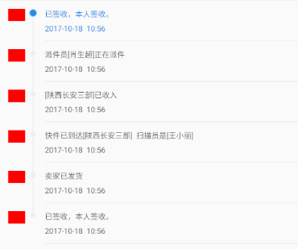

 

```java
public class LineCircle extends View {

    private Paint paint = new Paint(Paint.ANTI_ALIAS_FLAG);
    private Path path = new Path();

    /**
     * 线的颜色
     */
    private int mPathColor = Color.parseColor("#eeeeee");

    /**
     * 外圆的颜色
     */
    private int outerCircleColor = Color.parseColor("#96ccff");

    /**
     * 内圆的颜色
     */
    private int innerCircleColor = Color.parseColor("#2988e2");

    /**
     * 是否为头部
     */
    private boolean mHead = false;
    /**
     * 是否发为尾部
     */
    private boolean mEnd = false;

    /**
     * 是否选中当前
     */
    private boolean isSelect = false;

    /**
     * 圆心在高度上的百分比
     */
    private float mScale = 0.3f;


    public LineCircle(Context context, @Nullable AttributeSet attrs) {
        super(context, attrs);
    }

    @Override
    protected void onDraw(Canvas canvas) {
        int width = getWidth();

        // 计算高度的百分比
        int scaleHeight = (int) (getHeight() * mScale);

        //外圆半径
        int radius1 = width / 2;
        //内圆半径
        int radius2 = (int) ((width * 0.8) / 2);


        paint.setColor(mPathColor);
        paint.setStrokeWidth(Utils.dp2px(1f));
        path.moveTo(width / 2, 50);
        path.lineTo(width / 2, getHeight());

        //画线
        if (mHead) {
            canvas.drawLine(radius1, scaleHeight, radius1, getHeight(), paint);
        } else if (mEnd) {
            canvas.drawLine(radius1, 0, radius1, scaleHeight, paint);
        } else {
            canvas.drawLine(radius1, 0, radius1, getHeight(), paint);
        }
        //画圆
        if (isSelect) {
            paint.setColor(outerCircleColor);
            canvas.drawCircle(radius1, scaleHeight, radius1, paint);
            paint.setColor(innerCircleColor);
            canvas.drawCircle(radius1, scaleHeight, radius2, paint);
        } else {
            paint.setColor(mPathColor);
            canvas.drawCircle(radius1, scaleHeight, Utils.dp2px(3f), paint);
        }

    }

    /**
     * 是否为第一个
     */
    public void setHead(boolean head) {
        this.mHead = head;
        invalidate();
    }

    /**
     * 是否为最后一个
     *
     * @param end
     */
    public void setEnd(boolean end) {
        this.mEnd = end;
        invalidate();
    }

    /**
     * 设置线的颜色
     *
     * @param color
     */
    public void pathColor(int color) {
        this.mPathColor = color;
        invalidate();
    }

    /**
     * 设置圆高度的百分比
     *
     * @param mScale
     */
    public void setmScale(float mScale) {
        this.mScale = mScale;
        invalidate();
    }

    /**
     * 是否选中
     *
     * @param isSelect
     */
    public void setSelect(boolean isSelect) {
        this.isSelect = isSelect;
        invalidate();
    }
}
```

使用如下：

```java
   String tag = entity.getField(MultipleFields.TAG);
        if (tag.equals("head")) {
            address.setTextColor(Color.parseColor("#2988e2"));
            date.setTextColor(Color.parseColor("#2988e2"));
            lineCircle.setHead(true);
            lineCircle.setSelect(true);
        } else if (tag.equals("end")) {
            address.setTextColor(Color.parseColor("#666666"));
            date.setTextColor(Color.parseColor("#666666"));
            lineCircle.setEnd(true);
            lineCircle.setSelect(false);
        } else {
            address.setTextColor(Color.parseColor("#666666"));
            date.setTextColor(Color.parseColor("#666666"));
            lineCircle.setSelect(false);
        }
```

根据数据判断当前是否为 head 或者end。同时选择 head 即可

需要配个 recyclerview 或者 listView 使用

布局如下：

```java
<?xml version="1.0" encoding="utf-8"?>
<androidx.appcompat.widget.LinearLayoutCompat xmlns:android="http://schemas.android.com/apk/res/android"
    xmlns:tools="http://schemas.android.com/tools"
    android:layout_width="match_parent"
    android:layout_height="52dp"
    android:orientation="horizontal">


    <androidx.appcompat.widget.AppCompatImageView
        android:layout_width="22dp"
        android:layout_height="16dp"
        android:layout_marginStart="16dp"
        android:layout_marginTop="10dp"
        android:background="@color/red" />

    <com.fengtong.core.ui.view.LineCircle
        android:id="@+id/item_logistics_line"
        android:layout_width="10dp"
        android:layout_height="match_parent"
        android:layout_marginStart="5dp" />

    <RelativeLayout
        android:layout_width="match_parent"
        android:layout_height="match_parent"
        android:layout_marginStart="10dp">

        <androidx.appcompat.widget.LinearLayoutCompat
            android:layout_width="match_parent"
            android:layout_height="wrap_content"
            android:layout_centerVertical="true"
            android:orientation="vertical">

            <androidx.appcompat.widget.AppCompatTextView
                android:id="@+id/item_logistics_address"
                android:layout_width="wrap_content"
                android:layout_height="wrap_content"
                android:textColor="#2988e2"
                android:textSize="12sp"
                tools:ignore="HardcodedText" />

            <androidx.appcompat.widget.AppCompatTextView
                android:id="@+id/item_logistics_date"
                android:layout_width="wrap_content"
                android:layout_height="wrap_content"
                android:layout_below="@id/item_logistics_address"
                android:layout_marginTop="5dp"
                android:textColor="#2988e2"
                android:textSize="12sp"
                tools:ignore="HardcodedText" />
        </androidx.appcompat.widget.LinearLayoutCompat>

        <View
            android:layout_width="match_parent"
            android:layout_height="1dp"
            android:layout_alignParentBottom="true"
            android:background="@color/eeeeee" />

    </RelativeLayout>

</androidx.appcompat.widget.LinearLayoutCompat>
```

