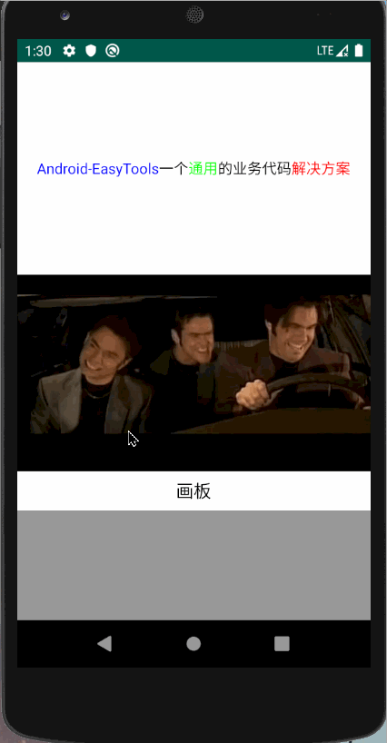

自定义签字板，实现名字居中，增加边距等

可直接获取到 bitmap，uri，File ，并且直接进行保存到手机，支持 Android Q 

下面看一下效果：



上面清除的展示了名字居中的效果，并且四周设置了内边距

下面看一下实现代码：

```kotlin
/**
 * @name DrawingView
 * @package com.example.ui.customView
 * @author 345 QQ:1831712732
 * @time 2020/5/26 20:46
 * @description 画板
 */

class DrawingView : View {

    private lateinit var mPaint: Paint
    private lateinit var mPath: Path
    private var cacheBitmap //用户保存签名的Bitmap
            : Bitmap? = null
    private var cacheCanvas //用户保存签名的Canvas
            : Canvas? = null

    //位置
    private var mLeft: Float = 0f
    private var mRight: Float = 0f
    private var mTop: Float = 0f
    private var mBottom: Float = 0f

    //边距
    private var mPadding = 20f

    //线宽度
    private var mPaintWidth = 10f

    constructor(context: Context?) : this(context, null)
    constructor(context: Context?, attrs: AttributeSet?) : this(context, attrs, 0)
    constructor(context: Context?, attrs: AttributeSet?, defStyleAttr: Int) : super(context, attrs, defStyleAttr) {
        init()
    }


    private fun init() { //初始化画笔
        mPaint = Paint()
        mPaint.style = Paint.Style.STROKE
        mPaint.color = Color.BLACK
        mPaint.strokeWidth = mPaintWidth
        mPath = Path()
    }

    /**
     * 在控件大小发生改变是调用
     */
    override fun onSizeChanged(w: Int, h: Int, oldw: Int, oldh: Int) {
        super.onSizeChanged(w, h, oldw, oldh)
        cacheBitmap = Bitmap.createBitmap(w, h, Bitmap.Config.ARGB_8888)
        cacheCanvas = Canvas(cacheBitmap!!)
        //设置背景色为透明
        cacheCanvas?.drawColor(Color.WHITE)
    }

    @SuppressLint("ClickableViewAccessibility")
    override fun onTouchEvent(event: MotionEvent): Boolean {
        when (event.action) {
            MotionEvent.ACTION_DOWN -> {
                //路径起点
                mPath.moveTo(event.x, event.y)
                if (mLeft == 0f) {
                    mLeft = event.x
                }
                if (mTop == 0f) {
                    mTop = event.y
                }
                setVertexCoordinates(event.x, event.y)
            }
            MotionEvent.ACTION_MOVE -> {
                mPath.lineTo(event.x, event.y)
                postInvalidate()
                //限制滑动的位置
                if (event.x < width && event.x >= 0) {
                    if (event.y < height && event.y >= 0) {
                        //如果是第二次按下，也需要记录位置
                        setVertexCoordinates(event.x, event.y)
                    }
                }
            }
            MotionEvent.ACTION_UP -> //将签名绘制到缓存画布上
                cacheCanvas?.drawPath(mPath, mPaint)
        }
        return true
    }

    override fun onDraw(canvas: Canvas) {
        super.onDraw(canvas)
        //绘制签名路径
        canvas.drawPath(mPath, mPaint)
    }

    /**
     * 重置画布
     */
    fun resetCanvas() {
        mPath.reset()
        cacheBitmap = null
        cacheCanvas = null
        cacheBitmap = Bitmap.createBitmap(width, height, Bitmap.Config.ARGB_8888)
        cacheCanvas = Canvas(cacheBitmap!!)
        //设置背景色为透明
        cacheCanvas?.drawColor(Color.WHITE)
        mBottom = 0f
        mTop = mBottom
        mRight = mTop
        mLeft = mRight
        postInvalidate()
    }

    /**
     * 记录四个边的位置
     */
    private fun setVertexCoordinates(x: Float, y: Float) {
        if (x > mRight) {
            mRight = x
        }
        if (x < mLeft) {
            mLeft = x
        }
        if (y > mBottom) {
            mBottom = y
        }
        if (y < mTop) {
            mTop = y
        }
    }

    /**
     * 返回 bitmap
     * @param blank ：边距
     */
    fun getBitmap(blank: Int): Bitmap? {
        return cropCanvas(blank.toFloat())
    }

    /**
     * 获取图片 file
     */
    fun getFile(): File? {
        val bitmap = getBitmap(15) ?: return null
        val uri = save(bitmap, "${System.currentTimeMillis()}.png")
                ?: throw FileNotFoundException("文件未找到")
        val query = context.contentResolver.query(uri, arrayOf(MediaStore.Images.Media.DATA), null, null, null)
        query?.moveToFirst()
        val index = query?.getColumnIndexOrThrow(MediaStore.Images.Media.DATA)
        val path = query!!.getString(index!!)
        if (path == null) {
            ToastUtils.showText("获取失败")
            query.close()
        }
        return File(path)
    }

    /**
     * 保存图片到本地
     * @param displayName 图片名称，注意需要加上后缀名 .png
     * 注意名字不能重复，否则无法保存
     */
    fun save(displayName: String): Uri? {
        val bitmap = getBitmap(15) ?: return null
        return save(bitmap, displayName)
    }

    fun save(bitmap: Bitmap, displayName: String): Uri? {
        val values = ContentValues()
        values.put(MediaStore.MediaColumns.DISPLAY_NAME, displayName)
        values.put(MediaStore.MediaColumns.MIME_TYPE, "image/png")
        if (Build.VERSION.SDK_INT >= Build.VERSION_CODES.Q) {
            values.put(MediaStore.MediaColumns.RELATIVE_PATH, Environment.DIRECTORY_DCIM)
        } else {
            values.put(MediaStore.MediaColumns.DATA, "${Environment.getExternalStorageDirectory().path}/${Environment.DIRECTORY_DCIM}/$displayName")
        }
        val uri = context.contentResolver.insert(MediaStore.Images.Media.EXTERNAL_CONTENT_URI, values)

        if (uri != null) {
            val outputStream = context.contentResolver.openOutputStream(uri)
            if (outputStream != null) {
                bitmap.compress(Bitmap.CompressFormat.PNG, 100, outputStream)
                outputStream.close()
            }
            ToastUtils.showText("完成")
            return uri
        }
        return null
    }

    /**
     * 剪裁画布把多余的画布去掉只保留签名部分
     *
     * @param blank 边距
     */
    private fun cropCanvas(): Bitmap? {
        return cropCanvas(mPadding)
    }

    private fun cropCanvas(padding: Float): Bitmap? {
        var right = (mRight - mLeft)
        if (right + (padding * 2) < width) {
            mLeft -= padding
            right += padding
        }
        var height = (mBottom - mTop)
        if (height + (padding * 2) < getHeight()) {
            mTop -= padding
            height += padding
        }

        if (right <= padding && height <= padding) {
            ToastUtils.showText("请进行签名")
            return null
        }

        val dip2px = dip2px(padding)
        //裁切签名的部分
        val cropBitmap = Bitmap.createBitmap(cacheBitmap!!, mLeft.toZero(), mTop.toZero(), right.toZero(), height.toZero())

        //设置边距
        val bitmap = Bitmap.createBitmap((cropBitmap.width + (dip2px * 2)), (cropBitmap.height + (dip2px * 2)), Bitmap.Config.ARGB_8888)
        val canvas = Canvas(bitmap)
        canvas.drawColor(Color.WHITE)
        canvas.drawBitmap(cropBitmap, dip2px.toFloat(), dip2px.toFloat(), mPaint)
        return bitmap
    }

    private fun Float.toZero(): Int {
        return if (this < 0f) {
            0
        } else {
            this.toInt()
        }
    }

    /**
     * 根据手机的分辨率从 dp 的单位 转成为 px(像素)
     */
    private fun dip2px(dpValue: Float): Int {
        val scale = resources.displayMetrics.density
        return (dpValue * scale + 0.5f).toInt()
    }
}
```

使用如下：

```kotlin
 //画板
        activity_drawing.setOnClickListener {
            val dialog = FastDialog.Builder(this)
                    .setContentView(R.layout.layout_drawing)
                    .setWidth(0.7f)
                    .build()
            dialog.show()
            val drawingView = dialog.getView<DrawingView>(R.id.layout_drawing)
            dialog.setOnClickListener(R.id.layout_save) {
                //这里使用的是 getFile，你也可以直接调用 getBitmap 等
                val file = drawingView?.getFile()
                val bitmap = BitmapFactory.decodeFile("${file?.path}")
                activity_views_image.setImageBitmap(bitmap)
            }
            dialog.setOnClickListener(R.id.layout_reset) {
                ToastUtils.showCenterText("重置")
                drawingView?.resetCanvas()
            }
        }
```

[源码地址](https://github.com/Blue-knife/Android-EasyTools/blob/master/app/src/main/java/com/business/tools/test/ViewsActivity.kt)

> 如有问题，还请指出，谢谢！