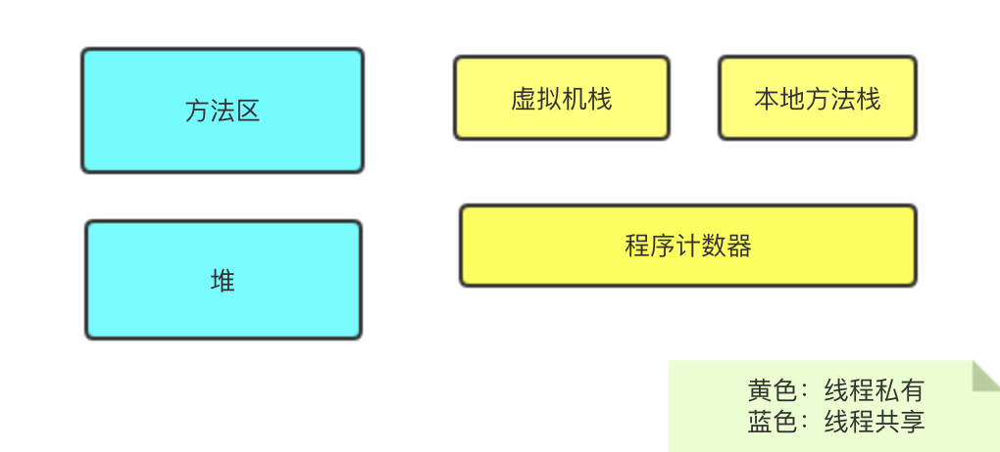

### Activity 异常情况下的生命周期

- 资源相关的系统配置发生改变导致 activity 被杀死并重新创建

  如横竖屏切换时：activity 被杀死，即调用 onPause，onStop，onDestroy，同时调用 onSaveInstanceState 保存 activity 的状态，这个方法在 activity 异常终止时调用。重新创建时，系统会调用 onRestoreInstanceState 和 onCreate 方法，通过这两个可以判断 activity 是否被重建

  如果不想 activity 屏幕旋转重建，可以设置 configChange=“orientation|screenSize”

- 资源不足导致低优先级的 activity 被杀死

  1，前台 activity，与用户交互的 activity，优先级最高

  2，可见非前台，比如出现了一个弹窗，导致 activity 可见但不能进行交互

  3，后台activity，已经被暂停，执行了 onStop 方法，优先级最低

### 如何判断图片需要放在那些文件夹中

​	ldpi：240 X 320

​	mdpi：320 X 480

​	hdpi：480 X 800

​	xhdpi：960 X 720

​	xxhdpi：1280 X 720

### Integer 和 int 之间的区别

- Integer 是 int 的包装类，必须实例化之后才可以使用，而 int 则不需要实例化
- int 是 java 中一种基本的数据类型，
- integer 的对象时引用，当 new 一个 Integer 时，实际上是生成的一个指针指向此对象。而int 则是直接存储数据值
- Integer 默认值为 null，int 默认值为 0

### String 转换 integer 的方式以原理

​		

### Activity 切换到 后台，在切换到前台的生命周期

A调用： onCreate  -> onStart -> onResume A 可见，接着 A 跳转 B 时， 接着调用 onPause。

B调用： onCreate ->onStart ->onResume B 可见，这时 A 调用 onStop，当 A 回到前台时：B调用 onPause，然后 A 调用 onReStart -> onStart -> onResume。然后b 调用 onStop -> onDestory 。

### 弹出 Dialog 时按 Home 键 Activity 的生命周期

​	弹出dialog：onCreate() -> onStart() -> onResume

​	按下Home：onCreate() -> onStart() -> onResume -> onPause() -> onStop()  	

​	为啥弹出 dialog 时没有执行 onPause 方法？

​		我们弹出的 AlertDialog 对话框实际上是 Activity 的一个组件，此时的activity 并不是不可见，而是被一个布满屏幕的组件覆盖掉了，所以没办法进行操作。当点击了 Home 时 activity 才进入了后台。

###  对 BroadcastReceiver 的了解？ 

​	广播接收者，需要在清单文件中进行注册，还需要声明那种类型的广播能被广播接收器接收到。

​	发送广播的方式：

​		1，标准广播：广播发出后，符合要求的广播几乎会在同一时间接收到广播

​		2，有序广播：广播发出后，同一时刻只能有一个广播接收到。可以选择继续传递，也可以拦截此广播。优先级高的会先接收到广播。

​	本地广播

​		本地广播是一种只能被本程序广播接收器所接收的广播

### 动态广播和静态广播有什么不同

- 动态的比静态安全
- 静态在 App 启动时候就初始化了，动态则在代码中初始化
- 静态需要在 清单文件中配置，动态不需要
- 静态广播的生存期比动态长很多
- 动态广播优先级比静态的高

### Android 项目构建过程

​	1，AAPT(Android Asset PackagingTool) 工具会打包应用中的资源文件，如 AndroidManifest.xml ，layout 中的布局等，并将xml 文件编译为 二进制形式，当然 assets 中的文件不会被编译。图片及 raw 文件资源会保持原来的形态，raw 中的资源会生出资源 id，AAPT 编译完成之后会生成 R.java 文件。

​	2，AIDL 工具会将所有的 aidl 接口转化为 java 接口

​	3，所有的 java 代码，包括 aidl 和 R.java 都会被 java 编译器编译成 .class 文件，

​	4，Dex 工具会将上述产生的 .class 文件以及第三方库及其他的 .class 文件编译成 .dex文件(dex 文件是Dalvik 虚拟机可以执行的格式)，dex 文件最终被打包进 APK文件。

​	5，ApkBuilder 工具会将编译过的资源文件 及 未编译过的(如 图片等) 以及 .dex 文件 打包成 APK 文件

​	6，生成 apk 文件后，需要对齐签名才可安装到设备，平时测试会使用 debug keystore，当正式版发布时，必须使用 release 版的 keystore 进行签名。

​	7，如果对 APK 正式签名，还需要使用 zipalign 工具对 APK 进行对齐操作，这样的好处是应用运行时会提高速度，但是会相应增加内存开销。

### ArrayList 和 LinedList 的区别

​	ArrayList：底层采用数组的方式，查询快，增删慢，允许 null 元素，线程是不安全的，从 JDK 1.8 开始 默认初始容量为 10

​	LinkedList：底层采用链表，可以将元素插入到首部或者尾部，线程是不安全的，增删快，查询较慢。

### 静态代理和动态代理

​	静态代理：主要有 接口，被代理类，代理类 。被代理类 和 代理类都实现 接口。最后给 代理类传入 被代理类的对象，然后 就可以通过 代理类去调用 被代理类的 方法，并且可在代理类中完成一些额外的操作。这样的好处就是：在 一个类不能被直接修改 或者是 不想直接创建他的对象时，可以 new 一个代理类，通过这个代理 进行 控制，并且很容易添加一些新的方法。

​	动态代理：主要有 接口，被代理类。通过 Proxy.newProxyInstance 方法 可以生成一个方法，在这个方法中可以直接调用被代理类的方法，并可以添加一些额外的操作。如下所示：

```java
// 接口
interface Subject {
    void sub();
}

// 被代理类
class RctSub implements Subject {
    @Override
    public void sub() {
        System.out.println("rct");
    }
}


private static RctSub rct;
public static void main(String[] args) {
        rct = new RctSub();
        //创建动态代理
        Subject subject = create(Subject.class);
        //调用 sub 会执行下面的 invoke 方法，
        subject.sub();
}

public static <T> T create(final Class<T> cls) {
        return (T) Proxy.newProxyInstance(cls.getClassLoader(), new Class[]{cls}, new InvocationHandler() {
            @Override
            public Object invoke(Object proxy, Method method, Object[] args) throws Throwable {
                //调用被代理类的方法，
                return method.invoke(rct, args);
            }
        });
    }
```

好处是：在程序运行期间，会自动生成代理类，代理类逻辑 和 业务逻辑 进行解耦。

### Bundle 传递数据为什么不支持对象，Serializable 和 Parcelable 的区别

因为 Bundler 只支持基本数据类型的传输，所以在传递对象时，需要将对象进行序列化，被序列化的对象可以被保存在本地文件中，也可以在网络，IPC 直接进行传输。

Serializable ：java 自带的序列化，实现该接口可以实现对象的序列化，被序列化的对象可直接使用 IO 流进行读写等操作。如果被序列化的对象中有引用类型，那么这个引用类型也必须是可序列化的，否则将无法被序列化

Parcelable ：android 的序列化，本质是将对象分解为基本数据类型，分解之后的每一个部分都是 Bundle 所支持的类型。

区别：

​			Serializable  将对象转换为可存储的状态，使用非常简单，但是效率很低，在序列化的过程中会有大量的 IO 操作，适合将对象保存在本地，或者通过网络传输。

​		    Parcelable  将对象分解为基本数据类型，使用比较复杂，但是效率高，主要用于内存中的序列化。

### JVM 内存模型 和 内存区域

- 内存模型：

  java 内存模型规定了所有的变量都是存储在主内存中，每个线程都有自己的工作内存，**线程的工作内存中保存了该线程用到的变量的主内存副本拷贝**，也就是说每个子线程中都有用到的主内存中的变量都是从主内存拷贝的副本。线程对变量的所有操作都必须在工作内存中，不能直接读写主内存中的变量。不同的线程直接也无法方法对方工作内存中的变量。线程之间的值传递需要用主内存来完成。

- 内存区域：

   

  程序计数器：

  他是一个比较小的控件，可以看作是当前线程所执行的字节码的行号指示器。如果线程执行的是 java 方法，这个计数器记录的就是正在执行的虚拟机字节码指令的地址；如果是 Native方法，他则为空。此内存区域是唯一一个没人规定任何 OOM 的区域

  虚拟机栈：

  虚拟机栈描述的是 java 方法执行的内存模型：每个方法在执行的同时会创建一个栈用于存储局部变量表，操作数栈，方法出口等信息。每一个方法从调用到执行完的过程就对应着一个栈在虚拟机中入栈到出栈的过程。

  本地方法栈：

  和虚拟机栈类似，只不过是虚拟机栈Wie java 方法服务，而本地方法栈为虚拟机执行 Native 方法服务。

  堆：

  用来存放对象的实例。

  方法区：

  用于储存已经被虚拟机加载的类信息、常量，静态变量等待

### Android 中的源码用到了那些设计模式

​	建造者模式：AlertDialog，OkHttp等。

​	模板模式：AsyncTask等，

​	装饰者模式：流对象，如：InputStream等。

​	观察者模式：java 内置的有观察者模式，可以直接使用。还有 liveData，RxJava，等。

​	工厂模式：线程池中，如 LayoutInflater，Bitmap，Retrofit 等。

​	单例模式：LayoutInflater.from() 获取到的就是一个单例服务。

​	代理模式：Retrofit 等。

### Binder 机制的了解

​	是 Android 中跨进程通信的一种方式，在使用 aidl 进行跨进程通信时，系统会为这个接口创建一个 实现类，这是实现类里面有一个 Stub 的抽象类，我们需要在服务端去实现这个抽象类，进行自己的逻辑处理。

​	这个 Stub 就是 Binder 类。在跨进程通信的时候，会判断服务是否是别的进程，如果不是，就会直接进行调用。否则就会调用代理类然后挂起当前线程，然后进行跨进程通信。所以尽量不要再主线程进行跨进程操作。当然也可以使用 o...关键字，具体名字忘了。

### Https 实现思路

客户端发起请求，然后会通过 tcp 进行连接，给服务器发送消息，服务器返回签名数据，其中包含了证书签名，证书厂家的信息。客户端使用公钥对证书进行验证，接着拿到厂家的一些信息，然后根据系统内部的根证书进行验证，验证成功后就说明服务端可以信任，然后双方就会商讨加密方式等，商讨完成后就会进行网络请求。

相对于 Http，https 更加的安全，但是安全的同时也损失了一些性能。并且 https 是密文传输，但是效率比较低。

### 有做过那些优化工作，内存优化，卡顿优化，启动优化，apk体积优化。

内存优化：对图片进行优化，如果图片是本地的且比较大，可以使用第三方工具进行压缩和处理，或者是使用 glide 进行处理；从根本上解决内存泄漏，溢出等问题，在写项目的时候，就要注意到那些地方可能会发生内存泄漏，溢出等问题，并进行排查，从根本上解决问题，在某个功能或者模块写完后，对其进行测试，查看是否有内存泄漏的情况，可以使用 as  自带的工具，也可以使用一些第三方的库，使用起来也非常好用。

卡顿优化：卡顿一般情况下都是在主线程干了不改干的事情，或者是内存占用的过高，如页面中加载了大量的图片，这个时候就需要对图片进行处理。还有就是避免在主线程做任何的耗时操作。

启动优化：一般情况都是在 Application 中初始化 sdk。有些人会将 比较耗时的 sdk 放在子线程进行初始化，这也算一种方式。还有在 内容提供者内部进行初始化。目前 jetpack 新推出了一个组件 startup，这个组件也是使用了内容提供者进行初始化 sdk，但是它使用比较简单，并且只需要一个 内容提供者即可，在内部可以自定义初始化的顺序。缺点是需要创建大量的类。如果 需要初始化的sdk 越多，需要创建的类就会越多。

apk 体积优化：apk 打包完成后，对 其进行分析，看一下到底是啥地方占用的比较大。如果图片占用比较大，就需要将 图片进行压缩处理，然后在打包。还有就是尽量使用依赖的方式来集成第三方库，有些 jar 包，还有 so 库会占用比较大的空间。还有进行混淆等。

// https://mp.weixin.qq.com/s/AvODMv5ulJ782McnewDAQg

### 单例模式为啥要双重判断

- 如果去掉第一个判断，当获取单例的时候，就会直接进入代码块中，这时，如果有其他线程也在获取单例，然而拿不到锁，只能等待。每次获取单例的时候都需要进入同步代码块中，导致性能变得低
- 如果去掉第二个，无法保证单例对象只被创建一次。

android 中的数据存储方式

- 本地存储
- 数据库存储
- sp 存储
- 网络存储

# 20/1-3

Kotlin 的高阶函数：函数可以作为一个参数进行传递，也可以作为一个返回值。

内联函数：在高阶函数中，内联函数是一个非常重要的概念。

定义：inline fun ....

原因：如果将函数作为参数进行多次传递，会造成比较的的开销和性能问题，每调用一次传入的函数，就相当于创建了一个新的对象，因为每个匿名函数就是一个对象。

概念：如果使用了 inline 进行标记。在代码的执行过程中，如果调用了内联函数，就会把内联函数体中的内容直接放在调用的地方，从而避免创建 匿名对象。

内联函数中的 return

​	默认会从调用出返回，等

内联属性

​	其实就是属性的 get / set 方法，会在调用的地方执行，和上面的一样

### 观察者模式

​	定义对象之间一对多的依赖，从而一个发生变化其他的都会改变。

​	[观察者模式](https://blog.csdn.net/baidu_40389775/article/details/103827548)

# 20/1-4

集合的变化与序列

​	filter，map，flatmap

​	注意恶汉序列和懒汉序列

集合的聚合操作

​	sum ，reduce，fold，zip 等

SAM 转换

​	一个抽象方法

​	在 Java 中，如果调用某个方法，且这个方法测参数是一个接口。接口中只有一个方法，那么就可以传入一个 Lambda 表达式 作为转换参数。

​	在 Kt 中，如果调用某个 java 方法，且这个方法测参数是一个接口。接口中只有一个方法，那么就可以传入一个 Lambda 表达式（必须是 java 方法）作为转换参数。

# 20/1-6

​	做了几个 Kotlin 的例子，类型的深入了解

​	理解装饰者模式：无数的装饰者和一个被装饰者

​	问题：被装饰后，如果要取消装饰会变得比较困难

​	整理 装饰者的笔记

# 20/1-11

	 定义在 类中的扩展函数，必须在类中使用别的类对象来调用

```
//所有的类都可以调用，模仿 run
inline fun <T> T.lv(t: T.() -> Unit) {
    t()
}
```

泛型的形变：

out：只读不写

in：只写不读，某些情况可读。但是读出来的只能是 Any

星投影

out：只读，默认读出的是上限类型 Any。也可指定上限

in：读出的是 Any?，不写。写入的是下限(Nothing)无法定义。所以不能写入

# 20/1-15

修改checkBox 的选中背景和字体

选中背景

```kotlin
<selector xmlns:android="http://schemas.android.com/apk/res/android">
    <item android:drawable="@drawable/radiobutton_background_unchecked"
        android:state_checked="true" />
    <item android:drawable="@drawable/radiobutton_background_checked"
        android:state_checked="false" />
</selector>
```

选中字体

```java
<selector xmlns:android="http://schemas.android.com/apk/res/android">
    <item android:color="@color/white" android:state_checked="true" />
    <!-- not selected -->
    <item android:color="@color/Black" android:state_checked="false" />
</selector>
```

使用

```kotlin
<CheckBox
        android:id="@+id/item_item_cb"
        android:layout_width="match_parent"
        android:layout_height="wrap_content"
        android:background="@drawable/radiobutton_background"
        android:button="@null"
        android:gravity="center"
        android:maxLines="1"
        android:paddingTop="@dimen/dp_10"
        android:paddingBottom="@dimen/dp_10"
        android:paddingLeft="5dp"
        android:paddingRight="5dp"
        android:text="柴油"
        android:textColor="@drawable/radiobutton_textcolor"
        android:textSize="11sp" />
```

# 3/4

### 	suspend 函数的理解：

- 如果执行到 suspend 后，suspend 在 IO（阻塞）线程中，则会被挂起，协程外部会直接绕过协程继续往下执行，直到恢复后才会返回到协程体中继续执行
- 如果执行到 suspend 后， 没有被阻塞，则不会被挂起，然后就会顺序执行，也就是直接执行 suspend 函数 按顺序继续往下执行
- 如果是自定义的 suspend(也就是加了 suspendCoroutine )，可以拿到 continuation 。这种情况下 continuation 如果没有 resume/resumeWith ，则就会挂起。只有调用了 resume 之后才会继续执行协程体。
- suspend 函数并不代表挂起，还需要看实际的使用。
- suspend 函数如果没有挂起，则会继续往下执行，并返回结果，这种就是没有挂起。如果挂起了，则会返回一个挂起标志，外部知道这个函数挂起后就会继续往下执行。挂起的函数最终会将结果回调出去(这一步我们是看不到的)。

### 在 kotlin 中使用 注解处理器的问题：

	在 app 的 gradle 中引入 注解处理器的 module 的时候一定要使用 kapt，不然无法生成 文件。如下所示：

```
apply plugin: 'com.android.application'
apply plugin: 'kotlin-android'
apply plugin: 'kotlin-android-extensions'
apply plugin: 'kotlin-kapt'


dependencies {
	.......
    implementation project(':libnavannotation') //注解库
    kapt project(":libnavcompiler") //注解处理器
}
```

# 3/5

### 启动协程和 resume 的理解

	启动协程可通过  createCoroutine 或者 startCoroutine ，两者的区别是一个创建(创建后需要进行启动)，而另一是直接启动。
	
	resume ：通过 createCoroutine 创建协程后 会返回一个 Continuation 。调用他的 resume 方法就可以执行协程了，官方对这个方法的解释为：**继续执行相应的协程，将[value]作为最后一个挂起点的返回值**。resume 可以携带一个参数
	
	个人理解：resume 就是用来执行协程的(**注意这里不是执行 suspend** )。调用 resume 后协程就会开始执行，如果协程中有 suspend 函数，则会调用此函数(并且隐式的传递一个 Continuation)。执行 suspend 会有下面这几种情况

- 自定义的 suspend（使用了 suspendCoroutine ），这种情况下可以获取到 Continuation。通过 continuation 就可以控制这个suspend 函数是否挂起，**如果调用了 resume**，就会继续跳出 suspend 函数，继续执行 协程体（也就是恢复），**如果没有调用**，则 suspend 函数会被挂起，直到调用 resume 为止。
- 如果是普通的 suspend 函数，且**是 IO 线程**，则会被挂起，协程体不会继续往下执行，但协程体外会继续执行（知道挂起的恢复后协程体继续往下执行）。如果不是 IO 线程，则意味着没有挂起，此时会将 supsend 函数执行完，接着返回到协程体继续执行。

# 3/6

### 		Kotlin 使用注解处理器遇到的一些问题：

- 首先注解处理器肯定是一个 javaLibrary 。你需要在 app 项目中依赖他，注意依赖的方式一定要用 kapt，如下：

  ```kotlin
  apply plugin: 'kotlin-kapt'
  
  dependencies{
  	//注解 library
      implementation project(':libnavannotation')
      //注解处理器 library
      kapt project(":libnavcompiler")
  }
  ```

- 如果你注解处理器使用 java 写的，那这样就已经好了

- 如果使用 kotlin 写的，那么还需要修改一下东西

  注解处理器的gradle 文件：

  ```kotlin
  apply plugin: 'java-library'
  apply plugin: 'kotlin'
  apply plugin: 'kotlin-android-extensions'
  tasks.withType(JavaCompile) {
      options.encoding = "UTF-8"
  }
  
  dependencies {
      implementation fileTree(dir: 'libs', include: ['*.jar'])
      implementation project(':libnavannotation')
  
      implementation this.rootProject.depsLibs.fastjson
      //auto service
      implementation  this.rootProject.depsLibs.autoservice
      implementation this.rootProject.depsLibs.corektx
      annotationProcessor 'com.google.auto.service:auto-service:1.0-rc6'
  }
  
  sourceCompatibility = "8"
  targetCompatibility = "8"
  ```

  接着需要在 注解处理器的 library 的 main 文件夹下创建一个 resources 文件，路径为 src/main/resources/META-INF/service/javax.annotation.processing.Processor

  

  

    在文件中注明注解处理器的全类别即可：如上图所示。

- 最后注意一下，注解处理器的代码一定要没有问题，我就是 将 || 写成了 && ，才遇到了一系列的坑

# 3/7

### 	协程的创建理解：

- 创建一个协程会有两个 Continuation。一个是传入的 Continuation，还有一个是 返回的 Continuation，传入的 Continuation 是协程执行完后回调的 Continuation，返回的则是协程的本地，协程内部的 resume 完成了之后他才会 回调我们传入的 Continuation

  ```kotlin
      // x ：协程的本体，内部的 resume 都执行完了之后才会回调我们传入的 Continuation
      val x = suspend {
  
          getData("http://www.baidu.com")
  
          //传进去的 Continuation 是协程执行完后回调的 Continuation
      }.createCoroutine(object : Continuation<String> {
          override val context: CoroutineContext = Disp()
          override fun resumeWith(result: Result<String>) {
              println("result" + result.getOrThrow())
          }
      })
      x.resume(Unit)
  ```

  首先是 使用返回值进行 resume。这样相当于启动协程，suspend 里面(协程)就会得到执行，协程的内部会进行很多的挂起恢复操作，但是协程本身也是一个 continuation，当协程内部执行完后，就会调用 continuation，这个 continuation 就是我们在 createCoroutine 中传入的。最终他的 resumeWith 会得到执行，到此协程执行完成。

协程的拦截器：

	注意上面的代码，在 createCoroutine 下面的第一句使用了 拦截器 Disp()，

```kotlin
//自定义一个拦截器
class Disp() : ContinuationInterceptor {
    override val key: CoroutineContext.Key<*> = ContinuationInterceptor

    override fun <T> interceptContinuation(continuation: Continuation<T>): Continuation<T> {
        println("拦截")
        return continuation
    }
}
```

	注意 上面使用拦截器的位置，在 执行 x.resume 是，首先会执行拦截器的内容，拦截器接收一个 Continuation，并且返回一个 Continuation。这样我们就可以在这里进行一系列的操作，例如换线程等。
	
	那么 拦截器接收的 continuation 到底是谁的呢？
	
	其实就是 suspend{} ，它本身也是一个 continuation，这里拦截的就是 suspend{} 这个 continuation，拦截了之后，每次 resume 的时候就想到于先经过拦截器，再能 resume 我们的协程本体。

# 3/9

###  Kotlin 中类型别名(typealias)

可用于提供一个更语义精简的别名来取代泛型类型，函数定义等

```
class UserUtils {
    companion object {
        fun text(str: String) {
            println(str)
        }
    }
}
```

上面的类，在调用的时候可以使用类型别名，如下：

```kotlin
public typealias U = UserUtils
fun main(args: Array<String>) {
    U.text("ssss") // 这里的 U 就相当于 UserUtils 类
}
```

手动实现 launch，了解过程中。。

# 3/10

	仿 Kotlin 框架，手动实现 launch ，join，delay，调度器
	
	launch：启动协程的入口，协程启动后，创建一个状态，表示协程未执行完成。等到执行完后就会更改为 完成。
	
	join ：在 launch 如果没有执行完成，状态为 未完成状态，接着就会将 当前线程阻塞，然后把 continuation 存放在状态中。等 launch 执行完成后就会获取当前状态，并且更新为完成状态，如果状态中有 continuation，则进行回调。
	
	delay：直接阻塞线程
	
	runBlocking：在拦截器中将 continuation 装进阻塞队列中，然后阻塞队列一直取出 continuation 并回调
	
	async：启动一个有返回值的协程。执行的逻辑和 join 差不太多。

# 3/11

实现取消响应

	一般情况下协程执行完后要么是成功返回，或者是异常结束。现在要增加一个取消。如果对应的 suspend 没有执行完成，那么就可以进行取消。通过状态的判断，来取消线程的执行

异常处理：如果在协程体中抛出了异常，则需要进行处理，

完成 NavHostFragmetn + 底部导航的联动，

# 3/12

实现作用域

	作用域的基本概念：
	
	作用域对异常传播的影响：
	
	作用域对取消响应的影响：
	
	三种协程作用域的区别：

| 类型 | 产生方式                                                    |   异常传播特征    |
| :--: | :---------------------------------------------------------- | :---------------: |
| 顶级 | 通过 GlobalScope 创建                                       |   不向外部传播    |
| 协同 | Job 嵌套、coroutineScope 创建                               |     双向传播      |
| 主从 | 通过 supervisorScope 创建，与内部直接子协程主从，与外部协同 | 自上而下 单向传播 |

	最外层的协程其实就是顶级的作用域，通常需要使用 GlobalScope 来创建。定义作用域如果出现了异常，他不会进行传播，因为外部啥都没有了，根本传不出去。
	
	协同作用域就是协程直接存在父子关系，我是在你里面创建的，那么我就是你的子协程，如果你取消了，我也会被取消。如果我出了异常，我也会把你取消。不管是谁出了异常，剩下的都会被连累。
	
	主从作用域：父协程出了异常或者被取消，子协程也会被取消。但是如果是子协程出了问题，父协程是没有任何影响的。所以是自上而下，单向传播
	
	如果没有指定是什么作用域的话，则就是 协同

未捕获异常处理流程示意


	对于 顶级和主从 来说，异常是传不出去的。这个时候就会找当前的 launch，是否有异常处理器，如果有就会进行处理，否则就由全局的异常处理器来处理。


	如果协同作用域出现了异常，则会取消当前作用域，并且将异常向上传播。如果父协程的作用域也是“协同”，那么就会继续取消，并向上传播。如果是是顶级或者主从，则会丢给异常处理器去处理。

# 3/16

打开 pdf 文件

```kotlin
 Intent(Intent.ACTION_VIEW).also {
                            it.setDataAndType(
                                FileProvider.getUriForFile(
                                    context!!,
                                    "${context!!.packageName}.provider",
                                    file
                                ), "application/pdf"
                            )
                            it.flags =
                                Intent.FLAG_ACTIVITY_NO_HISTORY or Intent.FLAG_GRANT_READ_URI_PERMISSION
                        }.also(::startActivity)
```

```xml
 <provider
            android:name="androidx.core.content.FileProvider"
            android:authorities="${applicationId}.provider"
            android:exported="false"
            android:grantUriPermissions="true">

            <meta-data
                android:name="android.support.FILE_PROVIDER_PATHS"
                android:resource="@xml/provider_paths" />
        </provider>
```

```xml
<paths xmlns:android="http://schemas.android.com/apk/res/android">

    //配置files path
    <files-path
        name="download"
        path="download"/>
</paths>
```

# 3/18

	使用DataBinding

- 在列表中，如果有些控件的宽和高是不确定的，需要根据运行时动态的计算，那么这种情况就不建议使用 DataBinding了，所以就推荐使用原生的方式绑定

# 3/27

	Fragment 报：could not find Fragment constructor
	
	解决：必须有一个空的构造函数

# 3/18

隐藏 ListView/RecyclerView 滑动到边界阴影

```xml
<ListView
    android:id="@+id/lv_type"
    android:layout_width="match_parent"
    android:layout_height="match_parent"
    android:overScrollFooter="@android:color/transparent"
    android:overScrollHeader="@android:color/transparent"
    android:overScrollMode="never"
    android:scrollbars="none">
```

```xml
<android.support.v7.widget.RecyclerView
    android:id="@+id/rv_search_one"
    android:layout_width="match_parent"
    android:layout_height="match_parent"
    android:overScrollMode="never"
    android:scrollbars="none" />
```

# 4/2

### 		今天遇到内存泄露的场景： ViewPager 嵌套 Fragment。

			如果使用的是 ：FragmentStatePagerAdapter 适配器，如果 Fragment 不显示，则会被销毁，在 这个适配器中。**Fragment 不能被添加进 List 中，然后在getItem 时获取集合数据**，这种中情况会造成内存泄露。 当 fragment 销毁后 List 还持有者 Fragment 的适配器，造成不能被回收。 **解决的办法就是直接 newFragment。而不是 使用集合存放**
	
			如果用的是 FragmentPagerAdapter ，则会全部缓存，不存在泄露的问题。但是这种不适合大量页面的需求

### 		Glide 清理缓存

		如果 列表中有使用 glide 加载图。这些图片会全部被加载到内存中，造成资源的浪费，甚至会 OOM，解决的办法就是当 列表中的条目不可见时 清除 Glide 的缓存

```kotlin
override fun onViewRecycled(holder: BaseViewHolder) { 
     Glide.with(imageView.context).clear(imageView)
}
```

	  Glide 加载图片的顺序：从内存加载 -> 从磁盘加载 ->网络加载 

# 4/6

### 	实现App 的黑白化效果1

	其实 Ganvas 对应的 API 肯定也是支持灰度的。我们在 draw 之前设置个灰度效果就可以。但是在单个控件上设置没有多大效果，因为我们要设置的是整个页面。所以我们需要自定义一个Layout。然后替换系统默认的 FrameLayout 即可
	
	替换方式如下：

```kotlin
/**
 * 灰度的布局
 */
class GrayFrameLayout : FrameLayout {

    private val mPaint = Paint()

    constructor(context: Context) : this(context, null)
    constructor(context: Context, attrs: AttributeSet?) : this(context, attrs, 1)
    constructor(context: Context, attrs: AttributeSet?, defStyleAttr: Int) : super(
        context, attrs, defStyleAttr
    ) {
        val cm = ColorMatrix()
        cm.setSaturation(0f)
        mPaint.setColorFilter(ColorMatrixColorFilter(cm))
    }

    override fun draw(canvas: Canvas?) {
        canvas?.saveLayer(null, mPaint, Canvas.ALL_SAVE_FLAG)
        super.draw(canvas)
        canvas?.restore()
    }

    override fun dispatchDraw(canvas: Canvas?) {
        canvas?.saveLayer(null, mPaint, Canvas.ALL_SAVE_FLAG)
        super.dispatchDraw(canvas)
        canvas?.restore()
    }
}
```

	接着这 BaseActivity 中替换即可：

```kotlin
/**
     * 实现界面灰度
     */
    override fun onCreateView(name: String, context: Context, attrs: AttributeSet): View? {
        if ("FrameLayout" == name) {
            val count = attrs.attributeCount
            for (i in 0 until count) {
                val attributeName = attrs.getAttributeName(i)
                val attributeValue = attrs.getAttributeValue(i)
                if (attributeName == "id") {
                    val id = attributeValue.substring(1).toInt()
                    val idVal = resources.getResourceName(id)
                    if ("android:id/content".equals(idVal)) {
                        return GrayFrameLayout(context, attrs)
                    }
                }
            }
        }
        return super.onCreateView(name, context, attrs)
    }
```

上面这种可能会有一些问题。下面还有一种解决方案！

### 实现App 的黑白化效果2

```kotlin
//实现灰度化
val paint = Paint()
val cm = ColorMatrix()
cm.setSaturation(0f)
paint.colorFilter = ColorMatrixColorFilter(cm)
window.decorView.setLayerType(View.LAYER_TYPE_HARDWARE, paint)
```

值 activity的 onCreate中添加如上代码即可

参考链接：https://mp.weixin.qq.com/s/EioJ8ogsCxQEFm44mKFiOQ

# 4/26 

Android Studio 中山城无用资源

1，在 AnayLaze 中选择 Run Inspection by Name


2，在弹出的窗口数据 unused resources 后回车


3，根据情况，选择整个项目，或者是 module。然后点击 ok


4，得到结果，可以一个一个删，也可以全部删除


结束

# 5/4

	IOC，控制反转的缩写，一般分为两个内容，依赖反转和依赖注入，一般主要用到的哈斯依赖注入
	
	Android 中主要就是用 反射+注解来实现
	
	例如：使用反射+注解来实现自动findViewById 和 点击事件，只要给对应的字段或者方法添加指定的注解，即可自动进行 findViewById 和 点击事件的实现。
	
	例子详解：Android进阶之旅/IOC

# 5/5

	熟悉 AndroidStudio 插件开发流程，回顾 AsyncTask 的源码

# 5/7

	查看 创建 Resource 的源码，从 调用 getResources 开始，会一直调到 Context 中的 getResource 方法，该方法为 抽象方法，具体的实现是 ContextImpl 类，该类需要从 源码中查看，as 中无法查看。
	
	 在 ContextImpl 类中 会通过 createResources 方法创建，具体的创建时通过 ResourcesManager 进行创建的。
	
	在 ResourcesManager 中 会判断是进行缓存等，最终创建 Resources 对象，该对象是通过 new 创建的。有好几个构造函数，在不同的源码种，创建的方式也有可能不同。但是最终结果都差不多。
	
	Resources 创建成功后，AssecsManager 也会创建出来。AssecsMaanger 中添加了一些路径，比较重要的就是apk 的路径，不同的版本添加的方式不一致。但是最终调用的方法是一致的。他最终会调用到 native 层的代码，然后就会加载资源文件。
	
	其实 android 系统中实际上对资源进行管理的类是 AssetManager，每个 Resources 类都会关联一个 AssetManager，Resources 将大多数的资源操作委托给了 AssetManager。

# 5/8

 LiveData：负责通知订阅者数据发送改变，liveData 发送数据后，所有订阅改 LiveData 的订阅者都会被调用，订阅LiveData 一共有两种方式，分别是 observer 和 observerForever。

- Observer

   使用 observe 订阅 liveData， 当前页面销毁后，liveData 会自动解除绑定。并且 liveData 发送数据后，如果页面不可见，则数据会被保存，当页面可见时，数据会发送到 订阅者中

- observerForever

   和 observer 的区别就是当页面不可见时，也会接收到数据。

ViewModel：用来管理 LiveData，一般情况下，ViewModel 需要持有者 LiveData。那么ViewModel 的作用是啥呢？


- 用来管理 LiveData，注意，ViewModel 要持有 LiveData。当页面不可见时，ViewModel 会被销毁，对应的 LiveData 会被销毁，这样就可以避免一些内存泄漏的问题。ViewModel 可以感知到 activity 的生命周期。
- 如果 LiveData 有多个订阅者，则就不要被 ViewModel 持有了，如果当 ViewModel 对应的页面销毁后，则LiveData 就没啥用了。

Litecycle：管理Activity+Fragment 的生命周期

getLifecycle().addObserver(new MyObserver()) ，添加一个观察者，当生命周期发送变化时，MyObserver 中对应的方法会被调用。

# 5/9

setContentView 流程

		创建 DecorView -> 加载系统资源布局 -> 将系统资源布局 add 进 DecorView 中 -> 找到 id 为 @android:id/content 的 Fragment -> 将从 setContentView 传入的 layout 加载进这个id中
	
		知道他的创建流程后，我们可通过以下方法设置布局，不用调用 setContentView 

```java
val view = LayoutInflater.from(this).inflate(layout(), null)
val decorView = window.decorView
val frameLayout = decorView.findViewById<FrameLayout>(android.R.id.content)
frameLayout.addView(view)
```

AppCompatActivity 和 Activity 中的 setContentView 有什么不同

		先将一个例子，在一个 activity 的布局中 放一个 imageView，然后 activity 分别继承 这两个 activity 进行打印，最后你会发现 两次打印的结果不同。
	
		 AppCompatActivity 设置 setContentView 调用的 是 AppCompatDelegateImpl 中的方法，这个类实现了一个接口 LayoutInflater.Factory2 ，然后调用 setFactory2 传入了自己(LayoutInflater.from(mContext) 是一个单例)，这样设置完之后使用 LayoutInflater 加载布局的时候就会调用 Factory2 中的方法，也就会调用到 AppCompatDelegateImpl 中，在 AppCompatDelegateImpl 实现的接口方法中，拦截了 View 的创建，将其修改为对应的具有兼容性的 View，如下部分代码：

```java
// We need to 'inject' our tint aware Views in place of the standard framework versions
switch (name) {
    case "TextView":
        view = createTextView(context, attrs);
        verifyNotNull(view, name);
        break;
    case "ImageView":
        view = createImageView(context, attrs);
        verifyNotNull(view, name);
        break;
    case "Button":
        view = createButton(context, attrs);
        verifyNotNull(view, name);
        break;
}
```

# 5/12

换肤框架的流程

1，在 Activity 的 onCreate 之前拦截 View 的创建

2，拦截后 ，创建 VIew 的时候解析 VIew 的属性，保存到 SkinView 中

```
val skinAttrs: List<SkinAttr> = SkinAttrSupport.getSkinAttrs(context, attrs)
val skinView = SkinView(view, skinAttrs)
```

3，将 skinView 保存到 list 中。最后将 list 保存到 map 中。map 中的 键为activity。值为 list。

4，获取皮肤路径，加载皮肤，初始化资源管理

5，遍历 map，接着遍历 list。遍历需要换肤的属性

6，获取资源Resources，然后获取皮肤中对应的资源。进行换肤

# 5/12

换肤框架类职责

SkinType：枚举类，换肤的类型，例如 textColor,background 等，在内部实现实现换肤的逻辑

```java
enum class SkinType(val resName: String) {

    TEXT_COLOR("textColor") {
        @RequiresApi(Build.VERSION_CODES.M)
        override fun skin(view: View, resName: String) {
            val skinResource = getSkinResource()
            val color = skinResource.getColorByName(resName)
            if (color != null) {
                (view as AppCompatButton).setTextColor(color)
            }
        }
    };
    //...
    abstract fun skin(view: View, resName: String)
    fun getSkinResource(): SkinResource {
        return SkinManager.getSkinResource()
    }
}
```

SkinAttr：保存需要换肤的资源名称和 SkinType，

SkinView：保存View 和 List<SkinAttr> ，

SkinAttrSupport：解析出需要替换皮肤的属性

BaseSkinActivity：拦截 View 的创建，解析属性，并保存。

SkinManager：单例，加载新皮肤，默认皮肤等。

SkinResource：资源管理，用来获取皮肤包中的资源

# 5/14

	改了一个 bug，最终的原因是 AssetsManager 被 close 了。。。
	
	完善换肤框架
	
	回顾 AIDL 多进程通信：分为 客户端和服务端，今天重新试了一下，做了两个 app，一个服务和一个客户端，这里贴一下客户端的代码，方便查找：

```java
class MainActivity : AppCompatActivity() {

    override fun onCreate(savedInstanceState: Bundle?) {
        super.onCreate(savedInstanceState)
        setContentView(R.layout.activity_main)
        bind_service.setOnClickListener {
            val intent = Intent()
            intent.action = "com.qs.essayjoke.UserServcie"
            intent.`package` = "com.qs.essayjoke"
            bindService(intent, service, Context.BIND_AUTO_CREATE)
        }
    }

    val service = object : ServiceConnection {
        override fun onServiceConnected(name: ComponentName?, service: IBinder?) {
            val stub = User.Stub.asInterface(service)
            Log.e("-----名称", stub.userName)
            Log.e("-----密码", stub.userPwd)
            Toast.makeText(
                this@MainActivity,
                stub.userName + "----" + stub.userPwd,
                Toast.LENGTH_LONG
            ).show()

        }
        override fun onServiceDisconnected(name: ComponentName?) {
        }
    }
}
```

这里有一个比较重要的地方，绑定服务是通过隐式意图进行绑定的。

还有一个就是 客户端的AIDL 文件 必须和 服务端的一致，并且 aidl 的包名也要一致。

# 5/16

	AndroidX 中ViewPage 懒加载
	
	原理的拦截者被 setMaxLifecycle 取代。这个方法的作用是为 Fragment 的状态设置上限，如果当前的状态超过了设置的上下，就会被强制降到对应的状态。下面是对应的状态

```
static final int INITIALIZING = 0;     // Not yet created.
static final int CREATED = 1;          // Created.
static final int ACTIVITY_CREATED = 2; // Fully created, not started.
static final int STARTED = 3;          // Created and started, not resumed.
static final int RESUMED = 4;   
```

	例如设置的状态是 RESUMED , 如果 fragment 状态低于 设置的状态，则状态变为 RESUMED。如果当前状态是 STARTED ，那么接下来 fragment 的状态会变成 RESUMED 。如果 当前状态是 RESUMED，则什么也不用做
	
		懒加载的新方案：
	
		**FragmentPagerAdapter** 接收一个 behavior 值，系统内置了两个。
	
		如果值为  **BEHAVIOR_RESUME_ONLY_CURRENT_FRAGMENT** ，就将上一个 fragment 的状态设置为 STARTED ，将要显示的 设置为 RESUMED 。反之使用 setUserVisibleHint() 设置 fragment 的可见性
	
		也就是说 使用这个值后，打开一个 fragment 他会调用 resume 方法，并且让上一个 fragment 生命周期处于 start ，这样一来每次打开 fragment 都会执行 resume 方法。我们只需要在其中做一下判断即可。

```kotlin
abstract class BaseFragment : Fragment() {

    private var isLazyLoad = false


    override fun onCreateView(
        inflater: LayoutInflater, container: ViewGroup?, savedInstanceState: Bundle?
    ): View? {
        return inflater.inflate(layout(), container, false)
    }

    override fun onViewCreated(view: View, savedInstanceState: Bundle?) {
        bindView(view)
    }

    override fun onResume() {
        super.onResume()
        if (!isLazyLoad) {
            isLazyLoad = true
            lazyLoad()
        }
    }

    /**
     * 加载布局
     */
    abstract fun layout(): Int

    /**
     * 逻辑处理
     */
    abstract fun bindView(rootView: View)

    /**
     * 懒加载
     */
    open fun lazyLoad() = Unit

}
```

	ViewPager2 的拦截载
	
	其实内部直接使用的就是上面这种方式，所以上面的 懒加载对 ViewPager2 也有效

# 5/20

	换肤框架在 MVVM 中遇到的问题
	
	如：在布局中使用的是 LinearLayout ，则 Databinding 会生成一个实现类，实现类中也会是 LinearLayout，但是在换肤时，拦截 View的创建后，会将 LinearLayout 转为 AndroidX 下面的 LinearLayout，导致实际的类型和 DataBinding 中的实现类中的类型不一致，导致报错，
	
	解决的办法：将布局中的 LinearLayout 直接改为 AndroidX 下面的即可。

# 5/27

```java
Bitmap b = Bitmap.createBitmap(100, 100, Bitmap.Config.ARGB_8888);
Canvas c = new Canvas(b);
```

	将绘制的内容保存在 bitmap 中

# 5/28

	内存抖动
	
		在程序中，每创建一个对象，就会给他分配一块内存，对应的程序可用的内存就会少一块；当程序内存被占用到一定程度后，gc 就会开始工作，去释放一下不在使用的内存。
	
		android 中 View 的 onDraw 中如果写了创建对象的代码，在界面频繁刷新的时候，就会创建大量只被使用一次的对象，这就会导致内存不断地攀升；然后很快 gc 就会开始工作，这些 onDraw 中创建出来的对象会被回收掉。这些都没有啥大问题。
	
		问题在于频繁的创建这些对象会导致内存不断攀升，然后 gc 会进行回收。回收完了之后 内存还会不断的攀升，紧接着又会进行回收。最终导致一种循环，一种在短时间内反复的增长和回收的循环
	
		这种循环的状态就像是水波纹的颤动一样，翻译为 Memory churn 。android 官方文档中把它翻译为 内存抖动。
​	

# 7/30

绘制图片，跟随手指移动

```kotlin
class MultiTouchView(context: Context?, attrs: AttributeSet?) : View(context, attrs) {

    val bitmap = getAvatar(resources, 200)
    val paint = Paint(Paint.ANTI_ALIAS_FLAG)
    var downX = 0f
    var downY = 0f
    var offsetX = 0f
    var offsetY = 0f
    var originalOffsetX = 0f
    var originalOffsetY = 0f


    override fun onTouchEvent(event: MotionEvent): Boolean {
        when (event.actionMasked) {
            MotionEvent.ACTION_DOWN -> {
                downX = event.x
                downY = event.y
                originalOffsetX = offsetX
                originalOffsetY = offsetY
            }
            MotionEvent.ACTION_MOVE -> {
                offsetX = event.x - downX + originalOffsetX
                offsetY = event.y - downY + originalOffsetY
                invalidate()
            }
        }
        return true
    }


    override fun onDraw(canvas: Canvas) {
        canvas.drawBitmap(bitmap, offsetX, offsetY, paint)
    }

}
```

## 多点触摸

 	通过 **MotionEvent.getActionMasked()** 获取

	 当第二个手指落下的时候，对应的 Aaction 为 ACTION_POINTER_DOWN 。这个时候就会包含两个信息 ：1，第一个手指的 x，y，index，id。第二个手指的 x，y，index，id。
	
	接着当滑动的时候也会有两个信息。这个时候就需要处理到的获取那个手指的位置了。

## index，id

index

- 每个手指都会有个 index。从 0 开始往后排，第一个手指为 0，第二个为 1 ...... 。
- 通常情况下在 ACTION_DOWN 中同个 getX() 方法获取位置的时候默认使用的就是 0，也就是第一个手指。
- 如果需要获取别的手指的 位置，则需要使用其他的 index进行获取。
- 如果有两个手指，对应的 index 为 0,1。抬起第一个，则第二个的 index 就为 0。	

id

- 每个手指都会有个 index。从 0 开始往后排，第一个手指为 0，第二个为 1 ...... 。
- 获取 index 的 id：event.getPointerId(actionIndex)
- 如果有两个手指，第一个手指：index=0，id =0；第二个手指：index =1，id = 1。当第一个手指抬起后，则第二个手指的 index = 0，id = 1；id 是对这个手指进行一个唯一的标记，并且会保持不变。

通过 id 获取对应的 index：event.findPointerIndex(id) ；拿到 index 后，就可以通过 index 获取到对应手指的位置。

如果要追踪某个手指，则需要对对应手指的 id 进行保存，例如：在 ACTION_DOWN 中，获取到 第 0 个 id。在 MOVE 中通过保存的 id 获取的位置，然后对图片进行位置的偏移等。这时，如果按下了第二个手指，则只需要修改保存的id 为刚按下来手指的 id。接着第二个手指在滑动的时候就会获取到第二个手指的位置，然后事件就会被转移到第二个手指上。

这种情况叫做接力型，同一时刻只有一个 id 在起作用。下面看一个实际的例子：

 

```kotlin
class MultiTouchView(context: Context?, attrs: AttributeSet?) : View(context, attrs) {

    val bitmap = getAvatar(resources, dp2px(200f).toInt())
    val paint = Paint(Paint.ANTI_ALIAS_FLAG)
    var downX = 0f
    var downY = 0f
    var offsetX = 0f
    var offsetY = 0f
    var originalOffsetX = 0f
    var originalOffsetY = 0f

    //活跃的手指 Id,接力型。只有一个 id
    var tackingPointerId = 0


    override fun onTouchEvent(event: MotionEvent): Boolean {
        when (event.actionMasked) {
            MotionEvent.ACTION_DOWN -> {
                //拿到第0个手指的 Id
                tackingPointerId = event.getPointerId(0)
                downX = event.x
                downY = event.y
                originalOffsetX = offsetX
                originalOffsetY = offsetY
            }
            MotionEvent.ACTION_MOVE -> {
                //根据 id 拿到对应的 index
                val index = event.findPointerIndex(tackingPointerId)
                //拿到 index 位置 event.getX(tackingPointerId)
                offsetX = event.getX(index) - downX + originalOffsetX
                offsetY = event.getY(index) - downY + originalOffsetY
                invalidate()
            }
            MotionEvent.ACTION_POINTER_DOWN -> {
                //拿到刚按下去的 index
                val actionIndex = event.actionIndex
                //根据 index 拿到 id ，进行保存
                tackingPointerId = event.getPointerId(actionIndex)
                //将刚按下的手指位置进行保存，保证新的手指可以进行移动
                downX = event.getX(actionIndex)
                downY = event.getY(actionIndex)
                originalOffsetX = offsetX
                originalOffsetY = offsetY
            }
            MotionEvent.ACTION_POINTER_UP -> {
                //拿到抬起手指的 index
                val actionIndex = event.actionIndex
                //根据 index 获取到 id
                val pointerId = event.getPointerId(actionIndex)
                //如果抬起的手指是追踪的手指
                if (tackingPointerId == pointerId) {
                    val newIndex: Int
                    //如果抬起的是最后一个手指，事件需要交给他的前一个手指
                    if (actionIndex == event.pointerCount - 1) {
                        newIndex = event.pointerCount - 2
                    } else {
                        //如果抬起的不是最后一个手指，则事件交给最后一个处理
                        newIndex = event.pointerCount - 1
                    }
                    //获取到新index的 id 进行保存
                    tackingPointerId = event.findPointerIndex(newIndex)
                    //记录新的点的位置和偏移
                    downX = event.getX(newIndex)
                    downY = event.getY(newIndex)
                    originalOffsetX =  offsetX
                    originalOffsetY =  offsetY
                }

            }
        }
        return true
    }
    override fun onDraw(canvas: Canvas) {
        canvas.drawBitmap(bitmap, offsetX, offsetY, paint)
    }
}
```

### 12/2

- 查看是否签名

  keytool -printcert -file CERT.RSA

- 美团 + 360 生成渠道包

  1，生成 replace 包

  2，使用 360 加固工具进行加固，注意不需要签名。这样生成的加固包是没有签名的

  3，使用 [ProtectedApkResignerForWalle](https://github.com/Jay-Goo/ProtectedApkResignerForWalle) 进行签名+渠道设置即可

  4，得到的渠道包则可以正常使用
  
  

### 12/3

- Activity onNewIntent

  如果 IntentActivity 的启动模式是 singTop或者 singTask， 并且处于任务栈中(之前打开过的 activity)，现在处于 onPause，onStop状态的话，其他应用在发送intent 的话，执行顺序为 onNewIntent，onRestart，onStart，onResume

  首先，在默认情况下，当您通过Intent启到一个Activity的时候，就算已经存在一个相同的正在运行的Activity,系统都会创建一个新的Activity实例并显示出来。为了不让Activity实例化多次，我们需要通过在AndroidManifest.xml配置activity的加载方式（launchMode）以实现单任务模式

  不要忘记，系统可能会随时杀掉后台运行的 Activity ，如果这一切发生，那么系统就会调用 onCreate 方法，而不调用 onNewIntent 方法，一个好的解决方法就是在 onCreate 和 onNewIntent 方法中调用同一个处理数据的方法。

### 12/15

- View 重绘导致原来有位移的 view 回到原点

  解决：之前有view位移的 View 在移动的时候应该直接操作 LayoutParams，而不应该是 onLayout 或者直接设置 left，top 等。