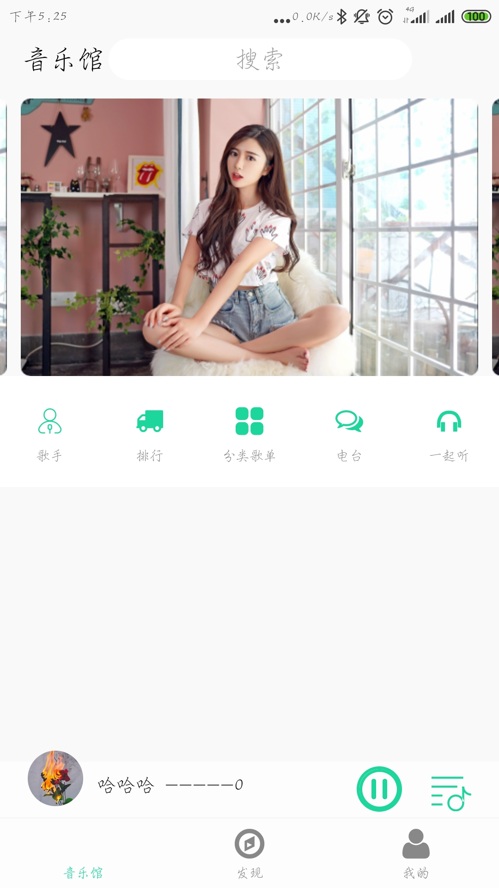

---

---

# 19/7-1

### RxJava 的使用

详见 Http / RxJava.md

# 19/7-2

### Glide 的用法

- 站位图

  站位图就是在图片的加载中显示一张临时的图片，等图片加载忘了后在替换成要加载的图片

  用法：

  ```java
  RequestOptions options = new RequestOptions()
          .placeholder(R.drawable.loading);
  Glide.with(this)
       .load(url)
       .apply(options)
       .into(imageView);
  ```

  如果图片有可能加载失败，则需要准备一张失败的图片，如下所示

  ```java
  RequestOptions options = new RequestOptions()
          .placeholder(R.drawable.ic_launcher_background)
          .error(R.drawable.error);
  Glide.with(this)
       .load(url)
       .apply(options)
       .into(imageView);
  ```

  简单的封装

  ```java
  public class GlideUtil {
      public static void load(Context context,
                              String url,
                              ImageView imageView,
                              RequestOptions options) {
          Glide.with(context)
               .load(url)
               .apply(options)
               .into(imageView);
      }
  }
  
  ```

- 指定图片的大小

  一般情况下，我们不需要指定图片的大小，因为 Glide 会根据 ImageView 的大小决定图片的大小，以此保证图片不会占用过多的内存从而引发 OOM。

  如果有这个需求，Glide 是支持的。如下所示

  ```java
  RequestOptions options = new RequestOptions()
          .override(200, 100);
  Glide.with(this)
       .load(url)
       .apply(options)
       .into(imageView);
  ```

  如果要加载一张图片的原始尺寸，如下所示

  ```java
  RequestOptions options = new RequestOptions()
          .override(Target.SIZE_ORIGINAL);
  Glide.with(this)
       .load(url)
       .apply(options)
       .into(imageView);
  ```

- 缓存机制

  Glide 在缓存上分为 硬盘缓存 和 内存滑出。

  内存缓存的主要作用是防止应用重复将图片数据读取到内存当中，而硬盘缓存的主要作用是防止应用重复从网络或其他地方重复下载和读取数据

  Glide 已经默认的 开启了内存缓存，如果需要禁用内存缓存，如下所示

  ```java
  RequestOptions options = new RequestOptions()
          .skipMemoryCache(true);
  Glide.with(this)
       .load(url)
       .apply(options)
       .into(imageView);
  ```

  禁止 硬盘缓存

  ```java
  RequestOptions options = new RequestOptions()
          .diskCacheStrategy(DiskCacheStrategy.NONE);
  Glide.with(this)
       .load(url)
       .apply(options)
       .into(imageView);
  ```

  硬盘缓存主要有五种参数

  DiskCacheStrategy.NONE： 表示不缓存任何内容。
  DiskCacheStrategy.DATA： 表示只缓存原始图片。
  DiskCacheStrategy.RESOURCE： 表示只缓存转换过后的图片。
  DiskCacheStrategy.ALL ： 表示既缓存原始图片，也缓存转换过后的图片。

  DiskCacheStrategy.AUTOMATIC： 表示让Glide根据图片资源智能地选择使用哪一种缓存策略（默认选项）

- 指定加载格式

  Glide 会自定判断图片的格式，如下所示

  ```java
  Glide.with(this)
       .load("http://guolin.tech/test.gif")
       .into(imageView);
  ```

  这样默认加载的就是一张 gif 图片。

  如果我希望加载的是一张静图，只需要加一个新的方法就可以了

  ```java
  Glide.with(this)
       .asBitmap()//只允许加载静图，gif图只显示第一帧
       .load("http://guolin.tech/test.gif")
       .into(imageView);
  ```

- 回调与监听

  [玩转Glide的回调与监听](https://blog.csdn.net/guolin_blog/article/details/70215985)

- 图片变换

  [Glide强大的图片变换功能](https://blog.csdn.net/guolin_blog/article/details/71524668)

# 19/7-13

​	前两天硬盘不小心被格式化了，所有的资料都没有了，从现在开始重新记吧。

### 	集成 MobTech 的qq登录和 短信验证遇到的问题

​		MobTech 官网： http://www.mob.com/

​		遇到的问题，刚集成完还是好的，但是因为我 硬盘被格式化了，所以项目从 github 拉取了一份，之后集成的登录 和 短信验证就用不了了报的错误为 找不到 Activity。最后问官方的技术指导说是关了 热部署就好了，如下所示：

O$O}S.jpg)

将图片中的 关闭即可。

### MobTech qq 登录

​	集成的过程就不说了，主要看一下登录的代码

```java
 /**
     * qq 登录
     */
    @OnClick(R2.id.icon_sign_in_qq)
    void onClickQQ() {
        Platform plat = ShareSDK.getPlatform(QQ.NAME);
        plat.removeAccount(true);
        plat.showUser(null);
        plat.setPlatformActionListener(new PlatformActionListener() {
            @Override
            public void onComplete(Platform platform, int i, HashMap<String, Object> hashMap) {
                for (Map.Entry<String, Object> map : hashMap.entrySet()) {
                    Log.e(map.getKey(), "" + map.getValue().toString());
                }
            }
            @Override
            public void onError(Platform platform, int i, Throwable throwable) {

            }
            @Override
            public void onCancel(Platform platform, int i) {

            }
        });
    }
```

###  MobTech 短信验证

​	同样集成就不说了，主要看代码

```java
RegisterPage page = new RegisterPage();
        page.setTempCode(null);
        page.setRegisterCallback(new EventHandler() {
            @Override
            public void afterEvent(int i, int i1, Object o) {
                if (i1 == SMSSDK.RESULT_COMPLETE) {
                    HashMap<String, Object> phoneMap = (HashMap<String, Object>) o;
                    String country = (String) phoneMap.get("country");
                    String phone = (String) phoneMap.get("phone");
                    Toast.makeText(getContext(), country + "------" + phone, Toast.LENGTH_SHORT).show();
                } else {
                    Toast.makeText(getContext(), "登录失败", Toast.LENGTH_SHORT).show();
                }
            }
        });
        page.show(getActivity());
```

### 遇到错误 java.lang.OutOfMemoryError: GC overhead limit exceeded

超过GC开销限制

解决：在 gradle.properties 将 org.gradle.jvmargs 开头的 那一行修改为：

```java
org.gradle.jvmargs=-Xmx4096m -XX:MaxPermSize=4096m -XX:+HeapDumpOnOutOfMemoryError
```

### ViewPager 显示 两侧的View，各显示一点

```java
 		<androidx.viewpager.widget.ViewPager
            android:id="@+id/more_viewpager"
            android:layout_width="match_parent"
            android:layout_height="200dp"
            android:layout_gravity="center"
            android:clipToPadding="false"
            android:paddingLeft="15dp"
            android:paddingRight="15dp"/>
```

里面使用了 padding 来调整左右两边的内边距

重要的是 clipToPadding，他表示用来定义ViewGroup 是否允许在 padding 中绘制，默认情况下为 true，为true 的情况小，那么绘制区域就会把padding 部分裁剪，若为 false，控件的绘制就会包含 padding 部分。

最后可以使用 setPageMargin 方法设置 间距，如下：

```java
mViewPager.setAdapter(new PagerAdapter(getChildFragmentManager()));
mViewPager.setPageMargin(30);
```

效果如下

### 设置图片四个角为圆角

使用 glide 进行设置

```java
 RoundedCorners roundedCorners = new RoundedCorners(10);
        RequestOptions options = RequestOptions.bitmapTransform(roundedCorners).override(300, 300);
        Glide.with(Latte.getApplication())
                .load("https://img02.sogoucdn.com/app/a/100520021/41778307d3291ab01cb5db13fe3af3e0")
                .apply(options)
                .listener(new RequestListener<Drawable>() {
                    @Override
                    public boolean onLoadFailed(@Nullable GlideException e, Object model, Target<Drawable> target, boolean isFirstResource) {
                        return false;
                    }

                    @RequiresApi(api = Build.VERSION_CODES.JELLY_BEAN)
                    @Override
                    public boolean onResourceReady(Drawable resource, Object model, Target<Drawable> target, DataSource dataSource, boolean isFirstResource) {
                        getActivity().runOnUiThread(() -> mImageview.setBackground(resource));
                        return false;
                    }
                })
                .submit();
```

注意回调方法中是子线程，需要在主线程更新 ui

### 当一个View 平移后，使他原来的位置可用。

如下所示：

```java
  ViewPropertyAnimator animate = mLinearLayout.animate();
                animate.translationY(height).setDuration(500);
                animate.setListener(new AnimatorListenerAdapter() {
                    @Override
                    public void onAnimationEnd(Animator animation) {
                        RelativeLayout.LayoutParams params = (RelativeLayout.LayoutParams) mLinearLayout.getLayoutParams();
                        params.topMargin = params.topMargin+ (-height);
                        mLinearLayout.setLayoutParams(params);
                        mLinearLayout.clearAnimation();
                    }
                });
                animate.start();
```

前两句 将一个 View 向下移动，时间为500，但是移动之后 其原来的位置不能使用，被遮挡。

查阅资料找到如下解决方法

```java
 RelativeLayout.LayoutParams params = (RelativeLayout.LayoutParams) mLinearLayout.getLayoutParams();
                        params.topMargin = params.topMargin+ (-(mLinearLayout.getMeasuredHeight()));
                        mLinearLayout.setLayoutParams(params);
                        mLinearLayout.clearAnimation();
```

例如上面 我们将view 向下移动了 height。那么监听动画完成之后 动态的设置这个view的位置即可，使用params.setMargins()， 这个方法可以设置位置，我采用的是 设置 marginTop ，因为我是向下移动，移动之后上面用不了了，然后让 view 设置 marginTop 即可，注意这里是 marginTop 是 负值。至于为什么是负值，自己试一下就知道了。

### RecyclerView 显示指定的条目

```java
mRecyclerView.scrollToPosition(i);
```

### RecyclerView 获取当前显示的第一个条目

```java
int current = mLayoutManager.findFirstVisibleItemPosition();
```

​	直接从管理器获取当前显示的条目

### 横向滑动的控件

HorizeontalScrollView

​	去掉滚动条

```
 android:scrollbars="none"
```

​	使用基本和 scrollView 一样，里面只能容纳一个子布局。

### MedialPlayer 获取音视频文件总时长的方法

​	1,本地文件

​			通过查询数据库audio或video视图的duration字段。这种方法针对手机上存储的本地文件有效，但对于网络上的在线文件则不起作用

​	2,在线文件

​			对于在线文件，则可以在MediaPlayer的prepareAsync后，当接收到onPrepared的时候通过MediaPlayer的getDuration方法取得总时长

### 禁止RecyclerView 的滑动

```java
recycler.setNestedScrollingEnabled(false);
```

### screenOrientation 属性

Android应用程序中，android:screenOrientation用于控制activity启动时方向，取值可以为：

- unspecified，默认值，由系统决定，不同手机可能不一致
- landscape，强制横屏显示
- portrait，强制竖屏显
- behind，与前一个activity方向相同
- sensor，根据物理传感器方向转动，用户90度、180度、270度旋转手机方向，activity都更着变化
- sensorLandscape，横屏旋转，一般横屏游戏会这样设置
- sensorPortrait，竖屏旋转
- nosensor，旋转设备时候，界面不会跟着旋转。初始化界面方向由系统控制
- user，用户当前设置的方向

### windowSoftInputMode 属性

- stateUnspecified-不指定软键盘的状态（隐藏还是可见） 将由系统选择合适的状态，或依赖主题中的设置，这是对软键盘行为的默认设置；

- stateUnchanged-保留状态 当 Activity 转至前台时保留软键盘最后所处的任何状态，无论是可见还是隐藏；

- stateHidden-隐藏软键盘 当用户确实是向前导航到 Activity，而不是因离开另一Activity 而返回时隐藏软键盘；

- stateAlwaysHidden-始终隐藏软键盘 当 Activity 的主窗口有输入焦点时始终隐藏软键盘；

- stateVisible-显示软键盘 在正常的适宜情况下（当用户向前导航到 Activity 的主窗口时，显示软键盘；

- stateAlwaysVisible-显示软键盘 当用户确实是向前导航到 Activity，而不是因离开另一Activity 而返回时；

- “adjustXXX” 还需要根据当前布局的形式来说明：

非滚动布局XML

- 1.adjustNoting。无效果，但是键盘弹出后会遮挡EditText，导致无法输入！这种情况下指定此形式是错误的。
- 2.adjustPan。主窗口会上移来保证待输入的EditText在软键盘之上。注意：ActionBar会被顶没了。参见图1
- 3.adjustUnspecified。同adjustPan。
- 4.adjustResize。无效果。

configChanges 属性

- android:configChanges="orientation"
   那么横竖屏切换时就不会重新创建activity，那么这个属性到底是什么意思呢？  首先，要了解Android默认在情况下，在系统的配置改变的情况下会重新创建activity，这个很好理解，因为系统环境变了，当然要重新创建activity来适应这个改变喽。但是在很多时候我们不想在系统配置改变时重新加载activity，那么就需要
   android:configChanges=“xxx|xxx”这个样子来搞定了。这里的xxx表这不同的系统配置的改变。
   这里的xxx包含了很多种，就像我上边写的，可以用|来连接多个值。下面简单介绍下各个值的不同含义：
- mmc：这里的意思是SIM卡的标识IMSI中的mmc发生了改变，这个mmc的用途是区分不同的国家的3位数号码，比如中国的是460，玩过水货的估计有了解这个东西的。
- mnc：IMSI中的运营商代码改变，就是用来区分当前SIM卡的网络运营商的，中国移动是00，联通是01，电信是03。
- locale：本地位置改变触犯，恩，这个貌似跟语言切换有关，没用过，不是跟了解。
- keyboard、keyboardHidden：这两个一起说一下，就是跟键盘有关的操作，前一个是键盘类型变化，如插了个键盘在设备上，后一个指的是键盘的可访问性发生变化。
- teachScreen：触摸屏变化。
- navigation：系统导航方式变化。
- screenLayout：屏幕布局发生了改变。
   layloutDirection：布局的方向发生变化，注意，是布局的方向，不是屏幕的，比较难理解的一个概念，是API17之后出现的
- orientation：屏幕方向改变，具体就是屏幕的横竖屏切换。
- uiMode：用户界面改变，这个是api18后出现的，比如切换夜间模式等场景会出现这个。
- fontScale：系统字体大小改变。
- screenSize：设备的屏幕的尺寸信息发生了改变，旋转屏幕时也会触发这个，但是这个值是API13之后才有的，因此13之前的设备没有这个。
- smallestScreenSize：设备的物理屏幕发生改变，同样是API13之后的东西，指的是设备的物理屏幕发生变化，比如外接显示器之类的。。。大体上是这个意思。‘

RecyclerView 平滑滚动

```java
 LinearLayoutManager manager = new LinearLayoutManager(getContext());
 manager.setSmoothScrollbarEnabled(true);
```

Drawable 转换为 Bitmap

```java
BitmapDrawable bd = (BitmapDrawable) resource;
Bitmap bm = bd.getBitmap();mMusicPhoto.setBitmap(bm);
```

设置图片相近的颜色

```java
Palette.from(bitmap).generate(new Palette.PaletteAsyncListener() {
                    @Override
                    public void onGenerated(@Nullable Palette palette) {
                        Palette.Swatch vibrant = palette.getVibrantSwatch();
                        if (vibrant != null){
                            mLinearLayout.setBackgroundColor(vibrant.getTitleTextColor());
                        }
                    }
                });
```

RcyclerView 跳转到制定的位置

```java
 /**
     * RecyclerView 移动到当前位置，
     *
     * @param manager   设置RecyclerView对应的manager
     * @param mRecyclerView  当前的RecyclerView
     * @param n  要跳转的位置
     */
    public static void MoveToPosition(LinearLayoutManager manager, RecyclerView mRecyclerView, int n) {
        int firstItem = manager.findFirstVisibleItemPosition();
        int lastItem = manager.findLastVisibleItemPosition();
        if (n <= firstItem) {
            mRecyclerView.scrollToPosition(n);
        } else if (n <= lastItem) {
            int top = mRecyclerView.getChildAt(n - firstItem).getTop();
            mRecyclerView.scrollBy(0, top);
        } else {
            mRecyclerView.scrollToPosition(n);
        }
    }
```

### 在Fragment 中使用 toolbar 的 menu

1,创建 menu 的布局

```java
<menu xmlns:android="http://schemas.android.com/apk/res/android"
    xmlns:app="http://schemas.android.com/apk/res-auto">

    <item android:id="@+id/scan_music"
        android:title="扫描歌曲"
        android:icon="@drawable/ssdk_logo"
        app:showAsAction="never"/>

</menu>
```

2,在 onViewCreated 中添加 menu 布局

```java
 @Override
    public void onViewCreated(@NonNull View view, @Nullable Bundle savedInstanceState) {
        mToolbar.inflateMenu(R.menu.native_menu);
        super.onViewCreated(view, savedInstanceState);
    }
```

3,重写 onCreateOptionsMenu

```java
 @Override
    public void onCreateOptionsMenu(Menu menu, MenuInflater inflater) {
        inflater.inflate(R.menu.native_menu, menu);
        super.onCreateOptionsMenu(menu, inflater);
    }
```

4,使用 mToolbar 设置点击事件

```java
 mToolbar.setOnMenuItemClickListener(new Toolbar.OnMenuItemClickListener() {
            @Override
            public boolean onMenuItemClick(MenuItem item) {
                if (item.getItemId() == R.id.scan_music){
                  ......
                }
                return false;
            }
        });
```

### Android 扫描本地音乐，扫描不到音乐的原因。

​	Android系统刷新媒体库的数据的时机，是在开机的时候，即手机一开机，系统便重新扫描一下sd卡，并将多媒体数据库更新一下。如果用户删除了某一个音频文件，不重新开机的话，数据库中的数据是不会更新的。那么，如果我们想用户一打开软件，就强制的更新多媒体数据库，应该怎么做呢？

解决如下：

```java
MediaScannerConnection.scanFile(context, new String[] { Environment
                .getExternalStorageDirectory().getAbsolutePath() }, null, null);
```

