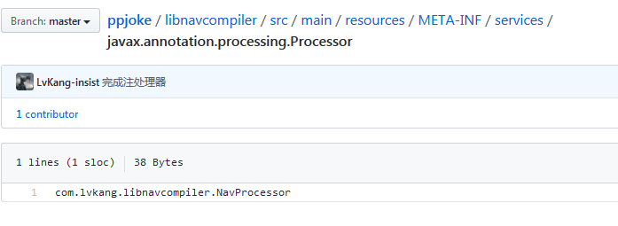

# 3/4

### 	suspend 函数的理解：

- 如果执行到 suspend 后，suspend 在 IO（阻塞）线程中，则会被挂起，协程外部会直接绕过协程继续往下执行，直到恢复后才会返回到协程体中继续执行
- 如果执行到 suspend 后， 没有被阻塞，则不会被挂起，然后就会顺序执行，也就是直接执行 suspend 函数 按顺序继续往下执行
- 如果是自定义的 suspend(也就是加了 suspendCoroutine )，可以拿到 continuation 。这种情况下 continuation 如果没有 resume/resumeWith ，则就会挂起。只有调用了 resume 之后才会继续执行协程体。
- suspend 函数并不代表挂起，还需要看实际的使用。
- suspend 函数如果没有挂起，则会继续往下执行，并返回结果，这种就是没有挂起。如果挂起了，则会返回一个挂起标志，外部知道这个函数挂起后就会继续往下执行。挂起的函数最终会将结果回调出去(这一步我们是看不到的)。

### 在 kotlin 中使用 注解处理器的问题：

​	在 app 的 gradle 中引入 注解处理器的 module 的时候一定要使用 kapt，不然无法生成 文件。如下所示：

```
apply plugin: 'com.android.application'
apply plugin: 'kotlin-android'
apply plugin: 'kotlin-android-extensions'
apply plugin: 'kotlin-kapt'


dependencies {
	.......
    implementation project(':libnavannotation') //注解库
    kapt project(":libnavcompiler") //注解处理器
}
```

# 3/5

### 启动协程和 resume 的理解

​	启动协程可通过  createCoroutine 或者 startCoroutine ，两者的区别是一个创建(创建后需要进行启动)，而另一是直接启动。

​	resume ：通过 createCoroutine 创建协程后 会返回一个 Continuation 。调用他的 resume 方法就可以执行协程了，官方对这个方法的解释为：**继续执行相应的协程，将[value]作为最后一个挂起点的返回值**。resume 可以携带一个参数

​	个人理解：resume 就是用来执行协程的(**注意这里不是执行 suspend** )。调用 resume 后协程就会开始执行，如果协程中有 suspend 函数，则会调用此函数(并且隐式的传递一个 Continuation)。执行 suspend 会有下面这几种情况

- 自定义的 suspend（使用了 suspendCoroutine ），这种情况下可以获取到 Continuation。通过 continuation 就可以控制这个suspend 函数是否挂起，**如果调用了 resume**，就会继续跳出 suspend 函数，继续执行 协程体（也就是恢复），**如果没有调用**，则 suspend 函数会被挂起，直到调用 resume 为止。
- 如果是普通的 suspend 函数，且**是 IO 线程**，则会被挂起，协程体不会继续往下执行，但协程体外会继续执行（知道挂起的恢复后协程体继续往下执行）。如果不是 IO 线程，则意味着没有挂起，此时会将 supsend 函数执行完，接着返回到协程体继续执行。

# 3/6

### 		Kotlin 使用注解处理器遇到的一些问题：

- 首先注解处理器肯定是一个 javaLibrary 。你需要在 app 项目中依赖他，注意依赖的方式一定要用 kapt，如下：

  ```kotlin
  apply plugin: 'kotlin-kapt'
  
  dependencies{
  	//注解 library
      implementation project(':libnavannotation')
      //注解处理器 library
      kapt project(":libnavcompiler")
  }
  ```

- 如果你注解处理器使用 java 写的，那这样就已经好了

- 如果使用 kotlin 写的，那么还需要修改一下东西

  注解处理器的gradle 文件：

  ```kotlin
  apply plugin: 'java-library'
  apply plugin: 'kotlin'
  apply plugin: 'kotlin-android-extensions'
  tasks.withType(JavaCompile) {
      options.encoding = "UTF-8"
  }
  
  dependencies {
      implementation fileTree(dir: 'libs', include: ['*.jar'])
      implementation project(':libnavannotation')
  
      implementation this.rootProject.depsLibs.fastjson
      //auto service
      implementation  this.rootProject.depsLibs.autoservice
      implementation this.rootProject.depsLibs.corektx
      annotationProcessor 'com.google.auto.service:auto-service:1.0-rc6'
  }
  
  sourceCompatibility = "8"
  targetCompatibility = "8"
  ```

  接着需要在 注解处理器的 library 的 main 文件夹下创建一个 resources 文件，路径为 src/main/resources/META-INF/service/javax.annotation.processing.Processor

  

  

    在文件中注明注解处理器的全类别即可：如上图所示。

- 最后注意一下，注解处理器的代码一定要没有问题，我就是 将 || 写成了 && ，才遇到了一系列的坑

# 3/7

### 	协程的创建理解：

- 创建一个协程会有两个 Continuation。一个是传入的 Continuation，还有一个是 返回的 Continuation，传入的 Continuation 是协程执行完后回调的 Continuation，返回的则是协程的本地，协程内部的 resume 完成了之后他才会 回调我们传入的 Continuation

  ```kotlin
      // x ：协程的本体，内部的 resume 都执行完了之后才会回调我们传入的 Continuation
      val x = suspend {
  
          getData("http://www.baidu.com")
  
          //传进去的 Continuation 是协程执行完后回调的 Continuation
      }.createCoroutine(object : Continuation<String> {
          override val context: CoroutineContext = Disp()
          override fun resumeWith(result: Result<String>) {
              println("result" + result.getOrThrow())
          }
      })
      x.resume(Unit)
  ```

  首先是 使用返回值进行 resume。这样相当于启动协程，suspend 里面(协程)就会得到执行，协程的内部会进行很多的挂起恢复操作，但是协程本身也是一个 continuation，当协程内部执行完后，就会调用 continuation，这个 continuation 就是我们在 createCoroutine 中传入的。最终他的 resumeWith 会得到执行，到此协程执行完成。

协程的拦截器：

​	注意上面的代码，在 createCoroutine 下面的第一句使用了 拦截器 Disp()，

```kotlin
//自定义一个拦截器
class Disp() : ContinuationInterceptor {
    override val key: CoroutineContext.Key<*> = ContinuationInterceptor

    override fun <T> interceptContinuation(continuation: Continuation<T>): Continuation<T> {
        println("拦截")
        return continuation
    }
}
```

​	注意 上面使用拦截器的位置，在 执行 x.resume 是，首先会执行拦截器的内容，拦截器接收一个 Continuation，并且返回一个 Continuation。这样我们就可以在这里进行一系列的操作，例如换线程等。

​	那么 拦截器接收的 continuation 到底是谁的呢？

​	其实就是 suspend{} ，它本身也是一个 continuation，这里拦截的就是 suspend{} 这个 continuation，拦截了之后，每次 resume 的时候就想到于先经过拦截器，再能 resume 我们的协程本体。

# 3/9

###  Kotlin 中类型别名(typealias)

可用于提供一个更语义精简的别名来取代泛型类型，函数定义等

```
class UserUtils {
    companion object {
        fun text(str: String) {
            println(str)
        }
    }
}
```

上面的类，在调用的时候可以使用类型别名，如下：

```kotlin
public typealias U = UserUtils
fun main(args: Array<String>) {
    U.text("ssss") // 这里的 U 就相当于 UserUtils 类
}
```

手动实现 launch，了解过程中。。

# 3/10

​	仿 Kotlin 框架，手动实现 launch ，join，delay，调度器

​	launch：启动协程的入口，协程启动后，创建一个状态，表示协程未执行完成。等到执行完后就会更改为 完成。

​	join ：在 launch 如果没有执行完成，状态为 未完成状态，接着就会将 当前线程阻塞，然后把 continuation 存放在状态中。等 launch 执行完成后就会获取当前状态，并且更新为完成状态，如果状态中有 continuation，则进行回调。

​	delay：直接阻塞线程

​	runBlocking：在拦截器中将 continuation 装进阻塞队列中，然后阻塞队列一直取出 continuation 并回调

​	async：启动一个有返回值的协程。执行的逻辑和 join 差不太多。

# 3/11

实现取消响应

​	一般情况下协程执行完后要么是成功返回，或者是异常结束。现在要增加一个取消。如果对应的 suspend 没有执行完成，那么就可以进行取消。通过状态的判断，来取消线程的执行

异常处理：如果在协程体中抛出了异常，则需要进行处理，

完成 NavHostFragmetn + 底部导航的联动，

# 3/12

实现作用域

​	作用域的基本概念：

​	作用域对异常传播的影响：

​	作用域对取消响应的影响：

​	三种协程作用域的区别：

| 类型 | 产生方式                                                    |   异常传播特征    |
| :--: | :---------------------------------------------------------- | :---------------: |
| 顶级 | 通过 GlobalScope 创建                                       |   不向外部传播    |
| 协同 | Job 嵌套、coroutineScope 创建                               |     双向传播      |
| 主从 | 通过 supervisorScope 创建，与内部直接子协程主从，与外部协同 | 自上而下 单向传播 |

​	最外层的协程其实就是顶级的作用域，通常需要使用 GlobalScope 来创建。定义作用域如果出现了异常，他不会进行传播，因为外部啥都没有了，根本传不出去。

​	协同作用域就是协程直接存在父子关系，我是在你里面创建的，那么我就是你的子协程，如果你取消了，我也会被取消。如果我出了异常，我也会把你取消。不管是谁出了异常，剩下的都会被连累。

​	主从作用域：父协程出了异常或者被取消，子协程也会被取消。但是如果是子协程出了问题，父协程是没有任何影响的。所以是自上而下，单向传播

​	如果没有指定是什么作用域的话，则就是 协同

未捕获异常处理流程示意


​	对于 顶级和主从 来说，异常是传不出去的。这个时候就会找当前的 launch，是否有异常处理器，如果有就会进行处理，否则就由全局的异常处理器来处理。


​	如果协同作用域出现了异常，则会取消当前作用域，并且将异常向上传播。如果父协程的作用域也是“协同”，那么就会继续取消，并向上传播。如果是是顶级或者主从，则会丢给异常处理器去处理。

# 3/16

打开 pdf 文件

```kotlin
 Intent(Intent.ACTION_VIEW).also {
                            it.setDataAndType(
                                FileProvider.getUriForFile(
                                    context!!,
                                    "${context!!.packageName}.provider",
                                    file
                                ), "application/pdf"
                            )
                            it.flags =
                                Intent.FLAG_ACTIVITY_NO_HISTORY or Intent.FLAG_GRANT_READ_URI_PERMISSION
                        }.also(::startActivity)
```

```xml
 <provider
            android:name="androidx.core.content.FileProvider"
            android:authorities="${applicationId}.provider"
            android:exported="false"
            android:grantUriPermissions="true">

            <meta-data
                android:name="android.support.FILE_PROVIDER_PATHS"
                android:resource="@xml/provider_paths" />
        </provider>
```

```xml
<paths xmlns:android="http://schemas.android.com/apk/res/android">

    //配置files path
    <files-path
        name="download"
        path="download"/>
</paths>
```

