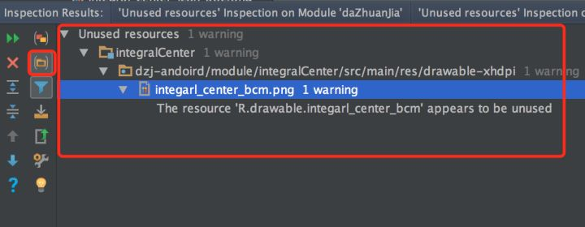

# 4/2

### 		今天遇到内存泄露的场景： ViewPager 嵌套 Fragment。

​			如果使用的是 ：FragmentStatePagerAdapter 适配器，如果 Fragment 不显示，则会被销毁，在 这个适配器中。**Fragment 不能被添加进 List 中，然后在getItem 时获取集合数据**，这种中情况会造成内存泄露。 当 fragment 销毁后 List 还持有者 Fragment 的适配器，造成不能被回收。 **解决的办法就是直接 newFragment。而不是 使用集合存放**

​			如果用的是 FragmentPagerAdapter ，则会全部缓存，不存在泄露的问题。但是这种不适合大量页面的需求

### 		Glide 清理缓存

​		如果 列表中有使用 glide 加载图。这些图片会全部被加载到内存中，造成资源的浪费，甚至会 OOM，解决的办法就是当 列表中的条目不可见时 清除 Glide 的缓存

```kotlin
override fun onViewRecycled(holder: BaseViewHolder) { 
     Glide.with(imageView.context).clear(imageView)
}
```

​	  Glide 加载图片的顺序：从内存加载 -> 从磁盘加载 ->网络加载 

# 4/6

### 	实现App 的黑白化效果1

​	其实 Ganvas 对应的 API 肯定也是支持灰度的。我们在 draw 之前设置个灰度效果就可以。但是在单个控件上设置没有多大效果，因为我们要设置的是整个页面。所以我们需要自定义一个Layout。然后替换系统默认的 FrameLayout 即可

​	替换方式如下：

```kotlin
/**
 * 灰度的布局
 */
class GrayFrameLayout : FrameLayout {

    private val mPaint = Paint()

    constructor(context: Context) : this(context, null)
    constructor(context: Context, attrs: AttributeSet?) : this(context, attrs, 1)
    constructor(context: Context, attrs: AttributeSet?, defStyleAttr: Int) : super(
        context, attrs, defStyleAttr
    ) {
        val cm = ColorMatrix()
        cm.setSaturation(0f)
        mPaint.setColorFilter(ColorMatrixColorFilter(cm))
    }

    override fun draw(canvas: Canvas?) {
        canvas?.saveLayer(null, mPaint, Canvas.ALL_SAVE_FLAG)
        super.draw(canvas)
        canvas?.restore()
    }

    override fun dispatchDraw(canvas: Canvas?) {
        canvas?.saveLayer(null, mPaint, Canvas.ALL_SAVE_FLAG)
        super.dispatchDraw(canvas)
        canvas?.restore()
    }
}
```

​	接着这 BaseActivity 中替换即可：

```kotlin
/**
     * 实现界面灰度
     */
    override fun onCreateView(name: String, context: Context, attrs: AttributeSet): View? {
        if ("FrameLayout" == name) {
            val count = attrs.attributeCount
            for (i in 0 until count) {
                val attributeName = attrs.getAttributeName(i)
                val attributeValue = attrs.getAttributeValue(i)
                if (attributeName == "id") {
                    val id = attributeValue.substring(1).toInt()
                    val idVal = resources.getResourceName(id)
                    if ("android:id/content".equals(idVal)) {
                        return GrayFrameLayout(context, attrs)
                    }
                }
            }
        }
        return super.onCreateView(name, context, attrs)
    }
```

上面这种可能会有一些问题。下面还有一种解决方案！

### 实现App 的黑白化效果2

```kotlin
//实现灰度化
val paint = Paint()
val cm = ColorMatrix()
cm.setSaturation(0f)
paint.colorFilter = ColorMatrixColorFilter(cm)
window.decorView.setLayerType(View.LAYER_TYPE_HARDWARE, paint)
```

值 activity的 onCreate中添加如上代码即可

参考链接：https://mp.weixin.qq.com/s/EioJ8ogsCxQEFm44mKFiOQ

# 4/26 

Android Studio 中山城无用资源

1，在 AnayLaze 中选择 Run Inspection by Name


2，在弹出的窗口数据 unused resources 后回车


3，根据情况，选择整个项目，或者是 module。然后点击 ok


4，得到结果，可以一个一个删，也可以全部删除



结束